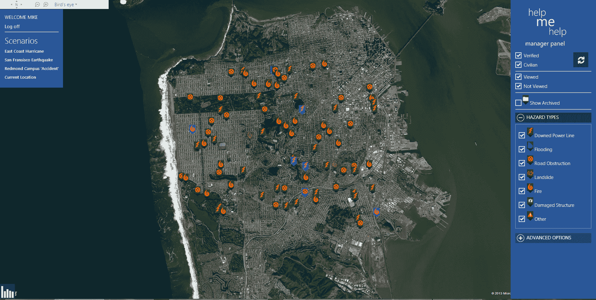
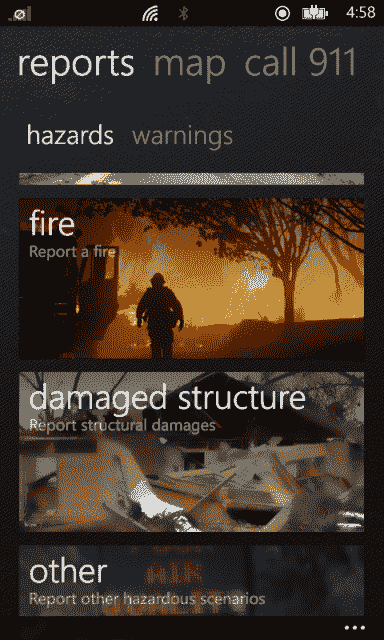

# 帮助我帮助使用众包提高灾难响应效率| TechCrunch

> 原文：<https://web.archive.org/web/https://techcrunch.com/2013/07/04/help-me-help-wants-to-make-emergency-response-during-disasters-more-efficient/>

# 帮助我帮助使用众包来提高救灾效率

[Help Me Help](https://web.archive.org/web/20230327215011/http://www.imaginecup.com/ic13/team/teampoli'ahu#?fbid=eXUMKT4AHvO) 希望让紧急救援人员在灾难发生后更容易全面了解情况。该服务结合了众包、智能手机应用和网络服务，允许训练有素的专业人士和平民实时标记地图，显示倒下的电力线、受损结构、火灾、道路障碍和其他危险的位置和照片。

Help Me Help 是由希洛夏威夷大学的一群学生开发的。该组织自称的里坡阿胡团队将代表美国参加下周在俄罗斯圣彼得堡举行的微软[创新杯](https://web.archive.org/web/20230327215011/http://imaginecup.com/Main/About)学生技术竞赛。

这个项目背后的最初想法是跟踪夏威夷一些州和国家公园的入侵物种。正如 Help Me Help 的 Mike Purvis 上个月告诉我的，该团队很快决定，它也可以将为这个项目开发的技术应用于更大范围的问题。

 该团队认为其服务可以提供情景感知，帮助紧急救援人员在发生灾害时更高效地做出响应。目前，像夏威夷的[民防组织仍然经常使用纸质地图、磁铁和写字板来追踪这些数据。该小组说，目前，灾难报道通常是分散的，通过多种形式的媒体传播。](https://web.archive.org/web/20230327215011/http://www.scd.hawaii.gov/)

除了移动应用程序，Help Me Help 还可以将 Twitter 上的内容抓取到其数据库中，这将使人们更容易提交更新。

由于该团队计划为其客户定制服务，客户可以决定他们是否希望允许任何人提交信息，或者他们是否希望限制向一组受信任和经过验证的提交者添加内容的能力。

## 想象杯 2013

帮助我帮助将在下周的想象杯决赛中推出它的服务。微软及其合作伙伴总共为进入决赛的学生提供了大约 100 万美元的奖励。总共有 69 个国家的代表将出席此次活动，7 月 11 日星期四的颁奖典礼将由《神秘博士》的马特·史密斯主持。