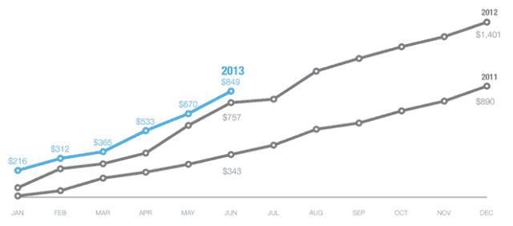

# 在很少退出、“涉猎”投资者和种子资本缺乏的情况下，一个不断增长的数字健康市场转向了众筹

> 原文：<https://web.archive.org/web/https://techcrunch.com/2013/07/08/amidst-dabbling-investors-and-dearth-of-seed-capital-digital-health-startups-turn-to-crowdfunding/>

在过去几年中，数字健康已经成为一个充满机遇的市场，初创公司和投资者都开始注意到这一点。例如，从 2009 年到 2011 年，对数字健康创业公司的投资翻了一番，这一增长在 2012 年的大部分时间里继续加速。但是快进到今天，随着这个领域继续向前发展，投资者保持乐观，数字健康叙事不再那么非黑即白。

本周，总部位于旧金山的创业公司加速器 Rock Health [发布了关于行业状况的年中报告](https://web.archive.org/web/20230322201139/http://rockhealth.com/2013/07/2013-midyear-digital-health-funding-update/)，尽管数字健康基金在 2013 年上半年增长了 12%，但市场首次显示出增长开始放缓的迹象。尽管 Rock Health 的报告(和数据)并不完整，但它们确实越来越准确地反映了数字健康领域的发展趋势，尤其是在初创公司投资者中。

具体来说:报告发现，2013 年上半年，90 家数字健康初创公司共获得了 8.49 亿美元的资金，与去年同期相比，投资额增加了 12%，交易额增加了 25%。然而，虽然这些数字似乎表明增长势头有增无减，但与去年同期市场的快速增长率(73%)相比，流入数字健康的资本似乎已经开始减速。

也就是说，有一线希望，因为这种减速多少反映了地图上正在发生的事情。例如，在第一季度，所有行业的风险投资与去年同期相比下降了 6%，而且，在更局部的地方，传统医疗保健的风险投资继续下降。例如，医疗设备基金和生物技术分别下降了 29%和 2%。

因此，最终，尽管数字健康可能进入减速期，但仍有理由保持乐观，随着我们向前发展，越来越多的传统医疗投资风险资本可能开始进入数字健康。此外，Rock Health 发现，投资者今年在数字健康领域的交易比 2012 年更多，该报告指出，投资者越来越意识到数字健康市场开始出现市场机会。

[福布斯的 David Shaywitz 指出](https://web.archive.org/web/20230322201139/http://www.forbes.com/sites/davidshaywitz/2013/07/01/digital-health-update-investors-hopeful-but-disruption-elusive/)例如，风险投资公司正慢慢开始增加致力于投资数字健康的合伙人数量，联邦和学术活动也开始增加。

总体而言，该报告发现，2013 年有 146 名投资者参与了一两笔交易，与去年同期投资数字医疗的 92 家公司相比，这是一个健康的增长。此外，今年有几家公司在市场上变得特别活跃，社交+资本合作伙伴关系在所有有五项数字健康投资的公司中领先，紧随其后的是 Norwest Venture Partners。

另一方面，就像任何新兴和活跃的领域一样，尽管投资者开始关注，但他们的涉足仍多于实际投资。Rock Health 的联合创始人 Halle Tecco 将此归因于这样一个事实，即投资者的普遍看法似乎是，现在对数字健康做出任何重大承诺还为时过早。这与人们在教育技术领域发现的情况非常相似。

此外，为了让投资者开始集体做出重大承诺，数字健康初创公司需要在未来展示更多差异化。虽然在过去的几年里，创业公司已经涌入这个领域，但仍有许多模仿和模仿的企业，我们还没有看到数字健康潜力的所有宣传中承诺的巨大成果。就这一点而言，一些大的退出将大大有助于鼓励仍在观望的投资者，是时候进入这个游戏了，但迄今为止，那些令人回头的退出仍然没有出现。

Rock Health 的报告还确定了数字健康领域的另一个重要(也是明显的)趋势:尽管今年上半年越来越多的初创公司成熟到 C 级系列交易，但数字健康投资继续向后期交易倾斜。此外，尽管富人开始越来越频繁地支持健康创业公司，但经验丰富的资深天使投资者仍然供不应求。

“虽然科技领域有谷歌、脸书和易贝/贝宝这样的公司，它们已经推出了数十家活跃的天使投资者，但我们仍然没有看到‘数字健康的脸书’，”Tecco 告诉我们。她说，市场上少数关键参与者的出现——或者几个价值数十亿美元的成功故事——将大大有助于创造“一个活跃的天使池，可以帮助支持下一代企业家”，并为羽翼未丰的初创公司提供退出机会。

大型科技公司的早期员工和高管已经成为相关垂直行业的积极天使投资者，为各自市场的整体成功做出了贡献。因此，似乎直到第一代数字健康创业公司——例如 Practice Fusion 或 Castlight 等更成熟、资本更雄厚的公司——上市或被高价收购，我们才会看到新一代天使投资人。

或许并不令人惊讶的是，鉴于数字健康领域缺乏种子和天使投资者，Rock Health 发现，初创公司越来越多地开始转向其他资本来源，如众筹平台。报告解释说，对于企业家，特别是那些建立硬件组件公司的企业家，众筹正成为一个有吸引力的选择，2013 年，38 个数字健康活动在 Indiegogo、Kickstarter、Medstartr 和 Fundable 上筹集了超过 450 万美元。

例如，Indiegogo 的健康相关活动数量在 2013 年飙升了 2279%，而 AngelList 发现今年在其平台上创建的健康初创公司简介数量增长了 272%。

此外，当人们考虑到一般健康相关活动的上升时，向众筹的转变似乎越来越成为全行业的趋势。例如，对于数字健康初创公司和转向众筹平台帮助支付医疗账单或支付手术费用的人来说，都是如此。大多数普通众筹平台，如 Rally.org、Fundly 和 GoFundMe 等，最近都发现健康和医疗筹款成为他们增长最快的类别。

医疗账单在线筹款平台 GiveForward 最近在其平台上的医疗捐款超过了 5000 万美元，其中 70%来自过去 12 个月。联合创始人 Ethan Austin 说，鉴于这个领域的发展速度，该公司预计明年这个数字将增加到 1.2 亿美元。

此外，当 TechCrunch 最近询问 [Crowdtilt](https://web.archive.org/web/20230322201139/https://www.crowdtilt.com/) 的联合创始人詹姆斯·贝沙拉(James Beshara)这个“团体融资”平台是否也看到了类似的数据时，他告诉我们，健康和医疗“无疑是(Crowdtilt)增长最快的类别之一。”贝沙拉说，11 月，这些活动占众筹平台上筹集的总美元的 3%，到 4 月，它们已增加到总美元的 16%。

话虽如此，但迄今为止，似乎大多数与健康相关的众筹活动都发生在一般的众筹网站上，而不一定发生在特定健康平台上。然而，尽管专门的众筹门户网站仍然相当少，但其数量正在增长。随着它们开始激增，并不可避免地有助于创造一些赢家，毫无疑问，这将开始鼓励更多的天使投资者和种子期基金加入数字健康的行列。

目前，众筹门户网站似乎是举足轻重的，但随着时间的推移，这种情况可能会发生变化，因为越来越多的投资者开始从埃丝特·戴森这样的老手那里得到启示。

更多信息，请查看以下幻灯片形式的 Rock Health 完整年中报告:

[slide share id = 23728823 & doc = digitalhealthfundingmidyearupdate 2013-130701041603-PHP app 02 w = 640 & h = 480]