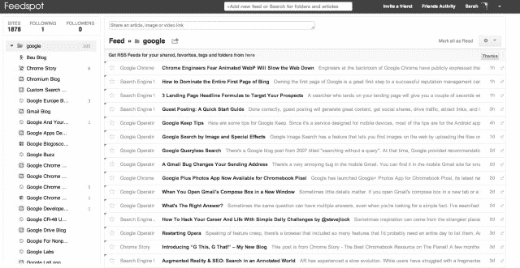
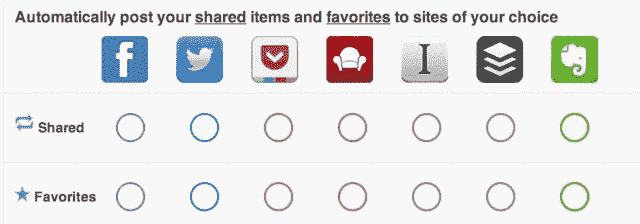
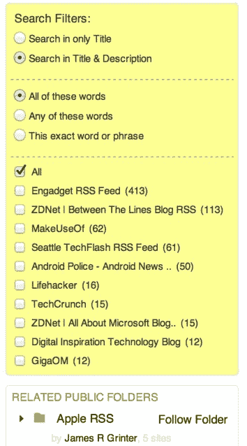

# Feedspot 通过内置搜索和社交共享提供了可靠的谷歌阅读器替代品技术危机

> 原文：<https://web.archive.org/web/https://techcrunch.com/2013/07/08/feedspot-offers-a-solid-google-reader-replacement-with-built-in-search-and-social-sharing/>

[Feedspot](https://web.archive.org/web/20221007164224/http://www.feedspot.com/) 是去年夏天[在谷歌阅读器移除社交功能后投入使用的在线 RSS 阅读器](https://web.archive.org/web/20221007164224/https://beta.techcrunch.com/2012/08/14/still-missing-google-readers-lost-social-features-feedspot-can-help/)，随着谷歌阅读器的消亡，它又一次登上了前台。这家初创公司现在又有一年的开发工作要做，它不仅为桌面提供了坚实的谷歌阅读器替代品，也是少数几个能够在 RSS 源中搜索的公司之一。

当 Feedspot [首次在私人网站 alpha](https://web.archive.org/web/20221007164224/https://beta.techcrunch.com/2012/08/14/still-missing-google-readers-lost-social-features-feedspot-can-help/) 上发布时，其目标不是成为谷歌阅读器的克隆，而是除了标准的 RSS 订阅模式之外，专注于从用户的推特账户提供基于主题的新闻和订阅源。然而，这些选择是在面对像谷歌这样的巨头时做出的，这意味着你必须有一个不同的功能集来吸引用户离开他们的旧待机模式。

今天，事情变了。随着谷歌阅读器(Google Reader)的淡出，Feedspot 这样的初创公司有机会发展自己的可行用户群，而且他们可以做到这一点，而不必与谷歌阅读器(Google Reader)曾经的样子有很大不同。对许多人来说，简单地提供一个看起来和感觉都很像谷歌老版本的阅读器就足够了。

在这方面，目前处于公开测试阶段的 Feedspot 取得了成功。它提供了一个朴实无华的界面，让人想起了 Reader 更刻板的外观，同样的键盘导航和其他快捷方式，以及一个紧凑的“列表”视图，这使得标题扫描更容易。

此外，与许多从谷歌阅读器的灰烬中推出的服务不同，Feedspot 是更好的选择之一，因为它在开发时间方面领先。

例如，当 Digg Reader 还在努力处理未读计数时，Feedspot 已经有了更多。例如，这项服务可以让你自动将分享的内容和收藏的内容发布到各种第三方来源，包括脸书、Twitter、Pocket、Instapaper、Readability、Buffer 和 Evernote，此外，它还可以让你在文件夹和文章中搜索关键词——这一点甚至连谷歌阅读器替代品的先驱之一 [Feedly](https://web.archive.org/web/20221007164224/http://www.feedly.com/) 都还没有推出。

在 Feedspot，文章内搜索是一个付费升级选项，这似乎也是其他 feed 阅读器现在的发展方向(Digg 和 Feedly 都暗示他们可能也是如此。每月起价 1.99 美元的 Feedspot Gold 提供上述搜索和高级分享选项，并关闭广告，强制 feeds 更频繁地刷新，等等。

 为了开始使用 Feedspot，用户通过 OMPL 导入他们的谷歌阅读器订阅——在 7 月 15 日之前，[仍然可以从](https://web.archive.org/web/20221007164224/http://www.google.com/reader/about/)[谷歌外卖](https://web.archive.org/web/20221007164224/https://www.google.com/takeout/#custom:reader)获取你的订阅数据，包括订阅源、明星和注释。你也可以浏览类别来找到你喜欢的网站。

Feedspot 中的“关注你的朋友”功能仍然存在，允许你在从电子邮件(Gmail、Yahoo、Outlook、Hotmail/MSN/Live 或 Aol)中导入联系人后找到并关注你的朋友。)用户还可以搜索和关注由其他用户创建的公共文件夹，并关注那些文件夹(例如[技术](https://web.archive.org/web/20221007164224/http://feedspot.com/search?q=technology)、[食物](https://web.archive.org/web/20221007164224/http://feedspot.com/search?q=food)、[网页设计](https://web.archive.org/web/20221007164224/http://feedspot.com/search?q=web+design))，而不是必须管理他们自己的订阅源集合。

然而，社交功能可能不会像 Reader 全盛时期那样引人注目，因为 RSS 用户群已经很小，现在分散在几十个新老服务中，这些服务从谷歌 Reader 中断的地方开始。

Feedspot 创始人 Anuj Agarwal 告诉我们，他的服务提供了自己的 API ~~，它得到了 Reader 先生(iPad 应用)、Reeder、gReader 和其他第三方客户端的支持~~。(更正:这是最终目标)。这家自举式创业公司如今拥有 15 万用户，目前正在考虑外部融资。