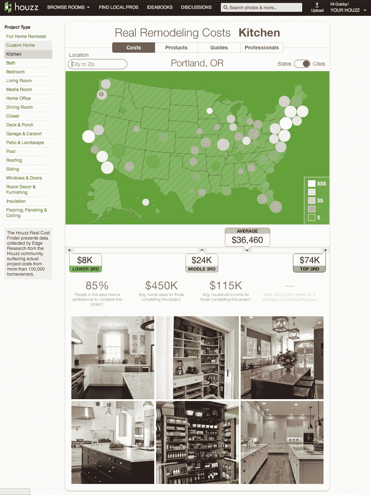
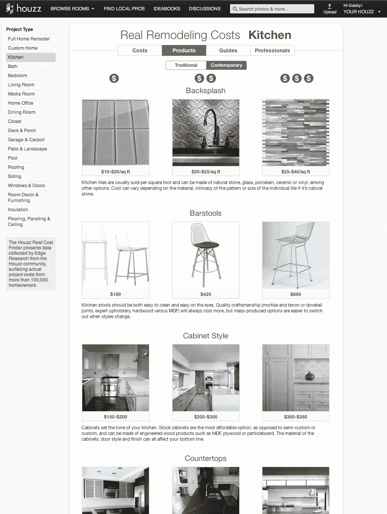

# 家居重塑平台 Houzz 为重塑梦想增加了现实检查

> 原文：<https://web.archive.org/web/https://techcrunch.com/2013/07/08/home-remodeling-platform-houzz-adds-reality-check-to-remodeling-dreams-launches-cost-database-for-renovation-projects/>

# 家居改造平台 Houzz 为改造梦想增加了现实核查，推出了改造项目成本数据库

如果你需要一次对房子的羡慕，没有比 [Houzz](https://web.archive.org/web/20230403113216/http://houzz.com/) 更好的地方了，这是一个越来越受欢迎的平台，为你的家庭改造项目寻找想法，并由专业人士实现这些想法。然而今天，这项服务为这些梦想增加了一点现实核查。该公司目前每月有 1400 万用户，最近调查了美国 10 万名房主的项目。现在[在其网站](https://web.archive.org/web/20230403113216/http://www.houzz.com/remodeling-costs)和移动应用程序上展示这些信息，让房主更好地了解他们所在地区的改造项目通常需要多少成本。

例如，这些工具向房主展示他们所在地区的厨房或媒体室改造成本。除了平均值之外，它也强调了低三分之一、中三分之一和高三分之一的统计数据。利用其现有的数据库，Houzz 还可以利用其庞大的令人羡慕的照片数据库和特定商品的价格。例如，通过这种方式，你可以看到某种台面会对你的预算产生什么影响，以及不同选项的利弊，这要归功于该服务上越来越多的操作方法和风格指南。

这个工具暂时只在 [Houzz 网站](https://web.archive.org/web/20230403113216/http://www.houzz.com/remodeling-costs)上有。它还不能通过其流行的移动应用程序获得，但该公司告诉我这很快就会实现。

正如 Houzz 的联合创始人阿龙·科恩(Alon Cohen)上周告诉我的那样，该公司用于支持这一工具的数据是基于有史以来最大规模的重塑活动调查。他说，公司决定将这些信息回馈给社区。科恩认为，这将有助于业主预算他们的项目。

目前，调查显示，半数启动这类项目的房主实际上没有设定预算或超出预算。此外，该工具还应该帮助该公司超过 23 万名专业人士的网络更好地了解他们可以收取的费用，并向房主展示他们的费率与平均水平相比如何。

Houzz 计划随着时间的推移更新数据。

