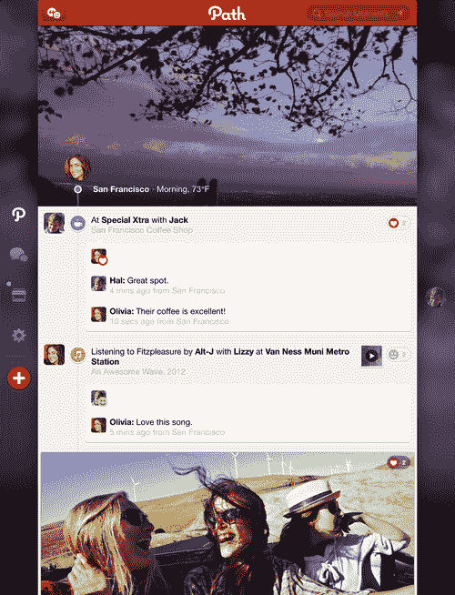

# Path 在 3.1 版本中将贴纸翻倍，还有新的 iPad 设计和真实世界交友 TechCrunch

> 原文：<https://web.archive.org/web/https://techcrunch.com/2013/07/09/path-doubles-down-on-stickers-in-version-3-1-alongside-new-ipad-design-and-real-world-friending/>

# Path 在 3.1 版本中加倍强调贴纸，以及新的 iPad 设计和真实世界的交友

Path [给评论](https://web.archive.org/web/20221006200804/http://blog.path.com/post/55025970617/path-3-1-more-stickers-in-more-places)加了贴纸，发布了新的 iPad 设计，今天还介绍了当面加好友的新方式。

任何贴纸，无论新旧，现在都可以在评论中用来回应朋友的瞬间。路径[在三月份的 3.0 版本中引入了贴纸](https://web.archive.org/web/20221006200804/https://beta.techcrunch.com/2013/03/08/in-first-24-hours-of-3-0-launch-path-made-more-money-than-ever-and-sent-more-than-1m-messages/)，获得了非常积极的反馈。在发布后的第一个 24 小时内，Path 收到了 100 万条信息，赚的钱比它作为一个公司的整个生命周期都要多。脸书紧随其后，添加贴纸，然后是[品牌贴纸](https://web.archive.org/web/20221006200804/https://beta.techcrunch.com/2013/06/27/facebook-branded-stickers/)，这可能会发展成为社交网络的赞助内容业务。

> “随着我们几个月前发布的消息，我们引入了一种新的方式来与您在 Path 上关心的人沟通，”该公司今天在一篇帖子中写道。“从那时起，我们的目标就是为这些日常的成功、烦恼和后勤工作赋予角色、面孔和图标。堵车了？工作中的晋升？急需咖啡因？感觉傻傻的，热恋中的，疲惫不堪的？有一个贴纸。”

该公司的博客一直被关于贴纸的帖子占据，这似乎是该公司的一个主要焦点，无论是用户体验还是收入。

除了加倍使用贴纸，Path 还改进了其 iPad 应用程序的导航，使其更容易创作和分享时刻。

最后，Path 使得当面发送好友请求变得更加容易。该应用程序将生成一个二维码，您的朋友可以亲自扫描该二维码，并立即成为路径朋友。

该更新现在适用于 iPhone、iPad 和 Android。