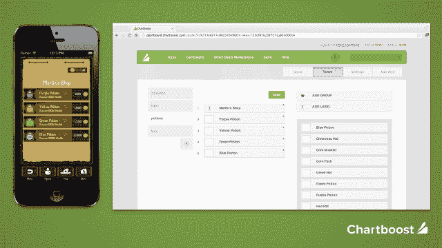

# Chartboost 为手机游戏开发商推出新方法，推动应用内购买 TechCrunch

> 原文：<https://web.archive.org/web/https://techcrunch.com/2013/07/11/chartboost-launches-new-way-for-mobile-game-devs-to-power-in-app-purchases/>

# Chartboost 为手机游戏开发商推出新的方式来支持应用内购买

为手机游戏开发商提供交叉推广服务的快速发展的网络公司 Chartboost 正在为其带来新的收入来源。它推出了一项新的后端服务[将推动手机游戏的应用内购买和存储。](https://web.archive.org/web/20221006023724/http://www.chartboost.com/store)

该公司表示，这款名为 [Chartboost Store](https://web.archive.org/web/20221006023724/http://www.chartboost.com/store) 的产品将使电影公司更容易即时添加新项目和定价，而不必经历耗时的更新过程。

新的商店服务还为开发者提供了分析功能，以便他们可以跟踪哪些商品和价格点表现最好。许多最大的游戏开发商已经在内部建立了类似的技术来管理他们的商店，但较小的开发商没有这样做的资源。

该公司表示，今天已经有五款游戏在商店上线，包括复古梦想家的冰淇淋掉落，Sniderware 的 Eric 的数独，Dobsoft 的 Run & Gun，猥琐技术的单词克星，以及 Naquatic 的篮球对决。该商店正在为 iOS、Android 和 Unity 进行封闭测试。并且可以申请测试版

目前它是免费的，但是当该产品在今年晚些时候全面推出时，Chartboost 将要求 10%的收入分成。这意味着在苹果或谷歌 Play 削减 30%后，Chartboost 将在此基础上获得 10%的份额。

Chartboost 今年在红杉资本(Sequoia Capital)牵头的一轮融资中筹集了 1900 万美元，通过大部分免费提供服务，它已经发展成为一个包括 16，000 多个游戏的网络。它为开发者提供在自己的网络内交叉推广游戏的工具，并安排不同开发者之间的直接交易，以广告交换彼此的作品。他们通过管理网络中的剩余广告库存来赚钱，这些库存每月达到 3 亿个独立设备，每月贡献超过 80 亿个游戏会话。