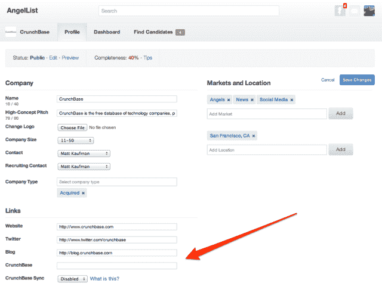
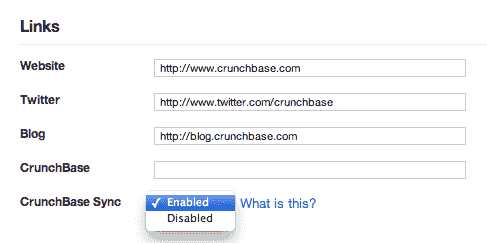

# CrunchBase 和 AngelList 有合作关系 TechCrunch

> 原文：<https://web.archive.org/web/https://techcrunch.com/2013/07/12/crunchbase-and-angellist-have-a-partnership/>

# CrunchBase 和 AngelList 有合作关系

过去，你必须支付一大笔钱才能获得私营科技公司的基本信息，比如它们筹集了多少资金，收购了谁。CrunchBase 免费提供。过去，你不得不花费大量的时间和金钱，试图通过网络获得天使投资者的资金。 [AngelList](https://web.archive.org/web/20221222081548/https://angel.co/) 免费提供。

现在，两人达成协议。

以下是基本情况。如果你在 AngelList 上有一家公司，你可以选择与 CrunchBase 同步——每天一次，你提供的任何公开信息都会自动导出到你的 CrunchBase 公司档案中。这将节省您在两个地方输入数据的时间，并帮助 CrunchBase 为公众提供更全面的数据集。这里的设置类似于 [CrunchBase Venture Program](https://web.archive.org/web/20221222081548/http://info.crunchbase.com/about/crunchbase-venture-program/) ，超过 240 家投资机构公开提供其投资组合的最新信息，以换取更好地访问 CrunchBase API 和团队。

这项功能已经测试了一周，超过 300 家 AngelList 公司已经选择加入，因此致力于这项功能的团队预计它会非常受欢迎。

与此同时，CrunchBase 正在为每一家在两个地方都有条目的公司链接回 AngelList(例如这里的)。一个链接将转到他们的主要 AngelList 页面，这对正在积极筹资的公司可能特别有用，另一个链接将 CrunchBase 用户导向该公司的 AngelList 工作列表页面。虽然团队没有透露围绕工作列表部分的收入分享协议，但我了解到有一个。

“我们正在搭建市场的脚手架，”AngelList 联合创始人 [Naval Ravikant](https://web.archive.org/web/20221222081548/https://twitter.com/naval) 告诉我。“创业生态系统越来越成熟，能够与 API 互联——就像股票市场、金融数据服务提供商和分析公司如何为上市公司工作一样。”他引用了 Mattermark 和 Dashboard.io 这两家初创公司的例子，这两家公司使用所有这些公开的初创公司数据来帮助公司和投资者找到合适的合作伙伴。

CrunchBase 总裁马特·考夫曼补充道:“当投资者使用像 AngelList 这样的服务寻找公司时，隐藏你的数据是没有意义的。”。“我们打算让 CrunchBase 成为这里的公共数据平台，因为我们认为更大的透明度将有助于每个人做出更好的决策。”

期待这两个组织能做出更多的贡献。Ravikant 一直在忙着利用 AngelList 来利用众筹的新变化以及其他一些举措。与此同时，CrunchBase 正在开发该网站的一个主要新版本，该团队表示，在未来几个月里，你将会听到更多关于这个版本的消息。