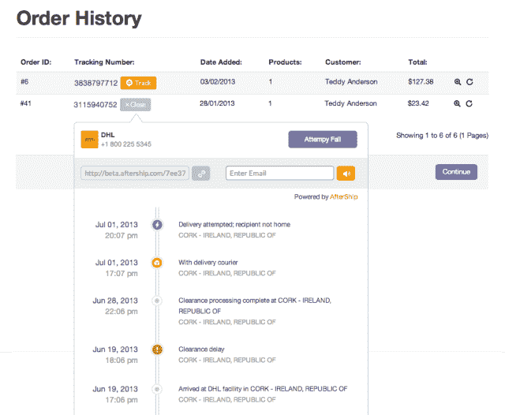
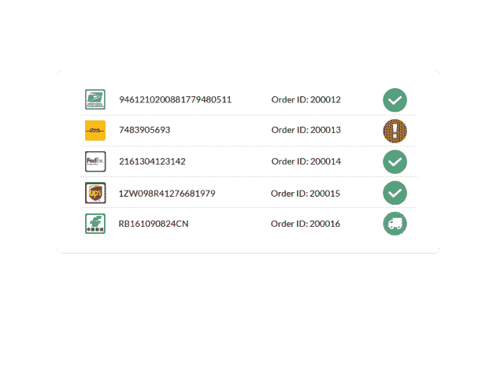
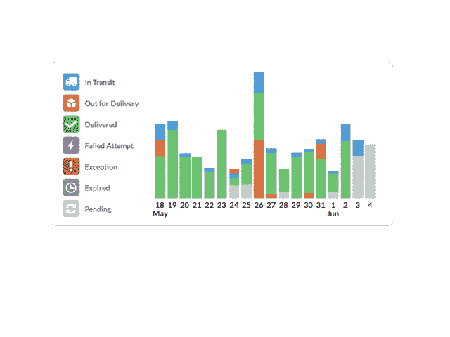

# 包裹追踪平台 AfterShip 推出新的追踪按钮插件和定价

> 原文：<https://web.archive.org/web/https://techcrunch.com/2013/07/14/package-tracking-platform-aftership-marks-its-public-launch-with-a-new-track-button-plugin-and-pricing/>

# 包裹追踪平台 AfterShip 以新的追踪按钮插件和定价标志着它的公开发布

[AfterShip](https://web.archive.org/web/20230119143018/http://www.aftership.com/) ，我们在 1 月份对[的小型电子商务商家的包裹跟踪平台，今天将离开测试模式并向公众推出。这家总部位于香港的初创公司还首次推出了一款易于使用的](https://web.archive.org/web/20230119143018/https://techcrunch.com/2013/01/15/aftership-launches-package-tracking-api-gives-amazon-style-post-sale-powers-to-any-online-merchant)[跟踪按钮小工具](https://web.archive.org/web/20230119143018/http://aftership.uservoice.com/knowledgebase/articles/169566-what-is-a-tracking-widget-g-tt-)，供不想处理 API 的供应商使用。通过插入一个简单的短代码(就像脸书的按钮插件一样)，发货后跟踪按钮将出现在电子商务网站的跟踪号码旁边，并允许客户无需离开页面即可查看交付信息。

AfterShip 给小商家提供了和亚马逊这样的电商巨头一样的工具。例如，它的 API 和跟踪按钮插件允许客户直接在电子商务网站上跟踪 85 家承运商的货物，增加了他们在那里花费的时间。商家可以使用 AfterShip 来改善客户服务，方法是设置自动短信通知，让买家知道货物何时延误或到达，以便他们记得在易贝等电子商务网站上留下反馈。

该平台还包括分析，让供应商比较不同运营商的表现。

“UPS 可能会说货物会在两天内到达，但没有人知道这是不是真的，”Chan 说。“我们把审核所有发货的权力还给商家，看他们是否真的按时发货。”

自从 2012 年 3 月推出私人测试版以来，AfterShip 已经跟踪了超过 100 万个包裹。AfterShip 的 4，000 名客户中约有 60%在美国，其余 40%的大部分在香港或 mainland China。Chan 说 AfterShip 的大部分用户都是销售高价值商品的小商家，比如电子产品、定制商品甚至金条。这家初创公司计划通过瞄准中国和拉丁美洲的更多商家来扩大规模，Chan 表示 AfterShip 的平台最终将能够进行自动翻译。

除了为其公开发布进行服务和设计升级之外，AfterShip 还调整了其定价等级以吸引更多的小供应商。用户可以免费跟踪包裹，而高级账户包括自动通知、以. CSV 文件导出货物的能力和 AfterShip 的 API 等功能。