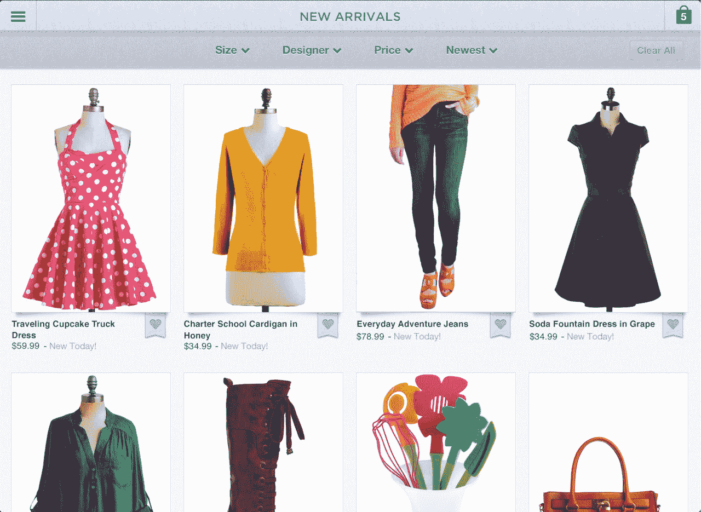
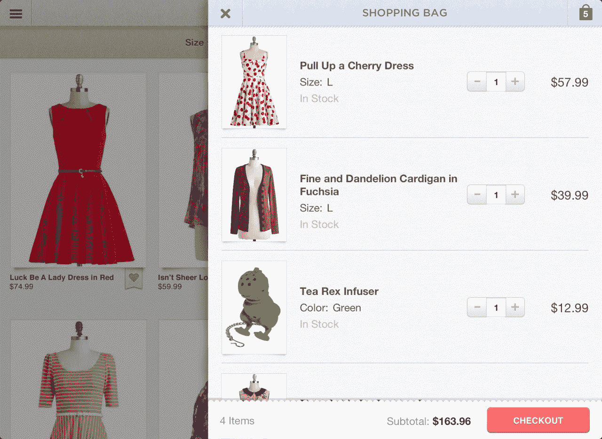
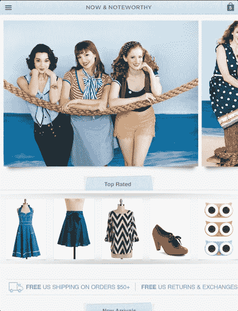
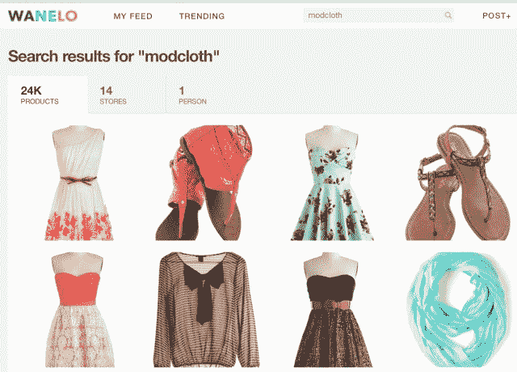

# 现在年收入超过 1 亿美元的 ModCloth 将首先进军移动领域 TechCrunch

> 原文：<https://web.archive.org/web/https://techcrunch.com/2013/07/19/modcloth-now-with-over-100-million-in-annual-revenue-is-going-mobile-first/>

以复古风格服装闻名的独立时尚网站 ModCloth ，今天首次发布了自 2009 年以来的收入情况。这家电子商务初创公司由大约 4800 万美元的外部资金支持，称其去年的收入超过 1 亿美元，目前年增长率超过 40%。这比 2009 年[报道的 1500 万美元有所增加。](https://web.archive.org/web/20221206122923/http://boss.blogs.nytimes.com/2010/01/08/modcloth/)

将这个数字与其他知名的电子商务行业参与者进行比较:Fab.com 去年的收入为 1.2 亿美元，现在的估值为 10 亿美元；超越机架[预计【2013 年约 2 亿美元；Rue La La 之前曾预计 2012 年的销售额为 4 亿美元；2012 年，金边债券的价值超过了 6 亿美元。与此同时，聚合商 Fancy 以不同的方式谈论销售额，](https://web.archive.org/web/20221206122923/http://www.theglobeandmail.com/report-on-business/economy/canada-competes/did-you-know-this-shopping-website-is-canadian/article5061065/)[声称](https://web.archive.org/web/20221206122923/https://beta.techcrunch.com/2013/07/08/a-month-after-going-international-social-commerce-platform-fancy-raises-53-million/)每天约有 10 万美元的交易。

公司首席执行官埃里克·科格解释说，ModCloth 的大部分销售是其知名服装，尽管网站上的其他商品，如泳装和鞋子，将会出现季节性上涨，他与妻子苏珊在 2002 年创建了 ModCloth。

##### 到年底，一半的 ModCloth 购物者来自手机市场

该公司取得进展的消息传出之际，整个电子商务行业正在学习适应新的移动格局，这不仅会影响人们购物的时间和地点，还会影响人们的购物方式。今年早些时候，ModCloth 开始利用这一趋势，在 2 月份首先在 iPad 上推出了应用程序，然后在那年春天晚些时候在 T2 推出了 iPhone 应用程序。

科格[最近将](https://web.archive.org/web/20221206122923/https://beta.techcrunch.com/2013/04/18/modcloth-iphone-app/) ModCloth 的业务描述为所有未来发展都将遵循“移动优先”的思维模式，他说该公司在移动领域的进展顺利，谈到了“增加参与度”等更软的指标，以及更直接影响 ModCloth 底线的指标。

“我们在这个应用程序上有更多的交易和购买，与移动网络应用程序相比非常显著，”他说。“我们预测，到今年年底，超过 50%的购物者将来自移动设备。”

从这个角度来看，就在去年圣诞节该公司注意到移动访问的激增已经开始占到 ModCloth 流量的近 30%。一年后，他们预计这个数字会增长到一半。

这种转变并非没有挑战——不仅仅是对 ModCloth，而是对任何希望在设备上保持和发展客户基础的电子商务公司来说，这些设备的受欢迎程度导致了个人电脑销量一个季度又一个季度的萎缩。在移动领域，电子商务企业需要考虑的事情包括:他们产品系列中的哪些商品最适合在移动设备上使用，访问者在一天中的什么时间购物，何时通过推送通知联系他们，他们需要如何为更小的屏幕修改他们的创意资产，以及他们如何将用户体验的各种元素转换为使用点击和滑动而不是鼠标悬停来工作，等等。

科格承认，他的公司还没有所有这些答案，它今天所知道的可能会随着时间的推移而改变。此外，即使他们找到了有效的方法，随着移动淘金热的继续，这些都是他们可能会保守的商业秘密。

##### 移动转换是不同的:每次访问更少，但随着时间的推移更多？

ModCloth 从其早期在 iOS 设备上的努力中了解到的是，在用户行为方面，很多事情已经发生了变化。客户似乎将该网站视为更像 Instagram 等社交应用的东西，而不是电子商务店面。自手机应用首次亮相以来，评论增加了 30%，上传到 ModCloth 的“自拍”画廊的穿着该公司服装的购物者增加了 60%。此外，从该应用程序进行社交分享的用户数量也增加了四倍，自该应用程序首次推出以来，“喜爱”(收藏功能)增加了 200%。

但是，如果用户把 ModCloth 当成一个社交应用，或者像 Wanelo 或 Fancy 这样的聚合器，这种参与就意味着他们真的在购买吗？这就是事情变得棘手的地方。科格的观点是，向移动的转变也意味着电子商务企业需要以新的方式思考转化。

 “这取决于你如何定义转化，”他说。“每次访问的转化率要低得多，这是大多数营销人员关注的指标。但如果你从每个独立购物者的转化率来看，这个数字要高得多。”他指出，这种缓慢的建立关系的体验从第一天起就是 ModCloth 的工作方式。

“每次访问的转化率真的是错误的看待方式，”科格补充道。“我们的目标是扩大客户群，并在(ModCloth 购物者的)衣橱中占据较大份额。”

让客户越来越多地访问移动应用程序会影响每次访问的转化率，但有助于实现更长期的目标，即让购物成为一项持续的活动，购物体验本身必须进行细分，以适应移动购物的方式。在用户经常启动他们最喜欢的应用程序的几分钟停机时间里，他们会花一些时间浏览和收藏，其他时间缩小选择范围并向购物车添加东西，然后回来完成结账过程，通过将用户支付和地址数据保存在文件中，这变得更容易。

##### 与聚合者竞争，还是从中受益？

但对于 ModCloth 和其他电子商务零售商来说，保持用户参与这一持续的流量可能会很困难，因为他们希望客户在大部分时间里与他们和他们的应用程序互动。跨品牌的时尚社区——像 Wanelo ( [在 iOS 的生活方式中排名第 20 位](https://web.archive.org/web/20221206122923/http://www.distimo.com/leaderboards/apple-app-store-for-iphone/united-states/lifestyle/free))和 Polyvore(排名第 36 位)今天的排名远远高于任何单一品牌，包括 ModCloth(排名第 110 位)。这些聚合器让用户在同样宝贵的几分钟停机时间里忙碌，同时也展示了各种竞争对手的风格和产品供选择。

对于 ModCloth 来说，这是一个挑战，可能必须通过为应用程序用户战略性地使用推送通知来解决，例如，确保在限量商品售罄之前提醒购物者。但最终，该公司希望社交媒体资源和聚合器将成为吸引新购物者的一种方式，然后他们会下载 ModCloth 应用程序并自行访问网站。

科格说:“我们的愿景和我们认为该行业的发展方向是，零售商支持独特的客户群体，这些零售商比任何其他零售商都更了解这些客户。”。“对于在 Pinterest 和 Wanelo 上发现我们的顾客来说，我们的任务是确保我们有如此令人兴奋的新商品流……以至于(购物者)直接来到我们这里。”

该公司拒绝提供交易或客户群的细节，只提到了它在 2012 年底发布的一张[信息图](https://web.archive.org/web/20221206122923/http://thenextweb.com/insider/2013/01/08/modcloth-2012-growing-50-percent-doubles-mobile-traffic/)，其中提到了该年发货的 120 万份订单。其社交媒体客户群(脸书 90.1 万，Pinterest 230 万)也说明了其用户群的大致规模。

至于该公司的下一步，计划是在 2013 年期间为其庞大的团队(目前约有 435 名员工)增加 100 人，包括扩大其位于洛杉矶的设计团队，专注于 ModCloth 的自有品牌。