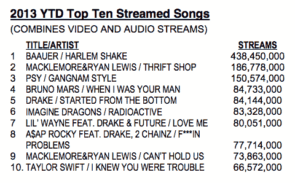

# 美国音乐销量下降，6 个月内流媒体音乐销量上升 24%，至 510 亿首；Harlem Shake 一路登顶 TechCrunch

> 原文：<https://web.archive.org/web/https://techcrunch.com/2013/07/19/u-s-music-sales-down-as-streaming-up-24-to-51b-tracks-in-6-months-harlem-shake-bumps-its-way-to-the-top/>

随着人们继续质疑艺人通过 Spotify 等流媒体音乐服务获得的报酬(T1)有多高，以及[可以做些什么来改善这种状况(T3)，尼尔森今天](https://web.archive.org/web/20230121164538/http://musically.com/2013/07/14/atoms-for-peace-quit-spotify-its-bad-for-new-music/)[发布了数字(T5 ),证明流媒体音乐如何在音乐销量下降的情况下崛起。2013 年前六个月，流媒体音乐增长了 24%，达到近 510 亿条，而专辑和等同曲目的总销量比一年前下降了 4.6%，目前为 2.1 亿部。此外，作为视频在流媒体游戏中发挥强大作用的一个标志，最受欢迎的曲目——遥遥领先——是 Harlem Shake，Baauer 曲目成为了所有人免费观看的](https://web.archive.org/web/20230121164538/http://www.nielsen.com/us/en/press-room/2013/nielsen-entertainment---billboards-2013-mid-year-music-industry-.html)[病毒视频](https://web.archive.org/web/20230121164538/https://techcrunch.com/2013/02/18/what-is-the-harlem-shake-so-popular/)的基础，每个人[和他们的](https://web.archive.org/web/20230121164538/https://techcrunch.com/2013/02/15/mandatory-fun/)[母亲](https://web.archive.org/web/20230121164538/http://www.youtube.com/watch?v=K54c_WeAN5M)都将自己的版本发布到 [YouTube](https://web.archive.org/web/20230121164538/http://www.youtube.com/results?search_query=harlem+shake&oq=harlem+shake&gs_l=youtube.12...0.0.0.139914.0.0.0.0.0.0.0.0..0.0.eytns%2Cpt%3D-30%2Cn%3D2%2Cui%3Dtr..0.0...1ac..11.youtube.) 上，以传播文化。

在截至 6 月 30 日的六个月中，Harlem Shake 被播放了 4.38 亿次，紧随其后的是来自麦克摩尔和瑞恩·刘易斯的旧货店，播放量为 1.87 亿次。这些不到 10 亿的数字也表明了长尾流媒体作为一个整体是如何的。

尽管流媒体需要更多的音乐和消费者的注意力，但数字音乐的整体情况仍然与 CD 销量的大幅下降形成鲜明对比。虽然 CD 销量下降了 14.2%，至 7820 万张，但数字销量却增长了 6.3%，至 6080 万张。尼尔森声音扫描和尼尔森 BDS 是分析小组的两个组成部分，他们编制定期的半年度报告，他们注意到数字专辑现在占所有专辑销售的 43%——高于一年前的 38%,但实际上低于六个月前[尼尔森](https://web.archive.org/web/20230121164538/https://techcrunch.com/2013/01/04/download-me-maybe-u-s-music-market-up-by-3-1-fuelled-by-1-3b-digital-track-sales/)发布的数字，当时数字专辑占所有销售的 56%。

或许更直接受到流媒体增长影响的是单轨数字下载市场——这是一个迹象，表明为什么像苹果这样传统上专注于下载的公司正在流媒体服务方面做得更多。单曲下载量下降了 2.3%，至 6.82 亿(记住:这是在有 510 亿个流的时期)。

SVP 尼尔森娱乐公司的大卫·巴库拉写道:“2013 年上半年，整体销量略有下降，但数字专辑销量仍有令人鼓舞的增长。”。但对于实体销售来说，并不都是惨淡的。黑胶唱片仍然在那里挂着，并在增长，尽管在这一点上更像是一个利基/新奇的业务。售出了 290 万张黑胶唱片，比一年前增长了 33.5%。

更详细地看看尼尔森的一些调查结果，在流行歌曲和专辑中，购买数字格式的人和选择更传统格式的人之间存在一些差异，但总的来说，当谈到标签的定位时，情况更加一致，环球音乐是每个类别中最大的玩家，尼尔森绘制了这一比例。它在数字和实体音乐领域的市场份额达到 35%甚至更高——这是该公司整合的一个迹象，一年前它还在与索尼音乐竞争。

与此同时，那些在流媒体领域最受欢迎的公司不一定能将其转化为销售额。尽管由于这些病毒式的视频，哈林 Shake 是最受欢迎的流媒体歌曲，但它未能进入单曲销量前十。就回报而言，更有利可图的是麦克摩尔，他的排名第二的曲目《旧货店》也是最畅销的数字歌曲，播放量排名第五的广播歌曲(我认为这并不是收入的驱动因素)。它也是排名第三的数字专辑和排名第七的实体专辑。

贾斯汀·汀布莱克(Justin Timberlake)是所有专辑类别中最畅销的艺术家，无论是实体还是其他类别，而他与 Jay-Z 的西装领带在数字歌曲中排名第七，但在流媒体方面没有进入前十，尽管今年早些时候 MySpace 的 prime 定位是。

完整的报告嵌在下面。

[scribd id = 154714584 key = key-13fo 574 wat 91 cl 60 hvaw mode = scroll]