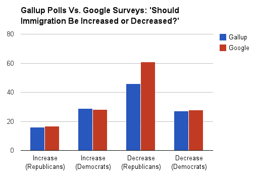

# 谷歌调查可以让任何人成为专业民调专家

> 原文：<https://web.archive.org/web/https://techcrunch.com/2013/07/20/how-google-surveys-could-turn-anyone-into-a-professional-pollster-as-shown-in-1-graph/>

# 谷歌调查可以让任何人成为专业的民意测验专家

内特·西尔弗和我都是谷歌消费者调查工具的超级粉丝，他们来自 T2。“也许用不了多久，谷歌，而不是盖洛普，就会成为民意调查中最受信任的名字，”西尔弗在谈到谷歌如何进行 2012 年选举周期中最准确的民意调查之一时写道。

但我不知道它们对媒体有多大用处，直到我能够以很小的成本复制一个相同的非选举盖洛普民意测验。上周，盖洛普发布了一项关于美国人(相对)反移民态度的重要民意调查，这是我见过的证明移民改革为何如此难以通过的最佳证据之一。

事实证明，没有人需要等待盖洛普或任何专业机构来实施这些非常重要的民意晴雨表。我花了大约 10 分钟用谷歌的调查向导工具重现了盖洛普自己的民意调查。

对于“在你看来，移民应该保持在目前的水平，增加，还是减少？”，除了两个问题，谷歌的每个答案都在几个百分点之内(对希望减少移民的共和党人来说，它下降了 15%，对希望将移民保持在“现有水平”的共和党人来说，它下降了 12%)。

这是详细的表格

|  | 姓氏 | 谷歌 |
| 增加(共和党人) | 16 | 16 |
| 增加(民主党) | 29 | 28 |
| 增加(独立) | 22 | 21 |
| 减少(共和党人) | 46 | 61 |
| 减少(民主党) | 27 | 28 |
| 减少(独立) | 35 | 41 |
| 当前水平(民主党) | 36 | 38 |
| 当前水平(共和党) | 42 | 20 |
| 当前级别(独立) | 41 | 34 |

不清楚谷歌对共和党的回答是否是错误的。互联网和电话调查自然有不同的回应人群，因为互联网偏向年轻人，而电话偏向老年人(人们还有电话吗？).一些人可能不愿意在电话中说他们想减少移民，然而他们完全愿意让他们内心的排外情绪在一个没有面孔的电脑屏幕上爆发。

要想知道谷歌何时能取代专业的投票操作，还需要更多的测试。不过看起来很有希望，现在就可以开始用了。

美国的每所新闻学院都应该教授学生(非常困难的)调查方法科学，这样他们都可以开始为自己的故事添加更多客观证据——因为，多亏了谷歌，他们都有能力成为民意测验专家。

颜色这个作家兴奋，更美味的信息统计来了。