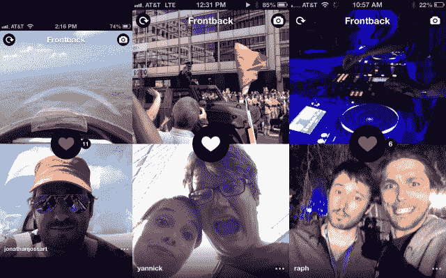

# Frontback 是一款非常个性化的照片拍摄应用，可以捕捉转瞬即逝的瞬间

> 原文：<https://web.archive.org/web/https://techcrunch.com/2013/07/22/frontback-is-a-deeply-personal-photo-taking-app-to-capture-fleeting-moments/>

来自[check 这个](https://web.archive.org/web/20230328012702/http://checkthis.com/)、 [Frontback](https://web.archive.org/web/20230328012702/http://frontback.me/) 是一个简单的 iPhone 拍照应用程序，可以捕捉发生的瞬间。你启动应用程序，给你面前的东西拍照，给你的脸拍照，然后在 Instagram、Twitter 或脸书上分享数字拼贴画。它会让人上瘾，非常容易理解，更重要的是，它非常个性化。

“人们告诉我们，他们希望看到他们的朋友，而不仅仅是他们的朋友看到的东西，”联合创始人兼设计师弗雷德里克·德拉·法伊勒告诉我。“我们想拥有这张自拍，”他继续说道。

前后概念并不新鲜。当你[在 Checkthis 上发帖](https://web.archive.org/web/20230328012702/https://techcrunch.com/2012/12/11/checkthis-updates-its-social-posters-share-visually-compelling-content-without-setting-up-a-blog/)时，你可以添加任意多的照片、文字和标题。大约四个月前，Della Faille first [在 Checkthis 上发布了两张关于纽约美丽风景和他的反应的照片。他同时解释了“前锋”的概念。](https://web.archive.org/web/20230328012702/http://checkthis.com/s374)

在过去的几个月里，我开始注意到越来越多的用户在 Checkthis 上发布#frontback 图片。就像在 Twitter 的早期，一个用户发明了一个新的用例——除了这一次，用户是 Checkthis 的联合创始人。没有任何#frontback 向导工具来简化创建它们的过程。用户只是在体验这种新发现的行话和艺术规则。

### 都是沉浸自己，设身处地为朋友着想。

进入应用程序 Frontback。今天在 App Store 发布。现在，正反面照片周围没有空白，绝对没有铬合金。照片本身没有任何滤镜。这只是两张大约四方形的照片叠放在一起，填满了你 iPhone 的整个屏幕。都是沉浸自己，设身处地为朋友着想。

Instagram 设计师 Tim Van Damme 最近告诉 Della Faille，“它比 Instagram 上的一张照片传达了更多的信息。“两张照片改变了一切，”德拉·菲勒告诉我。“在 Instagram 上，你分享一些东西，因为它很美，但你不分享背景，”他继续说道。

Frontback 不是另一个社交网络。目前，它建立在 Instagram、脸书和 Twitter 之上。当一个朋友加入 Frontback，你自动跟随他或她，而不需要做任何事情。当然，你可能会开始在推特、脸书和 Instagram 上看到他们的正面帖子。

Della Faille 现在希望用户能够启动 Frontback 应用程序来捕捉转瞬即逝的瞬间，就像他们会启动默认的相机应用程序一样。他平静地浏览了几个伟大的前后传球的例子。“这个家伙在驾驶飞机的时候想的是前后颠倒。这家伙在新比利时国王游行的时候会考虑打前锋。当这个人遇到阿戈里亚时。所有这些都发生在周末。”

