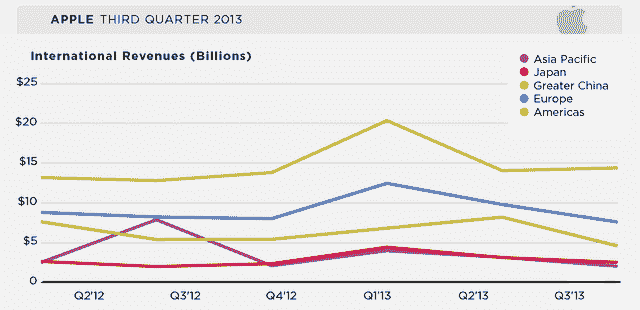

# 由于国际销售疲软，苹果 2013 年第三季度在中国的收入骤降至 46 亿美元，在 Q2 下降了 43%

> 原文：<https://web.archive.org/web/https://techcrunch.com/2013/07/23/apple-international-q3-2013/>

在 Android 和其他平台上的低成本智能手机制造商的压力下，[苹果](https://web.archive.org/web/20221007022226/http://www.apple.com/)今天[报告其在大中华区的第三季度收入](https://web.archive.org/web/20221007022226/http://www.businesswire.com/news/home/20130723006564/en/Apple-Reports-Quarter-Results)大幅下降，大中华区包括台湾、香港和世界上最大的智能手机市场 Mainland China。在该地区，销售额为 46.4 亿美元(包括零售在内为 49 亿美元)，比去年下降了 14%，比上一季度下降了 43%。这与 Q2 报告的 82 亿美元形成了惊人的对比，据[首席执行官蒂姆·库克](https://web.archive.org/web/20221007022226/https://beta.techcrunch.com/2013/04/23/apple-international-sales-q2-2013-china/)称，这是苹果在该地区创下的纪录，当时它是唯一一个连续增长的地区。总体而言，美洲之外的国际销售额现在不到 48%，而上个季度为 56%，2012 年第四季度为 61%。

它表明，虽然 Flurry today 指出苹果是目前中国活跃的智能手机和平板电脑中最受欢迎的品牌，但今天的收益表明，该公司在未来几个月可能会面临保持这一头衔的挑战。

苹果非美洲地区的其他销售类别也出现了下滑——唯一的例外是日本，它仍然是该公司增长较为强劲的市场之一。欧洲——仍然感受到经济衰退的压力以及低价手机的竞争——下降到 76 亿美元，比去年下降 8%，比上一季度下降 22%。除中国和日本以外的亚太地区收入为 20.5 亿美元，同比下降 18%，环比下降 35%。与此同时，日本的收入为 25.4 亿美元，比去年增长 27%，但比上一季度下降 19%。苹果首席财务官皮特·奥本海默在电话会议上指出，iPhone 在日本的销量增长了 66%。

苹果在国际上面临的一大问题仍然是，它将如何继续在新兴市场发展，该公司将继续感受到来自低成本手机制造商的价格压力。即使不推出可能影响公司利润率的低成本设备——许多人认为该公司会这样做——iPhone 已经看到其平均售价下降，并继续对其利润率产生影响。

事实上，您可以从下图中看到，在大中华区经历了几个季度的增长后，该地区的收入排名现在明显低于欧洲，而在此前，该地区似乎有可能超过欧洲，成为仅次于美洲的第二大地区。后者包括苹果最大的本土市场美国。

我们现在正在听取收益电话会议，并将根据该公司在国际方面给出的任何有趣的颜色进行更新。

**从谓**。首席执行官库克在国际业务表现如何的问题上进行了辩护。在大中华区，当他被问及对上一季度增长下降 43%的看法时，他承认“中国在本季度表现更弱”，但他也表示，“对收入的关注并不能说明全部情况……在(增长的)弧线上，我不会因为可能有经济和其他因素的 90 天周期而感到沮丧。”

他指出，大中华区的总销售额占公司总收入的 14%，在追溯基础上为 270 亿美元。本季度 iPad 销售强劲，比去年增长了 50%。他还指出了生态系统方面更积极的迹象，现在有超过 50 万名开发者在开发 iOS 应用程序。库克还重申了公司去年将零售店数量翻一番的承诺。

库克提到的其他增长的国际市场包括印度，增长了 400%，波兰增长了 60%，土耳其增长了 140%。

库克还被问及苹果在俄罗斯的情况，三大运营商 MTS、Beeline 和 Megafon[已经停止销售 iPhone](https://web.archive.org/web/20221007022226/http://tech.fortune.cnn.com/2013/07/16/apple-russia-iphone-nyet/) 。

库克对此轻描淡写，似乎完全不予理会:“如果你看看俄罗斯市场，超过 80%的手机是在运营商商店以外的零售渠道销售的，”他说。“上个季度，我们在俄罗斯的激活量创下了有史以来最高的季度记录。”

当然，这也混淆了 iPhone 相对于其他设备的表现。IDC(通过[《财富》](https://web.archive.org/web/20221007022226/http://tech.fortune.cnn.com/2013/07/16/apple-russia-iphone-nyet/))指出，苹果在智能手机市场的份额从一年前的 9%下降到上个季度的 8.3%。

