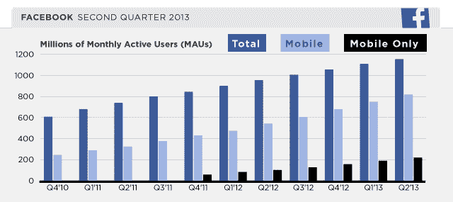
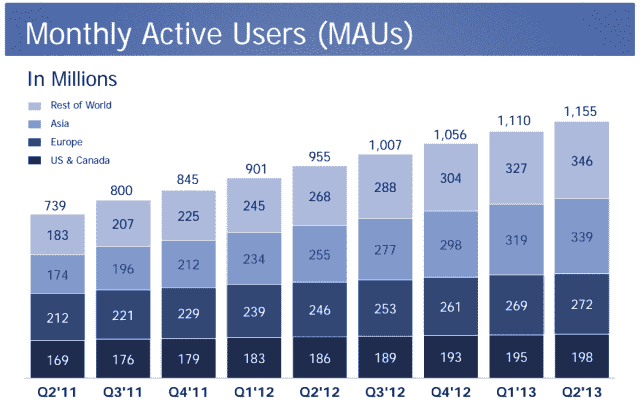
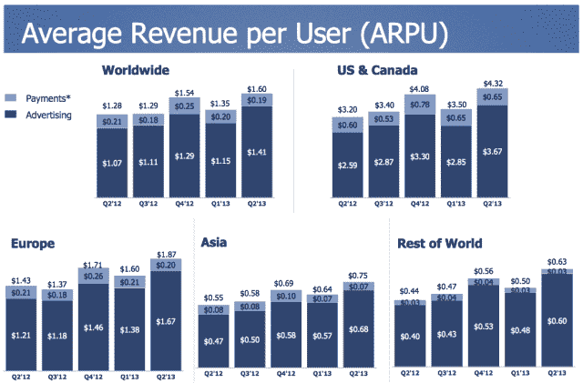

# 脸书 Q2:月度用户同比增长 21%至 15 亿，日报增长 27%至 6.99 亿，移动月度用户增长 51%至 8.19 亿| TechCrunch

> 原文：<https://web.archive.org/web/https://techcrunch.com/2013/07/24/facebook-growth-2/>

在 2013 年的 [Q2，脸书月活跃用户从 Q1 年末的 11.1 亿增长到 11.5 亿，日活跃用户从 6.65 亿增长到 6.69 亿，移动月活跃用户从 7.51 亿增长到 8.19 亿。不过，这些总数并不能说明全部情况，因为脸书的大部分增长来自亚洲和发展中市场，在这些市场，它从每个用户身上赚的钱没有那么多。](https://web.archive.org/web/20230224135437/http://investor.fb.com/releasedetail.cfm?ReleaseID=780093)

2013 年 6 月，移动日平均活跃用户达到 4.69 亿。截至 6 月底，脸书的纯移动用户数量从 Q1 的 1.89 亿增长到了 2.19 亿。今年 6 月，脸书的日均通话时长为 200 亿分钟，相当于每位用户每天 17.39 分钟，或每位用户每月 8.3 小时。在财报电话会议上，首席执行官马克·扎克伯格表示，[脸书的数据显示，青少年没有逃离社交网络](https://web.archive.org/web/20230224135437/https://techcrunch.com/2013/07/24/teens-on-facebook/)，脸书在美国青少年中接近完全渗透，青少年仍然稳定地使用该服务。

至于社交网络带来的收入，脸书的收入达到 18.1 亿美元，增长 53%，移动广告收入占 41%。你可以在这里看到脸书的全部财务收益数据[。](https://web.archive.org/web/20230224135437/https://techcrunch.com/2013/07/24/facebook-q2-earnings-beats-with-1-81b-in-revenue-up-53-mobile-hits-41-of-ad-revenue/)

脸书增长的其他亮点包括，Instagram 在功能发布后的头 24 小时内就有 500 万视频上传，最近达到了 1.3 亿用户。脸书每部手机的月活跃用户数最近突破了 1 亿，这距离脸书推出丰富的功能手机版仅两年时间。脸书收购的 Parse 上个月宣布，在其移动后端即服务平台上已经开发了 10 万个应用，而脸书收购时只有 6 万个。

按地理位置细分用户增长，我们看到脸书在 Q1 的日活跃用户(DAU)从 1.39 亿增长到 1.42 亿，增长了 2.15%，在 Q2、美国和加拿大的月活跃用户(MAU)从 1.95 亿增长到 1.98 亿，增长了 1.53%。欧洲增长更慢，DAU 仅增长 1.67%，毛仅增长 1.11%。

但在亚洲和世界其他地区，脸书仍在快速增加用户。在“世界其他地区”，脸书本季度 dau 增长 8.33%，从 1.8 亿增加到 1.95 亿，mau 增长 5.81%，从 3.27 亿增加到 3.46 亿。在本季度增长最强劲的市场中，亚洲的 DAU 增长了 8.38%，从 1.67 亿增加到 1.81 亿，MAU 增长了 6.26%，从 3.19 亿增加到 3.39 亿。

重要的是要明白，总体增长数字并不一定能解释脸书的业务正在发生什么。脸书目前的大部分增长来自发展中市场，在这些市场，它的人均收入没有 ARPU 那么高。全球范围内，脸书的每用户收入为 1.60 美元，但在支撑其增长的“世界其他地区”的每用户收入仅为 0.63 美元。

不幸的是，脸书仍然没有按地理位置统计其移动用户的增长。这使得它模糊了其移动增长是否主要来自发展中国家。

总体而言，这是脸书又一个用户增长相对稳定的季度。虽然它在第一世界可能已经没有用户了，但它仍设法在亚洲和世界其他地区实现了本季度约 8.3%的增长。尽管反对者声称脸书肯定会失去冷静并碰壁，但它仍在不断壮大，并进一步巩固其作为关键通信工具的地位。

