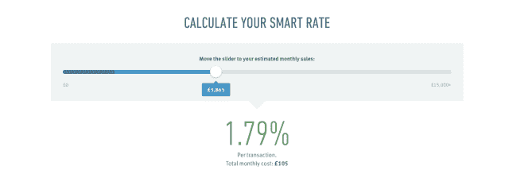

# iZettle 以低至 1.5%的每笔交易费用击败其英国移动 POS 竞争对手 TechCrunch

> 原文：<https://web.archive.org/web/https://techcrunch.com/2013/07/24/izettle-lowers-fee/>

移动读卡器领域在欧洲是一个拥挤的领域，尽管美国的先行者 Square 仍未涉足。竞争者包括 iZettle、火箭互联网支持的 Payleven 和 SumUp。这三家公司都采用相同的固定费用结构，每笔交易收取 2.75%的费用，没有月费，这使得初创公司能够将卡支付纳入小企业的支付范围。或者更确切地说，他们一直共用这个费率，但 iZettle 决定通过推出新的每笔交易定价结构来改变目标，这意味着其费用可以低至 1.5%，具体取决于每笔业务的月销售额。

iZettle 保持每笔交易 2.75%的上限，但一旦小企业每月超过 2000 英镑，费用就开始下降，降至 1.5%。iZettle 正在自己进行降价计算，为了简单起见，英国 MD Jens Münch 表示，将对本月所有交易收取 2.75%的费用，然后进行月底结算。销售额超过 2，000 英镑的企业将获得返现，返现率根据与其月总销售额相关的折扣率而定。

“2.75%的(利率)是美国的后遗症，”明希告诉 TechCrunch。“Square 基本上说是 2.75%，因为美国的成本结构与欧洲有很大不同，这是(欧洲移动支付初创公司)带来的。所以我们知道，在某个时候，这将受到挑战。”

明希表示，iZettle 评估了各种降低费率的选择，包括费率区间和收取月费，但最终确定了一种基于月交易量的滑动降低费用，以尽可能简化其小企业客户的事情，同时仍然创造了一个新的更低的费用下限，以削弱其竞争对手。

iZettle 已经创建了一个在线滑动工具,让企业可以直观地看到随着月销售额的增加，税率是如何下降的:

这家初创公司已经在向客户提供(免费)分析工具，蒙克强调这是其差异化战略的核心部分。他说:“让小企业感兴趣的唯一方法是，首先消除(用信用卡支付)太贵的说法。”。“然后你们可以谈谈我到底得到了什么？我可以有一个产品库，我可以有一个完整的 POS 系统，我可以用它来记账，我可以用它来记录我的现金。

“分析是我们区别于竞争对手的地方。如果你想注册 SumUp 或 Payleven，你只需输入金额，然后付款，就可以了。我们正在做的所有事情，即一个月内有多少客户会再次光顾，我们可以告诉你，或者一周。他们中的许多人会使用同一张卡，这是重复访问的一个很好的代理…或者我们可以告诉你在过去的一周或一天里你最畅销的产品。在接下来的几周和几个月里，我们也在不断改进。”

“令人兴奋的不是支付，令人兴奋的是我们在此基础上建立的所有东西，”他补充道。

iZettle 正在将英国作为降低费率的试验平台，以期将其推广到目前运营的其他市场，即:西班牙、德国、瑞典、丹麦、挪威、芬兰以及最近的墨西哥。然而，明希表示，由于地方差异，这种方法可能不会在它经营的每个市场都有意义。“有趣的是，欧洲的市场不同，所以我不确定这将是一个放之四海而皆准的模式，”他说，并补充说墨西哥也是独特的。

iZettle 尚未公布每个市场或所有运营市场的客户数量，但在评论目前的英国牵引 Münch 时说:“我看到了真正的巨大增长。”