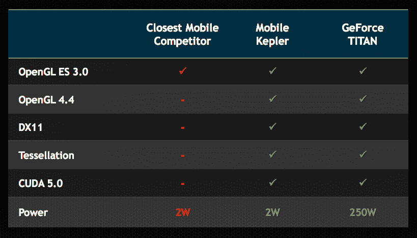
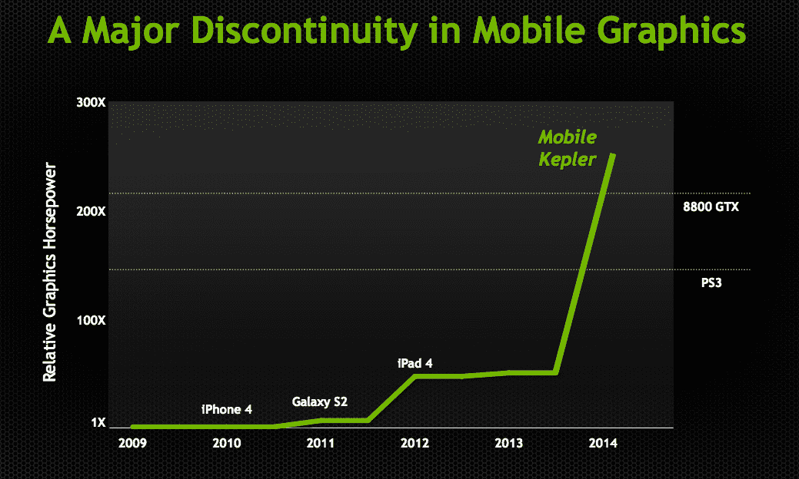

# Nvidia 将 Kepler 引入移动设备，提供与 iPad 4 相同的图形处理能力，但电池消耗只有 iPad 4 的三分之一 TechCrunch

> 原文：<https://web.archive.org/web/https://techcrunch.com/2013/07/24/nvidia-brings-kepler-to-mobile-offers-same-graphics-power-as-ipad-4-with-one-third-the-battery-drain/>

# Nvidia 将 Kepler 引入移动设备，提供与 iPad 4 相同的图形处理能力，而电池消耗只有 iPad 4 的三分之一

在本周举行的 SIGGRAPH 大会上，Nvidia 就移动游戏的未来做出了一项潜在的重大宣布:该公司将通过其 Project Logan 下一代移动处理器将其 [Kepler 图形架构带到移动设备](https://web.archive.org/web/20221205105949/http://blogs.nvidia.com/blog/2013/07/24/kepler-to-mobile/)。Nvidia 将这一发展与 14 年前第一款 GPU GeForce 256 的推出相提并论。Nvidia 表示，Logan 作为一个平台，凭借其开普勒 GPU，将移动计算向前推进了相当于 7 年的进步。

Nvidia 表示，在此之前，移动设备还没有真正支持完整桌面功能集的 GPU。这包括更好的渲染和模拟技术，如镶嵌，高级物理和抗锯齿，以及在一次通过中计算照明效果渲染的能力。所有这些都是非常技术性的，但最终意味着许多游戏机游戏可用的技巧和功能将被带到移动设备上。

 开普勒已经在桌面 GPU 中使用，在 Nvidia 的桌面设计中，它也可以承担通用计算，以帮助处理工作负载，即使你不在玩《使命召唤》。开普勒手机也可以提供这一功能，这意味着具有计算成像、计算机视觉、增强现实或语音识别等功能的移动应用程序将能够受益于开普勒 GPU，不仅可以利用其处理能力，还可以利用其能效。

为了展示开普勒的力量，Nvidia 发布了一段视频，展示了实时生成的逼真的人类头部模型。演示本身并不新鲜——今年早些时候在一台使用开普勒的台式电脑上展示过。但这一次，开普勒的移动洛根处理器为渲染提供了动力，这使得这成为开普勒对移动游戏和移动计算整体状况的影响的一个非常明显的证明。

 许多人认为移动游戏和桌面游戏不会发生冲突——由于不同的图形能力、控制方案等，它们将各得其所，并提供不同的功能。但通过开普勒，英伟达表明它正在提供技术，以进一步模糊桌面和移动之间的界限，并在一些人认为可能发生的时间之前提供这种技术。

【YouTube http://www.youtube.com/watch?v=Vx0t-WJFXzo？feature = player _ detail page & w = 640 & h = 360]