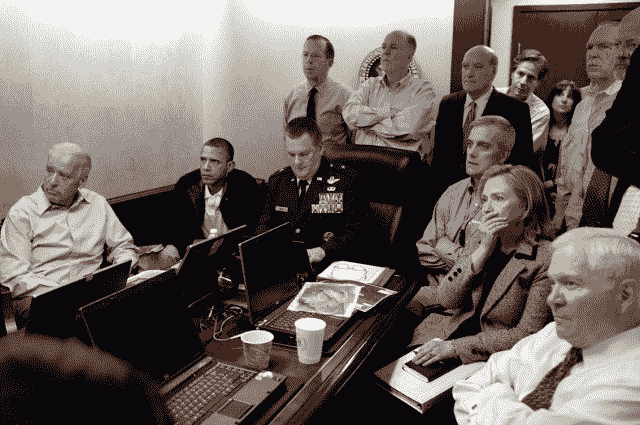

# 白宫摄影师 Pete Souza 在 insta gram TechCrunch 上向更广泛的观众展示他的摄影作品

> 原文：<https://web.archive.org/web/https://techcrunch.com/2013/07/24/white-house-photographer-pete-souza-takes-his-photography-to-a-broader-audience-on-instagram/>

# 白宫摄影师皮特·索萨在 Instagram 上向更广泛的观众展示他的摄影作品

今天，著名且受人喜爱的白宫首席摄影师 Pete Souza [宣布](https://web.archive.org/web/20221006203352/https://twitter.com/petesouza/status/360038211441004544)他已经加入 Instagram，将他的部分作品带入一个新的数字领域。他在[稍后的推特](https://web.archive.org/web/20221006203352/https://twitter.com/petesouza/with_replies)中证实，他将只上传用智能手机拍摄的照片，尽管他似乎不确定他目前的手机是什么型号。

Instagram 账户的内容将与白宫的 Flickr 账户分开。在脸书拥有的平台上的最初几个小时，Souza 已经积累了相当可观的 2300 名粉丝。到今天结束时，这个数字将是五位数。

你可以[在 Instagram 上点击](https://web.archive.org/web/20221006203352/http://instagram.com/petesouza)关注 Souza。

苏扎很重要，因为他对奥巴马政府的运作了如指掌。作为一个例子，他举了一张白宫的标志性照片，上面显示的是情报室正在等待导致奥萨马·本·拉登死亡的突袭的消息。仅在 Flickr 上就有 270 万次点击:

苏扎的 Instagram 的内容似乎比他的其他努力更平淡无奇。他的第一张总统印章的照片几乎是陈词滥调，但也许对 Instagram 的年轻观众更有吸引力:

正如《The Verge》在《T4》中指出的，鉴于奥巴马政府在互联网上异常活跃，Souza 出现在 Instagram 上并不令人惊讶。其他人也努力效仿这一成功，比如安·罗姆尼加入 Pinterest。

或许我们可以把 Souza 的举动视为 Instagram 现在和脸书一样酷的象征。

*上图，第一张图片来源:[白宫](https://web.archive.org/web/20221006203352/http://www.flickr.com/photos/whitehouse/)*