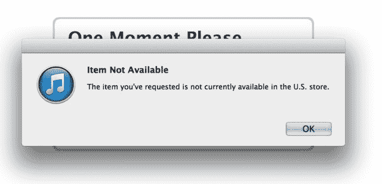
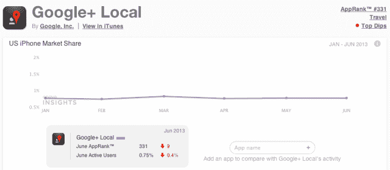
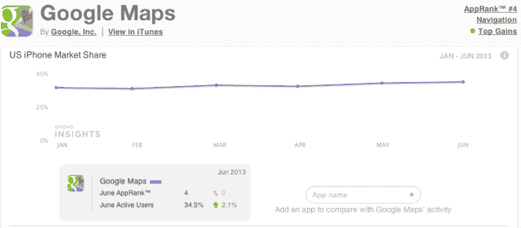
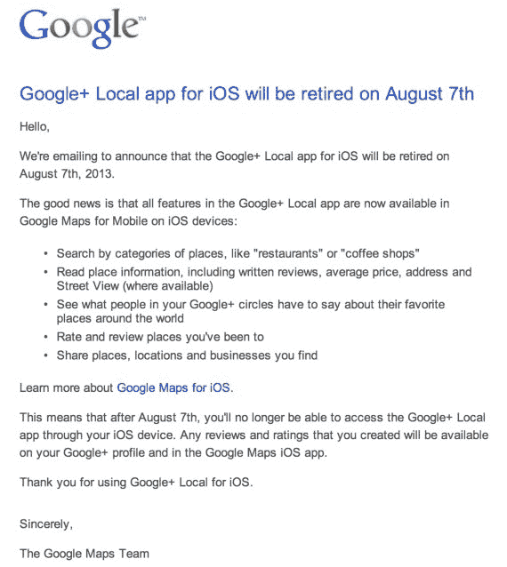

# 谷歌封杀 iOS 版 Google+ Local，该应用现已从 iTunes 应用商店 TechCrunch 下架

> 原文：<https://web.archive.org/web/https://techcrunch.com/2013/07/26/google-kills-google-local-for-ios-app-now-pulled-from-itunes-app-store/>

据网上流传的一篇报道称，谷歌将于 8 月 7 日正式退出其 iOS 版 Google+本地应用。然而，据我们所知，该应用程序已经从苹果的 iTunes 应用程序商店中删除，当点击指向该应用程序的链接时，会显示“您请求的商品目前在美国商店中不可用”的信息

被许多出版物引用的这份报告是基于 [9to5Mac 的博客文章](https://web.archive.org/web/20221207154132/http://9to5mac.com/2013/07/25/google-local-to-be-retired-august-7/)，它指的是一封由线人发送的电子邮件。我们也获得了一份电子邮件的副本，是由[马克·特拉普哈根](https://web.archive.org/web/20221207154132/http://google.com/+MarkTraphagen)转发给我们的，他在 Google+上发布了该应用被关闭的消息。(参见下面的完整电子邮件)。

在邮件中，谷歌解释说，iOS 上的 Google+ Local 应用程序将于 8 月 7 日退役，因为谷歌地图应用程序的更新版本现在可以提供本地应用程序曾经提供的许多功能，包括按地点类别搜索、阅读地点信息、评论、价格和地址的能力，以及对你去过和发现的地点进行评级、评论和分享的能力。

此外，该邮件称，在 8 月 7 日之后，用户将无法在他们的 iOS 设备上访问 Google+本地应用，但任何评论和评级都可以在他们的 Google+个人资料和 iOS 版谷歌地图应用中看到。

然而，[从谷歌搜索结果或其他网页到应用程序](https://web.archive.org/web/20221207154132/https://www.google.com/url?sa=t&rct=j&q=&esrc=s&source=web&cd=6&ved=0CFIQFjAF&url=https%3A%2F%2Fitunes.apple.com%2Fus%2Fapp%2Fgoogle%2B-local%2Fid406513617%3Fmt%3D8&ei=5nvyUZWOLYyA8gTTlID4DA&usg=AFQjCNGnoTuQF9PLaZiNW45a3K08sbcGpw&sig2=Lpa7rEnnN7Rbrfmrnjdj7w&bvm=bv.49784469,d.eWU&cad=rja)的实际链接目前已经断开。此外，在 iOS 应用商店中搜索[所有谷歌应用](https://web.archive.org/web/20221207154132/https://itunes.apple.com/us/artist/google-inc./id281956209)显示该应用不再可用。(尽管我们确实发现~~似乎是对谷歌坐标~~ [的 beta 测试。哎呀，那是一款](https://web.archive.org/web/20221207154132/https://itunes.apple.com/us/app/google-coordinate/id562220757?mt=8)[企业级产品](https://web.archive.org/web/20221207154132/http://www.google.com/enterprise/mapsearth/products/coordinate.html)。我们知道。)

9to5Mac 的博客文章使用了一个 App Store 附属链接指向 Google+本地应用，现在这将重定向点击谷歌地图 iOS 应用的用户。

我们已经联系了谷歌来确认这一情况，但这似乎是显而易见的。iOS 版 Google+ Local 不复存在，尽管现在还不到 8 月 7 日。(更新:谷歌证实该应用程序正在退役。)

尽管大部分功能现在已经转移到了谷歌地图上，但本地应用因其独特的关注点而非常有用，这使其成为本地列表的便捷工具。地图是一个更强大、功能更丰富的应用程序，当你需要速度时，它并不总是最好的。但最近几周，这款本地应用并没有得到太多关注，导致应用商店出现了几条负面评论，用户纷纷抱怨。一个人甚至说这个项目“已经被搁置了”，谷歌应该“直接放弃它”。

看来谷歌做到了。

在谷歌的拉里·佩奇时代，该公司一直忙于精简其产品阵容和开发领域，重点放在社交平台 Google+上。Google+已经在网络上吸收了 Local，但 Google+ iOS 应用尚未在侧边栏中包含“Local”选项，这就是为什么邮件可能会将用户指向 Google Maps 旗舰应用，而不是它和 Google+应用。

Google+ Local 不仅重复了在其他地方能得到更好服务的功能，应用程序本身也在努力获得采用。Onavo Insights 报道称，该应用在美国 iPhone 用户中的覆盖率不到 1%。今年 6 月，不到 0.75%的美国 iPhone 用户至少打开过一次这款应用，相比之下，有近 35%的用户打开过谷歌地图。

【T2

下面，谷歌发给 Google+本地用户的邮件全文如下:

