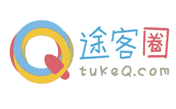

# 16 家中国创业公司在 ChinaBang 大会上大放异彩 

> 原文：<https://web.archive.org/web/https://techcrunch.com/2012/02/25/16-chinese-startups-chinabang/>

***编者按**:客座作者卢刚、本江和 Jason Lim 是中国双语博客 [TechNode](https://web.archive.org/web/20230209111224/http://www.technode.com/) 的编辑。*

上周末，为期两天的 ChinaBang 大会在北京举行，这是一年一度的盛会，关注本地创业、创新和创业。在中国本土初创企业创始人和企业家的主题演讲和小组讨论中，颁奖典礼表彰了 2011 年最佳中国初创企业和创始人，并举办初创企业启动大赛。ChinaBang 的 Launchpad 竞赛由 TechNode 组织，有 16 个团队向 14 名评委(来自 GSR Ventures、IDG、祁鸣、Matrix Ventures、Atomico、Singtel、Paypal、Innovation Works、CyberAgent、Rovio、Infinity Ventures、泰山、CSDN)和现场观众进行了推介。每支队伍都有 10 分钟的时间上台陈述——5 分钟的演讲时间和 5 分钟回答评委问题的时间。裁判以 10 分制给每个队打分。然后根据平均得分对团队进行排名，产生前三名，他们都将获得包括现金和海外旅行在内的奖励。

这是在 launchpad 中展示的所有初创公司的概要。

**一等奖:TukeQ——赢得 10000 元人民币和一趟“愤怒的小鸟”的故乡芬兰之旅**

 创始人 Alex Su 展示了他的社交网络和移动旅行组织应用程序的一个有吸引力的演示， [TukeQ](https://web.archive.org/web/20230209111224/http://tukeq.com/) 。TukeQ 作为创新工厂的前孵化器，其巨大潜力已经得到认可。在他的演示中，Alex 展示了用户直观快速地将活动或名胜拖放到旅程中的能力。精彩的是，地图会自动填充从 A 到 B 到 c 的路线。例如，如果你在澳大利亚的悉尼，想从邦迪海滩到环形码头再到唐人街，你的行程会告诉你何时何地去，并标出路径。最引人注目的是它利用社会关系的能力。意思是，我网络中的人可以推荐要去的地方和要看的东西。您可以看到这些建议，并将它们拖到您自己的计划中。TukeQ 上的人可以用新浪微博联系。Atomico 公司的潘嘉丽建议 TukeQ 考虑为外国人创建一个英文版来组织他们的中国之旅，但亚历克斯明确地将他的市场定义为新兴的中国新富游客群体，他们希望探索和体验这个世界。

作为获胜者，TukeQ 获得了由[硅谷银行](https://web.archive.org/web/20230209111224/http://www.svb.com/)赞助的 10000 元人民币的最大现金奖励，以及由 Rovio 协办并由 Rovio 中国 CEO 陈保赠送的《愤怒的小鸟》发源地芬兰之旅。

**二等奖:穆格达——赢得 5000 元人民币**

 随着 web 和移动的融合，HTML5 正迅速成为两者之间的桥梁。知道每个人都需要一个网络和移动战略， [Mugeda](https://web.archive.org/web/20230209111224/http://www.mugeda.com/) 是一个基于云的动画生成器，你可以在你的浏览器中创建、共享和发布有机的 HTML5 动画内容，无需任何下载或安装。目标用例用于广告、游戏、教程和漫画的创作，可以在 PC、智能手机和平板设备上轻松查看。由于这是非常新的，网站上的一些例子看起来非常基础，但创建复杂动画的潜力很大。

有趣的是，尽管该团队总部在中国，但网站是英文的，可能是针对国外市场的。它基于免费增值模式，高级用户需要为额外的服务付费，比如云存储和技术支持。

**三等奖:智能相册——获得 5000 元人民币**

Incubated by [Shanda](https://web.archive.org/web/20230209111224/http://www.shanda.com/), SmartAlbum is an innovative technology which organizes Android smartphone contacts and photo albums by people’s faces rather than just their names. For most people, remembering someone’s face is much easier than their name. For this reason, it makes more sense to be able to just find someone’s face then click to call them. By using face recognition even in your Android smart-phone’s photo album, you can also click to call or message directly there, saving time and effort.

**阴相马**

 你是否厌倦了从验证码中识别扭曲的字符，这些验证码可以防止网站被机器人破解，但有时会让人发疯？青岛创业公司[印象码](https://web.archive.org/web/20230209111224/http://www.yinxiangma.com/)巧妙地将验证码转化为广告，解决了这个问题。它是这样工作的:当登录一个网站时，阴相马的“印象”被替换为原来扭曲的、几乎无法辨认的字符。印象广告通常由图像或视频广告以及附带的文本组成(见下面的例子)，图像/视频可以是任何类型的产品，文本可以是任何相关的关键词，例如价格等等。因此，网络用户现在可以轻松输入关键词，如智能手机的价格、公司口号等，而不是输入验证码。，然后访问他想访问的任何内容，巧妙地将验证码转化为广告。

**马德拉云**

 [MadeiraCloud](https://web.archive.org/web/20230209111224/http://madeiracloud.com/) 去年 6 月获得天使投资，以更好地组织云应用。首席执行官 Dan O'Prey 和首席技术官赵鹏称自己为云计算的微软 Visio。他们的 WYSIWYG web GUI 使用户能够简单地将他们的云资源拖放到画布上，并可视化地连接它们以配置端口。一旦设计了架构，整个设置的模板(堆栈)可以被保存以供重用，并多次启动到实际应用程序中，而不必担心配置中的冲突。主要业务案例是利用公共云，利用按需资源向潜在客户演示概念证明(PoC)软件。Madeiracloud 最接近的竞争对手是一家名为 AppCara 的小型创业公司。然而，他们并不认为这是一个很大的威胁，因为他们“相信我们在开发周期中走得很远，我们的产品具有卓越的可用性和功能性。”这种商业模式将像许多其他 SaaS 一样运作。没有初始设置费用，但有一个免费的软件包-限于两个运行的应用程序；专业套装-每月 99 美元，最多限 10 个正在运行的应用程序；以及企业包，定价取决于需求。

**VKU**

A report estimates the number of mobile video users in China will reach 282 million by 2013\. At the same time, online video, mobile Internet and online payment were deemed the three Internet trends with the most potential in the Chinese Internet sector. [VKU](https://web.archive.org/web/20230209111224/http://vku.sdo.com/) (or 微酷), taps into these trends with its mobile video sharing tool/community that combines both mobile Internet and online video. Anyone can shoot short clips (no longer than 30 seconds) easily and share them with friends through popular social media platforms like Sina Weibo and so forth. VKU is also a powerhouse for shooting and making short video clips. Underpinned by its strong technical team, VKU supports some unique and awesome features like realtime filtering and editing, video effects, subtitling and dubbing, all on your smartphone. Especially, with its pre-installed effects like LOMO, black and white, old times and so on, you can produce high quality professional footage with just a few clicks.

**盖茨亚洲**

[gates 2 Asia(G2A)](https://web.archive.org/web/20230209111224/http://www.gates2asia.com/)成立于去年 3 月，是一个 B2B 合作采购网站，为国际中小企业提供直接从中国等低成本亚洲供应商处采购的服务。本质上，它就像中小企业的 Groupon，意味着当与其他中小企业合作批量购买相同的东西时，它会导致更低的成本和更大的竞争力。市场规模显然很大。2009 年，中小企业仅从中国就进口了 1240 亿美元的商品，其中 80%来自批发商和非制造企业。[日本的 Infinity Ventures 和 SOS Ventures 向 2011 年 TechCrunch Disrupt Beijing 的获胜者 OrderWithMe.com 投资 300 万美元，这是一个巨大的机会。这个过程相当简单。中小企业可以加入 G2A，说明他们想买什么，买多少。在寻找供应商并与供应商谈判后，他们将细节张贴在公告板上。其他中小企业买家可以加入该合作社，一旦有足够的买家，就会发出采购订单。当然每个人都省钱，因为订单总量很大。](https://web.archive.org/web/20230209111224/https://techcrunch.com/2011/12/08/techcrunch-disrupt-beijing-winner-orderwithme-raises-3-million-from-infinity-venture-partners-sosventures/)

**身变**

 [【深变】](https://web.archive.org/web/20230209111224/http://shenbian.com/)，基于微博的社交 IM 的创新者，通过利用新浪微博的社交力量和周围交流的实时乐趣，进一步推进移动通信的前沿。在微博绑定和群聊方面，神变与其他基于位置的移动社交网络有所不同。使用新浪微博登录的人可以找到他们周围的其他微博联系人。您可以随时在私人聊天和群聊之间轻松切换。你可以把它的群聊功能想象成一个基于位置的微博用户专用聊天室。

**MobileMoMo**

 [MobileMoMo](https://web.archive.org/web/20230209111224/http://momo.im/) 通过利用 3G 和您的电话簿，在产品设计中采用了一种轻量级的移动社交网络方法。您的所有电话簿联系人都将自动成为您的 MobileMoMo 好友(但出于隐私考虑)，您可以发送短信、文件并与联系人共享您的位置，即使他们的手机中没有安装 MobileMoMo 客户端。所有信息都将显示在您的手机浏览器上。接收者可以直接回复你的文本或者从浏览器下载文件。

**气宇**

[Qiyu](https://web.archive.org/web/20230209111224/http://www.qiyu.im/) is a location-based elastic social networking service aiming to help people in the same area get connected. The app also encourages users to transform their connection from online to offline with real-life gatherings, using it is like starting an adventure, you never know what’s gonna happen next, said Gao Cao who designed the product. Qiyu launched the first version early last December, as of now the service has more than 60,000 users while more than 13 percent of them are in Taiwan, which according to Gao Cao is quite an interesting surprise, because there’s nothing similar in Taiwan.

**分组单元格**

[group cells](https://web.archive.org/web/20230209111224/http://www.groupcells.com/)宣称自己是世界上第一个基于群体的 sCommerce(社交商务)。其社交网络中的每个节点都是一个基于用户位置或兴趣的照片组。每个用户都可以通过上传照片向最精准的人群分享和出售一切。所有的组都可以自动和灵活地创建，没有群主，任何人都可以自由地加入和离开多个组。

**适合日常锻炼**

 [适合日常锻炼](https://web.archive.org/web/20230209111224/http://www.tomorobank.com/EN/index_EN_Iphone.html)是一款 iOS 社交应用，有助于让在家锻炼变得自由有趣。你基本上拿着手机，从一系列身体运动中选择，转动身体，应用程序将使用其正在申请专利的技术自动计算运动时间，运动强度和体重减轻。您可以通过脸书、Twitter、微博和大豆等与您的朋友和家人分享乐趣。你甚至可以与其他用户竞争，看看谁的结果更好！

**一块儿**

Founded in early July of last year, Beijing-based [Yikuair](https://web.archive.org/web/20230209111224/http://jishi.yikuair.com/) (or 一块儿微集市) is trying to leverage the power of social media to reshape the online marketplace. Being the first, and as of now the only company to build upon Sina Weibo’s virtual currency Sina Weibi (新浪微币), Yikuair has developed a marketplace combining social, local, mobile and commerce in an effort to help connect online/offline merchants and consumers and to offer them special deals through a distinct micro-payment system powered by Sina Weibo, the No. 1 Chinese twitter-like service. As of now Sina Weibo has more than 250 million registered users, a huge user pool that Yikuair could tap into. And besides social media like Weibo, the marketplace is also considering coming up with its own mobile app and weibo app to help merchants reach out to more customers.

**盘代**

在线消费金融或点对点(P2P)在中国是一个非常新的概念，现金仍然主导着大多数交易。[Pandai.cn](https://web.archive.org/web/20230209111224/http://paidai.cn/)由在南非长大的斯坦福大学毕业生罗杰·英(Roger Ying)创立，通过在一个安全、透明和易于使用的在线平台上为借款人提供信用贷款，为贷款人提供高固定收益产品，提供下一代在线金融服务。此外，盘贷将是中国唯一一家允许其客户建立定制信贷和价格贷款的公司。

**断足米**

 Duanzumi 可以简单地被描述为一个中国的 AirBNB，一个列出短期出租房间的网站。短租空间开始与现有的房地产门户网站竞争，如来自 Soufan.com 的 Youtx.com 和 Ganji.com 的 Mayi.com。当然，这发生在 AirBNB 成为硅谷最热门的初创企业之一，估值超过 10 亿美元之后。然而，这些网站中的许多被批评为简单地从他们的母网站获取现有的财产，并在房东不知情的情况下以每晚为基础列出它们。与 Airbnb 类似，Duanzumi 向房间主人收取交易费，并且只在客人到达后收取。

**博塔塔**

 传统网络直播既费时又费钱。你需要购买或租用昂贵的直播设备，雇佣专业运营人员，并与解决方案提供商协商，以确保满足你所有的定制需求。 [Botata](https://web.archive.org/web/20230209111224/http://www.botata.com/) 是一家交钥匙网络直播服务提供商，它有一个简单且经济高效的解决方案，可以让网络直播人员摆脱所有这些陷阱。这家总部位于北京的公司成立于 2011 年 5 月，建立了一个基于云的实时网络直播客户端设备(具有传统笔记本电脑的形状和重量)，该设备从智能手机或平板电脑等可拍照的互联网连接设备接收输入，并通过基于云的内容分发系统将其输出到互联网连接设备。目前支持 H.264 视频编码标准和 1080i、1080p、720p 画质。

此外， [ChinaNetCloud](https://web.archive.org/web/20230209111224/http://www.chinanetcloud.com/) 赞助所有七强团队一年免费云服务器托管管理。

虽然不是 Launchpad 决赛入围者之一，但一家四人游戏公司 Walnut Company Limited 展示了他们极具吸引力的游戏制作和开发技能。他们的游戏[最终愤怒](https://web.archive.org/web/20230209111224/http://www.youtube.com/watch?v=XhpdVfxM0H8)，类似于 Gun Bros，给 [Infinity Venture Partners](https://web.archive.org/web/20230209111224/http://www.infinityventures.com/) 的 Akio Tanaka 留下了深刻印象。作为奖励，丰田章男选择核桃出席在日本举行的下一届 [Infinity Ventures 峰会](https://web.archive.org/web/20230209111224/http://www.infinityventures.com/ivs)，并支付机票和住宿费用。

*照片由 Chris Tow 提供*