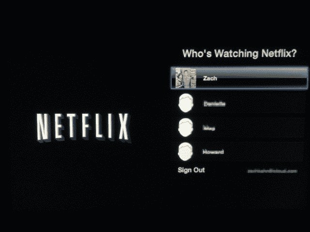

# 网飞用户档案开始出现在 Apple TV TechCrunch 上

> 原文：<https://web.archive.org/web/https://techcrunch.com/2013/07/30/netflix-users-profiles-start-appearing-on-apple-tv/>

期待已久的网飞用户档案在 8 月份首次亮相之前首次亮相。根据[几篇](https://web.archive.org/web/20221003085454/http://www.macrumors.com/2013/07/29/netflixs-personalized-user-profiles-begin-showing-up-on-apple-tv/) [报道](https://web.archive.org/web/20221003085454/http://9to5mac.com/2013/07/29/netflix-user-profiles-feature-starts-rolling-out-to-apple-tv-users/)，用户资料在苹果电视设备上部分可用，选项在网飞部分首次推出时出现。然而，用户现在仍然缺乏添加或编辑配置文件的能力，即使对于那些现在正在获得新功能的用户也是如此。

*更新*:网飞现在进一步解释说，只有少数人——测试组中使用苹果电视的人——会看到新的个人资料。“这是我们全体会员的一小部分，”一位公司代表说。"我们希望在今年夏天晚些时候向所有会员推出这项功能."

网飞用户档案在今年早些时候的 E3 会议上公布，一些用户已经加入了有限的 beta 测试，允许他们在其他设备上使用档案，比如 iPad。

简档基本上只是网飞的用户账户，每个家庭成员(或共享网飞账户的家庭成员，视情况而定)都将获得自己的账户，并配有可定制的头像、个性化推荐和个人观看历史。对于那些有孩子的人来说，现在将会有家长控制。

新的选择不仅在它允许的隐私方面有用(不再有令人尴尬的看网飞的约会！)，对于不想让孩子不受限制地使用网飞服务的父母来说，这也很好。虽然该公司今天提供了一个名为“只为孩子”的儿童区，但这只是对网飞体验用户界面的一个改变——没有密码保护来防止孩子退出，也没有其他家长限制。然而，“儿童专用”部分是为网飞最年轻的用户设计的——例如，那些正在观看 PBS 或迪士尼卡通片的用户——而不是年龄较大的孩子，他们更倾向于积极寻找他们知道他们的父母不会同意他们观看的内容。

添加个人资料也将有助于网飞更好地与亚马逊竞争，亚马逊的 Prime 即时视频已经作为网飞的替代品向家长们大力推销。亚马逊最近赢得了几项儿童电视内容交易，包括与维亚康姆达成的多年协议[，该协议将几个知名的 Nickelodeon 和 Nick Jr .标题添加到其服务中——这一声明足够引人注目，以至于亚马逊将新闻直接放在 Amazon.com 主页的大型广告中。亚马逊的 Kindle Fire 设备还将亚马逊即时视频的内容传输到一个名为 Kindle FreeTime 的儿童友好型平板电脑体验中，该体验提供预先批准的内容，包括书籍、游戏、电影和电视。](https://web.archive.org/web/20221003085454/https://beta.techcrunch.com/2013/06/04/dora-streams-again-amazon-signs-deal-with-viacom-wins-popular-kids-shows-netflix-lost/)

网飞档案还可以帮助公司做出更好的内容推荐，像以前一样，多用户家庭的推荐是基于几个用户的观看习惯，而不是个人。[最近增加的脸书整合](https://web.archive.org/web/20221003085454/https://beta.techcrunch.com/2013/03/13/netflix-gets-social-in-the-u-s-thanks-to-facebook-partnership-after-over-a-year-of-lobbying-and-lawmaking/)也将更有意义，因为每个用户都可以将他们的社交分享活动与他们自己的观看行为联系起来，而不是像[那样与他们的孩子](https://web.archive.org/web/20221003085454/https://beta.techcrunch.com/2013/03/13/go-diego-g/)联系起来。

根据网飞的说法，该公司不准备证实 AppleTV 的报道，也不准备提供新的信息，说明我们何时可以预计用户资料将在 Apple TV 或网飞产品线中其他受支持的设备上完全直播，包括 Android、iOS (iPhone、iPad)、智能电视、蓝光播放器和游戏机。该公司表示，用户档案一直在测试中，并仍有望在今年夏天晚些时候推出。

*(图片鸣谢:[9to5Mac.com](https://web.archive.org/web/20221003085454/http://9to5mac.com/2013/07/29/netflix-user-profiles-feature-starts-rolling-out-to-apple-tv-users/)；MacRumors [论坛用户 JonasCalhoun](https://web.archive.org/web/20221003085454/http://forums.macrumors.com/showthread.php?t=1616014) )*