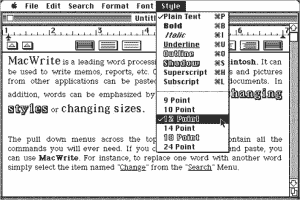
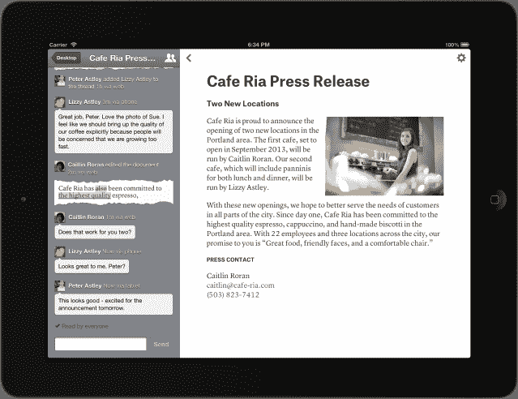

# Quip 是由前脸书首席技术官 Bret Taylor TechCrunch 开发的一款漂亮的新型移动文字处理器

> 原文：<https://web.archive.org/web/https://techcrunch.com/2013/07/30/quip-mobile-word-processor/>

30 年过去了，我们的文字处理软件还没有发展，甚至还不能适应手机。今晚，随着前脸书首席技术官 Bret Taylor 的新创公司推出的免费增值新文字处理应用 [Quip](https://web.archive.org/web/20230204224419/https://quip.com/) 的发布，这种情况发生了变化。Quip 可以在桌面上工作，但它是为[手机](https://web.archive.org/web/20230204224419/https://itunes.apple.com/app/quip/id647922896)设计的。它会自动将文档格式化到你的屏幕大小，提供应用内协作和消息传递，甚至可以离线工作。

“Quip 是为平板电脑和手机时代优化的现代文字处理器”，泰勒告诉我。我们正处于远离台式电脑的过渡时期，然而文字处理器却停滞不前。为了获得戏剧性的效果，泰勒将 MacWrite 的截图(如右图所示)放到了 Quip 的介绍帖子中，并告诉我“这看起来和我们今天使用的非常相似，真是滑稽。”

泰勒说，向手机的转移是如此的震撼，以至于它超越了所有传统文字处理功能的重要性，并且“给了我们一个改变这个软件的机会”。

微软等了这么久才抓住这个机会，真是愚蠢。这只是移动办公的一个真实版本。虽然功能齐全，但它被宣传为 Office for desktop 的移动伴侣，而不是真正的移动优先，在 iOS 上，它只面向 Office 365 的用户。当你想到文档编辑的需求有多广泛时，Quip 的免费增值模式有很多发展空间。

妙语看起来很精致，这是有道理的，因为泰勒在 2012 年 6 月离开了脸书，与谷歌应用程序引擎之父凯文·吉布斯一起创办了这家公司。2012 年 12 月，泰勒将他的 backchannel.org 网站重新定位到 Quip.com，[向世界展示了这家初创公司的名字](https://web.archive.org/web/20230204224419/https://techcrunch.com/2012/12/23/short-sweet-and-in-stealth-mode-is-quip-the-name-of-ex-facebook-cto-bret-taylors-next-project/)。虽然没有公布细节，但我们自己的 Ingrid Lunden 根据应用程序图标中的钢笔和授予初创公司的云协作专利，推测出这可能是一款协作写作应用程序。

现在我们有了所有的信息。那么[是什么让 Quip 与众不同](https://web.archive.org/web/20230204224419/https://quip.com/blog/introducing-quip)？

首先，它可以让文档适应你正在使用的任何尺寸或形状的屏幕。如果你在 iPhone 上，嵌入的照片可以全幅显示，但在 iPad 上，它会出现在右边，被文本包围。

协作工具可能是最令人兴奋的部分。您可以与其他用户共享任何文档，当他们第一次打开它时，您会收到通知。Taylor 说，这让你可以使用 Quip 的内部消息系统，直接进入文档并向他们展示。泰勒告诉我:“这感觉就像坐在办公桌前，身边有人围着一张纸。”。

你所有的协作编辑和信息都变成了你可以关注的类似聊天的线索。为了找到你未来的合作作者，Quip 要求你登录谷歌，让它访问你的联系人。这看起来像是对脸书的冷落，但实际上这只是表明 Quip 是为严肃的业务而生的，而不仅仅是和你的朋友一起玩。

在 iPad 上，你会在你的文档旁边看到交流流，而在 iPhone 上你会把它滑出。您可以@提及他人以在文档中引起他们的注意，快速添加图像，链接到其他 Quip 文档或文件夹，以及使用格式工具添加您自己的风格。我喜欢标准的“用相机拍照”和“从照片中选择”旁边的“使用最近的照片”选项，尽管它只是用于 Quip 消息而不是文档编辑，这很可惜。

从该应用程序的 Quip“桌面”主页，您可以看到您当前的所有文档，并检查收件箱中的新更新和消息。如果你在写作的时候掉线，没关系。当您恢复连接时，Quip 会将您的文档同步回云端。泰勒说，当他在旧金山的 BART 地铁上通勤时，他喜欢这种无缝的工作方式，这种方式的手机信号不稳定。

房间里的大象就是 Quip 如何与 Microsoft Word 一起工作的。现在还没有特别的方法从 Word 中导入文档或者将文档导出给老用户。然而，泰勒说他的团队在完美的复制和粘贴上下了很大功夫。Quip 将在您将文本复制到 Word 或从 Word 复制文本时保留格式。

Quip 对个人使用是免费的，但是每个用户每月需要支付 12 美元的商业许可费，这样你就可以和更多的人合作。它现在可用于 [iPhone、iPad](https://web.archive.org/web/20230204224419/https://itunes.apple.com/app/quip/id647922896) 和[桌面](https://web.archive.org/web/20230204224419/https://quip.com/)，泰勒说一个安卓应用程序正在开发中。对微软来说，桌面打字工具是一项利润丰厚的业务。mobile 的这个机会让 Quip 在由彼得·芬顿在 Benchmark 牵头的首轮融资中筹集了 1500 万美元，为其 12 人团队支付了费用。幸运的是，这不是泰勒的第一次创业。在共同创建谷歌地图后，他创建了 FriendFeed，后来卖给了脸书。

Quip 将不得不取代现在被误传的文字处理最好在桌面上完成的观点。它将与之对抗的其他写作应用包括苹果自己的[页面](https://web.archive.org/web/20230204224419/https://itunes.apple.com/us/app/pages/id361309726?mt=8)，精简但便宜的应用，如 [iA Writer](https://web.archive.org/web/20230204224419/https://itunes.apple.com/us/app/ia-writer/id392502056?mt=8) ，以及更高级但昂贵的选项，如 [Textilus](https://web.archive.org/web/20230204224419/https://itunes.apple.com/us/app/textilus-word-processor-document/id537818639?mt=8) 。

Quip 确实有一点学习曲线。不一定是因为设计有太多的错误，而是因为你必须抛弃微软灌输的习惯。在 iPhone 的 Quip 中有几个笨拙的手势。你从顶部往下拉，露出你的桌面，但我发现自己不小心打开了 iOS 通知托盘。

然而，一旦你掌握了妙语连珠的窍门，它似乎最终可以让你在沙发上、通勤路上或咖啡馆里表达你内心的语言大师。

*附言*

Quip 现在可能是一款文字处理应用，但它的野心可能会大得多。它结合了一些顶级生产力、协作和工作场所通信应用程序的功能。它可能会从谷歌文档、Hangouts (Gchat)、Asana、Yammer 和 Skype 上偷走时间。今天，它只是取代了那些围绕文本文档编辑的工具。但是想象一下，一旦 Quip 将文字处理分类，它就会去处理电子表格或演示文稿。

Quip 有团队和资金来努力开拓这个巨大的空间。如果它成为热门收购目标，我不会感到意外。唯一的问题是泰勒和吉布斯已经赚到了他们的积蓄，也许能够坚持到底

集成通信和协作平台的应用非常广泛。如果没有其他人建立这种移动优先，并 Quip 钉用户体验，我们可能会看到一个大公司的开始。

