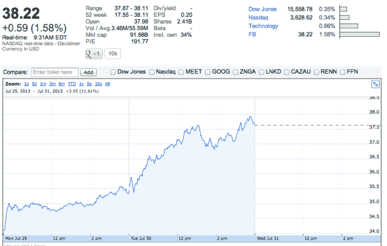

# 脸书股票以 38.22 美元开盘，经过一年的动荡后，终于回到了 IPO 价格

> 原文：<https://web.archive.org/web/https://techcrunch.com/2013/07/31/facebook-shares-return-to-its-ipo-price/>

# 脸书股票以 38.22 美元开盘，经过一年的动荡后，终于回到了 IPO 价格

脸书股票( [NASDAQ:FB](https://web.archive.org/web/20230316061141/http://www.google.com/finance?cid=296878244325128) )终于突破了心理玻璃天花板，即脸书的 IPO 价格每股 38 美元。该股目前的交易价格为每股 38.22 美元，比昨天的收盘价略高 1.52%——开盘时为 37.98 美元，但几秒钟内就飙升至 38 美元以上。对于股票来说，这是动荡的一年，但投资者现在似乎对脸书的稳健增长及其移动收入感到满意。

今天标志着脸书成为一家成熟的上市公司的犹豫步骤的结束。起初，首席执行官马克·扎克伯格(Mark Zuckerberg)没有太多交流，公司主要专注于打造更好的产品。虽然吸引更多用户很重要，但这不足以让投资者相信长期收入。建立一家上市公司需要大量的沟通工作。

许多人担心脸书无法成为一家移动优先的公司，但扎克伯格[坚持](https://web.archive.org/web/20230316061141/https://techcrunch.com/2012/09/11/zuckerberg-the-leader/)这是他在 TechCrunch Disrupt SF 2012 上的首要关注。那天[推动](https://web.archive.org/web/20230316061141/https://techcrunch.com/2012/09/11/zuckerberg-talk-drives-facebook-stock-up-4-6-in-after-hours-trading/)股票上涨。

但更重要的是，该公司设法带来更多收入，同时转向移动业务。它报告了令人印象深刻的 Q2 收入，移动广告收入现在占总广告收入的 41%。

2012 年 5 月，脸书开始交易时，其 IPO 价格为每股 38 美元。但在 2012 年 8 月，随着 2.71 亿股初始锁定期的开始，该股跌至目前的最低价格 19.69 美元。早期投资者 Accel Partners、Meritech Capital Partners 和 Greylock Partners 都套现了。安德森·霍洛维茨、微软和凯鹏华盈选择留在董事会。

扎克伯格不得不安抚投资者，说他不会兑现他的股份，股票不会跌破这些水平。

然而，其他禁售期对该公司更有利。第一次员工禁售期导致 5%的跌幅，随后脸书股票下跌了几天。

11 月 14 日，最大的禁售期发生了，股价上涨了 10%以上，标志着脸书股价疯狂日子的结束。在那之后，股票的波动性大大降低，并且很容易受到非理性变化的影响。卖空脸书股票也没有那么受欢迎。

自那以后，股价一直在略高于 30 美元或略低于 30 美元的水平上波动，仍远低于 38 美元的发行价。直到最近，在脸书的盈利电话和出色的移动电话号码之后，股价才开始上涨。现在，股价可以稳定在这个水平(大约 38 美元)，因为股价昨天已经上涨了 6%以上。但目前的趋势令人鼓舞。

*(图片鸣谢:[埃马纽埃尔·惠布雷希特](https://web.archive.org/web/20230316061141/http://www.flickr.com/photos/ensh/) )*