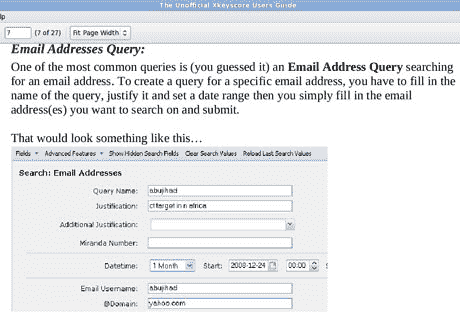

# 美国国家安全局回应绝密间谍项目 xkey score TechCrunch 新报道

> 原文：<https://web.archive.org/web/https://techcrunch.com/2013/07/31/nsa-responds-to-new-reports-on-top-secret-spying-program-xkeyscore/>

# 国家安全局回应绝密间谍项目 XKeyscore 的新报道

国家安全局认为我们被*《卫报》*关于一种新工具 [XKeyscore](https://web.archive.org/web/20221104173533/https://beta.techcrunch.com/2013/07/31/nsa-project-x-keyscore-collects-nearly-everything-you-do-on-the-internet/) 的报道误导了，这种工具允许特工阅读电子邮件和私人社交媒体聊天的内容。

该机构今天发布的一份新闻稿称:“关于分析师广泛、不受限制地获取国家安全局收集数据的指控完全不属实。”。“对 XKEYSCORE 以及 NSA 所有分析工具的访问权限仅限于那些需要访问其分配任务的人员。”

今天早些时候,*《卫报》*公布了之前绝密监视工具的细节，据报道，该工具允许授权分析师搜索互联网通信的名称、日期和内容(上图)。《卫报》辩称，这种权力不需要授权,并且被赋予了许多分析师，比如他们的线人爱德华·斯诺登。

“我们的工具在几个层面上内置了严格的监督和合规机制，”报告继续说道。“不是每个分析师都能执行每个功能，也没有分析师能自由操作。NSA 分析师的每一次搜索都是完全可审计的，以确保它们是正当的、合法的。”

然而，直言不讳的批评者和参议院情报委员会成员罗恩·怀登暗示，行政部门在其报告中不诚实。在白宫解密了要求威瑞森交出电话元数据的命令后，怀登[发表了这样的声明](https://web.archive.org/web/20221104173533/http://www.wyden.senate.gov/news/press-releases/wyden-declassified-documents-show-how-inaccurate-statements-have-misled-congress):

“今天公布的新解密的简报文件显示，行政部门一再向国会做出不准确的陈述，说明 2011 年前根据 USA PATRIOT 法案开展的批量电子邮件记录收集项目的价值和有效性。这些声明在这个项目的有用性上误导了国会议员。

那么，我们应该相信国家安全局吗？如果你信任他们的话。