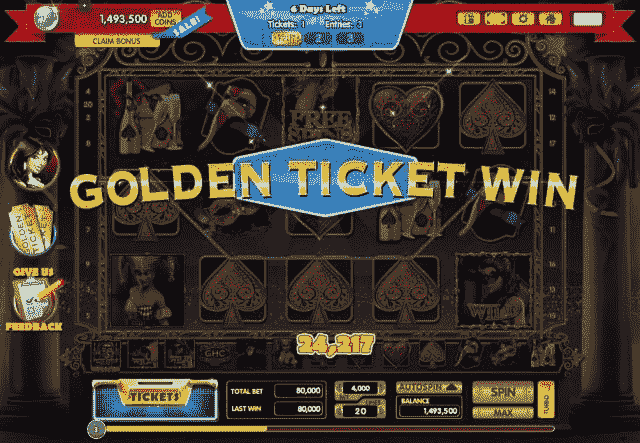

# RealNetworks 以 1560 万美元收购 Slingo，新的抽奖活动 TechCrunch

> 原文：<https://web.archive.org/web/https://techcrunch.com/2013/07/31/realnetworks-slingo/>

# RealNetworks 以 1560 万美元收购 Slingo，开始重视社交赌场游戏

总部位于西雅图的上市公司 RealNetworks 运营着 RealPlayer，并拥有一个游戏部门，该公司正通过以 1560 万美元收购 Slingo 的交易进军社交赌场游戏。它还推出了一种新的赌场游戏，涉及 10 万美元的抽奖活动，名为 Gamehouse Casino Plus。

这两项举措旨在振兴 RealNetworks 的游戏业务[，该业务在截至今年 3 月的季度中带来了 1390 万美元的收入。](https://web.archive.org/web/20221208072909/http://www.sec.gov/Archives/edgar/data/1046327/000104632713000025/a10q2013q1.htm)

Slingo 是 bingo 和老虎机的结合，在脸书每月有超过 450 万活跃用户，在移动平台和赌场的实体老虎机上还有更多。这款游戏于去年 2 月在脸书推出，并达到每月活跃用户超过 5000 万的峰值。它还通过付费应用 Slingo Supreme 来到了 Android 和 iOS。这种在 Slingo 品牌老虎机中进行的实体游戏在美国 300 多家赌场中进行，RealNetworks 表示，通过其他彩票游戏售出了超过 10 亿美元的 Slingo 品牌门票。

“真钱游戏在美国不会很快成为主流，”RealNetworks 首席执行官 Rob Glaser 说。但他表示，他相信电影公司仍然可以在社交赌场类型上进行创新，这种类型在过去两年里变得越来越有竞争力。

在 Gamehouse Casino Plus 中，玩家可以玩典型的赌场游戏，如吃角子老虎机、电动扑克、二十一点和轮盘赌，但他们也可以赢得每月 10 万美元的彩票。

