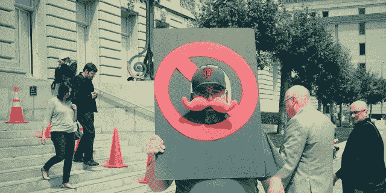
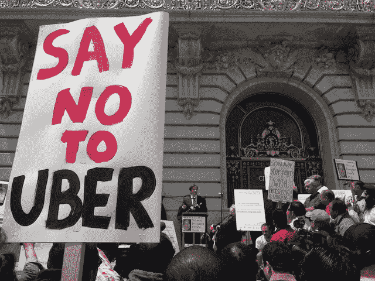

# 出租车团体呼吁根除顺风车在旧金山市政厅抗议

> 原文：<https://web.archive.org/web/https://techcrunch.com/2013/07/31/taxi-groups-call-for-eradication-of-rideshare-startups-at-sf-city-hall-protest-2/>

CrunchGov Essential 是一份关于科技对当今重大问题的影响力的扫描综述。在一篇专题文章下面，我们呈现了通过网络最佳内容讲述的最有思想、最令人愤慨、最鼓舞人心的故事。在这里注册早间新闻[。](https://web.archive.org/web/20221208133046/http://link.beta.techcrunch.com/join/134/crunchgov-signup)

旧金山出租车劳工团体昨天在市政厅前举行抗议，呼吁根除拼车初创公司，并监禁一些成员。“我们希望看到这些非法出租车消失。如果有必要的话，我们希望他们被开罚单，传讯，逮捕。旧金山出租车司机协会主席巴里·科伦戈尔德帮助组织了这次抗议活动。

[出租车工会已经全力以赴](https://web.archive.org/web/20221208133046/https://beta.techcrunch.com/2012/01/14/ubercommissioner/)反对日益增长的交通科技初创公司行业，这些公司将车主变成智能手机出租车司机。昨天，几个出租车团体停止了旧金山市中心周围的交通，因为出租车车队团结一致地按响了喇叭。

【YouTube = http://www . YouTube . com/watch？v=acQgv3et5gg&w=560&h=315]

抗议活动的政党路线是，智能手机拼车服务是“未经许可、不受监管、非法和不安全的”。与受到严格监管的出租车行业不同，这些拼车司机享受私人保险计划和公司培训。[抗议者认为](https://web.archive.org/web/20221208133046/http://venturebeat.com/2013/07/30/taxi-drivers-protest-ridesharing-road-bandits-at-sfs-city-hall/)Lyft 和优步的私人保险政策不足以保护消费者，司机本身也没有经过适当的培训。

然而，除了精心策划的口号，我们采访的几乎每一位司机和代表都认为拼车初创公司给已经陷入困境的出租车行业带来了不必要的竞争。“你拿了我的钱，我怎么养活我的家人？”一个抗议标语上写着。另一条写道:“技术窃贼”。演讲者比我想象的更刺耳。在过去与 TechCrunch 的会面中，纽约市出租车工会只是表达了对平等监管的渴望。他们认为，优步、Lyft 和边车司机需要适当的许可、监督和培训才能上路。如果没有监管和税收的负担，拼车可以在忽视重要安全要求的情况下降低出租车的价格。

但当我调查旧金山的示威者时，没有人能想象乘车应用与出租车和平共存的未来——即使他们同意监管。“如果他们要上路，为什么城市里要有出租车？我不想让他们上路，”一个开了四年出租车的司机说。“他们甚至不应该存在，”另一名司机说，他认为，“如果我们不能摆脱他们，”优步和 Lyft 应该只能像豪华轿车一样搭载预先安排的乘客(而不是像出租车一样按需打车)。

去年，出租车协会领导人承认，出租车司机对拼车竞争对手的敌意已经转化为暴力。上周，一名前 Lyft 司机告诉我，他转向优步的一个原因是，Lyft 标志性的粉红色汽车胡子鼓励了对他和他的汽车的攻击。“合法出租车司机和试图抢走我们车费的出租车司机之间会发生肢体冲突，”Kornengold 解释道。“我们不宽恕任何人身攻击，但我们都是人，当他们被偷走时，人们会生气。”

对拼车初创公司的合法性和安全性的抗议完全是预防性的。没有人能举例说明优步或 Lyft 的事故会给消费者带来不公平的法律后果。律师克里斯托弗·多兰争辩说:“还没有发生，但它随时都会发生。”他说他正试图“阻止一场灾难。”

两天前，我在推特上写了一篇关于为什么工会在硅谷不被普遍接受的文章，引发了一场辩论。我提出的调查数据表明，工会往往不情愿地接受创新，将就业置于技术进步之上。在抗议的同一天，加州公共事业委员会[提出了新的指导方针](https://web.archive.org/web/20221208133046/https://beta.techcrunch.com/2013/07/30/california-regulator-proposes-new-ride-sharing-rules-in-a-victory-for-uber-lyft-and-sidecar/)，允许拼车初创公司通过安全和保险标准得到适当的监管。如果昨天的抗议真的是关于消费者，而不是出租车的保护主义政策，我们就不会看到出租车协会反对这些新的指导方针。时间会证明他们的真实意图。

## 本质:曼宁(部分)无罪，艾伦·施瓦茨麻省理工学院博士，反国家安全局法案，科尔伯特对英国色情过滤器

**曼宁无罪，有点像[[TechCrunch](https://web.archive.org/web/20221208133046/https://beta.techcrunch.com/2013/07/30/bradley-manning-found-not-guilty-of-aiding-the-enemy/)]**
——维基解密泄密者布拉德利·曼宁被指控犯有最严重的间谍罪，但在其他 19 项罪名上被判有罪，可能面临 100 多年的监禁

**艾伦·施瓦茨案进一步深化【 [Lessig 博客 V2](https://web.archive.org/web/20221208133046/http://lessig.tumblr.com/post/56881544082/the-mit-report-on-aaronsw)】**
——麻省理工学院关于堕落的黑客主义者艾伦·施瓦茨的报告，为该大学的大多数错误行为开脱，但发现麻省理工学院从未认为斯沃茨的黑客行为是“未经授权的”
—“如果艾伦的访问确实不是“未经授权的”——正如艾伦的团队从一开始就说的，现在麻省理工学院似乎也承认了——那么这场起诉的悲剧只会增加。

**新的反 NSA 法案【[The Hill](https://web.archive.org/web/20221208133046/http://thehill.com/blogs/hillicon-valley/technology/313853-nsa-foes-emboldened-by-house-vote-#ixzz2abKldGc9)】**
——众议员 Amash 和 Conyers 提出了一项法案，将拉网式监控定为非法，即《自由法案》
——《con yers-Amash 法案》将要求政府证明“具体和明确的”事实，即电话记录对调查至关重要，并且“仅与接受此类调查的个人相关”。"

科尔伯特使用色情过滤器

–史蒂文·科尔伯特对英国[新的反色情互联网过滤器](https://web.archive.org/web/20221208133046/https://beta.techcrunch.com/2013/07/26/a-look-at-why-britains-new-anti-porn-law-could-censor-much-of-the-internet/)有一些精选词汇。开始于 3:25

[Hulu id = uyztfmxzdaazx 9 dri fuc 1g width = 512]