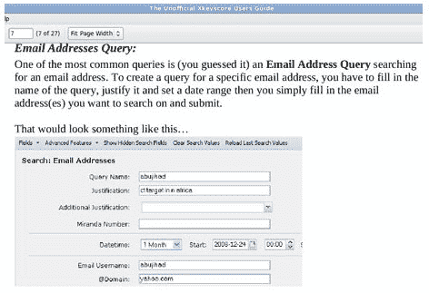

# 政府谎称可以在没有搜查令的情况下阅读你的邮件

> 原文：<https://web.archive.org/web/https://techcrunch.com/2013/07/31/the-government-lied-about-being-able-to-read-your-email-without-a-warrant/>

# 政府谎称可以在没有搜查令的情况下阅读你的邮件

爱德华·斯诺登“我坐在我的办公桌前，可以窃听任何人，从你或你的会计师，到联邦法官，甚至总统，如果我有一个私人电子邮件地址的话。”

*[众议员迈克·罗杰斯](https://web.archive.org/web/20230307081621/http://thehill.com/homenews/house/305409-house-intel-chiefs-snowden-lying):“他在撒谎。[……]他不可能做到他所说的他能做到的事情。”*

谁是对的，谁在说谎？根据《卫报》和格伦·格林沃尔德的新披露，政府再次回避真相，事实上，斯诺登是正确的。一个名为 XKeyscore 的 NSA 项目[恰恰提供了](https://web.archive.org/web/20230307081621/http://www.theguardian.com/world/interactive/2013/jul/31/nsa-xkeyscore-program-full-presentation)[斯诺登详述的](https://web.archive.org/web/20230307081621/https://techcrunch.com/2013/07/31/nsa-project-x-keyscore-collects-nearly-everything-you-do-on-the-internet/)和众议员罗杰斯否认的能力。

政府对 NSA 能力的否认开始被证明是错误的，其次数已经足够多，以至于它们正在失去官方言论的地位，反而越来越滑向等级误导的领域。

XKeyscore 允许 NSA 阅读你的电子邮件的方式如下:分析师不需要搜查令，只需提供电子邮件地址或 IP 地址、书面“理由”和时间范围。就是这样。如果感觉有点松，你有适当的内部反应。(有关美国国家安全局如何收集和存储数据的信息，请点击这里[。)](https://web.archive.org/web/20230307081621/https://techcrunch.com/2013/07/31/nsa-project-x-keyscore-collects-nearly-everything-you-do-on-the-internet/)

这些文件指出，电子邮件的“正文”事实上是可以搜索的，这意味着 NSA 有能力超越简单的电子邮件元数据跟踪。然而，这也是可以搜索的，但这并不是 NSA 事实上可以找到和访问的全部内容。

分析师向 XKeyscore 请求电子邮件后会发生什么？格林沃尔德:“然后，分析师通过在 NSA 阅读软件中打开邮件，选择他们想要阅读的回复邮件。”根据文件，该软件可用于读取“过境”美国的通信，以及在美国“终止”的对话。尽管有问题的通信来自外国，因此不涉及宪法保护，但我怀疑世界其他地方会认为这种防御放松了。

或许最令人寒心的是为保护隐私和个人权利而设立的可笑的安全标准:电子邮件请求的“正当理由”部分。看你能不能发现:

【T2

两个小领域，我们去比赛。一个是该死的下拉菜单。人们不禁要问，美国国家安全局为其分析师提供了哪些有益的选择。

以上是新的，有启发性的，但也许并不特别令人惊讶。它确实证明了我们之前关于数字隐私不存在的想法是正确的，政府中的一个精英一直在错误地展示这个国家的数字监控能力。

这可不太好。

*顶级形象功劳:[安德鲁马龙](https://web.archive.org/web/20230307081621/http://www.flickr.com/photos/andrewmalone/)*