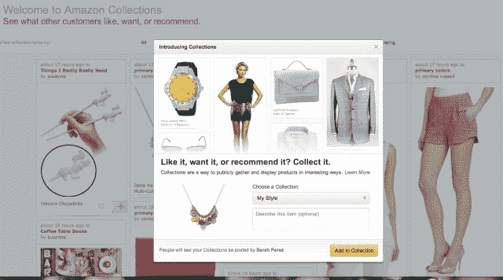

# 亚马逊在 Pinterest 上进行了名为“亚马逊收藏”的实验

> 原文：<https://web.archive.org/web/https://techcrunch.com/2013/08/01/amazon-experiments-with-its-own-take-on-pinterest-called-amazon-collections/?_ga=2.192121128.322783611.1670249134-1146828373.1657807215>

亚马逊已经悄悄地推出了自己对 Pinterest 的直接挑战，推出了一个名为“[亚马逊收藏](https://web.archive.org/web/20230316161321/http://www.amazon.com/gp/river)的功能这是一个更有吸引力、图像更丰富的网站，消费者可以通过浏览其他人保存的产品来保存、分享和发现新产品。像 Pinterest 一样，用户创建单独的列表，称为集合，例如“想要的列表”或“时尚”，他们可以通过该服务找到并关注与他们有相同兴趣的其他用户。

该公司一直在测试这一功能，在更大规模的公开亮相之前，先从一些博客开始，一些早期访问的人已经[详细介绍了](https://web.archive.org/web/20230316161321/http://www.therichlifeonabudget.com/2013/06/amazon-collections-and-stripes.html)他们使用该网站整理服装的经历，或者[其他](https://web.archive.org/web/20230316161321/http://kerriskitchen.com/new-toy-from-amazon-in-beta-testing-amazon-collections/)初步印象。有些人甚至被雇来做顾问。我们看到的关于该服务的测试版测试者的最早参考是在四月下旬发布的。

如今，当你将鼠标悬停在亚马逊主页下拉菜单中的“你的账户”上时，“你的收藏”链接就会出现在选项列表中，这使得这项服务在亚马逊网站上的位置更加突出。

最初，所有用户都有一些空的收藏(“我的风格”、“想要的列表”和“可能性”)，但是你也可以创建自己的收藏。要将一件商品添加到收藏中，只需点击亚马逊网站上商品图片下方的“添加到收藏”按钮。但是，由于 Collections 是一个新功能，这个按钮目前还没有推广到网站上的所有产品。

为了解决这个问题，亚马逊提供了一个“收藏”按钮，可以拖动到浏览器的书签栏，让你将亚马逊上的任何产品添加到你的收藏中。不过，此时这似乎不是一种“收集”非亚马逊产品的方式，因为在场外点击按钮时不会发生任何事情。

用户可以为他们保存的项目添加描述，编辑或从列表中删除它们，甚至可以一次删除整个收藏。该服务还为用户提供了一种浏览默认类别的方式，如书籍、男性时尚、电影、音乐、女性时尚、特色等，所有这些都以 Pinterest 风格的图片图钉板格式排列，其中重点强调了商品照片，除了产品名称和一个用于收藏的“心形”按钮之外，几乎没有其他信息。为了看到价格和进一步的产品细节，你必须点击通过。

目前，亚马逊收藏的交友和关注模式是有限的——该网站显示其他人发布的热门商品以及他们发布这些商品的时间(例如“3 分钟前”)，然后你可以点击这些用户的名字，以便在服务上关注他们。但似乎没有一个选项可以发现你在亚马逊收藏上的朋友，比如通过地址簿上传或脸书整合。

我们应该指出，这不是亚马逊第一次尝试为消费者提供另一种购物方式。在过去几年中，它已经推出了许多其他产品可视化工具，如其 2008 年的[网格状店面亚马逊橱窗商店](https://web.archive.org/web/20230316161321/https://techcrunch.com/2008/10/27/amazons-windowshop-offers-a-sleek-interface-for-the-online-megastore/)，后来[于 2010 年在 iPad 上推出](https://web.archive.org/web/20230316161321/https://techcrunch.com/2010/10/26/amazon-launches-brand-new-ipad-shopping-app-called-windowshop/)，或其[于 2011 年通过亚马逊流涉足增强现实](https://web.archive.org/web/20230316161321/https://techcrunch.com/2011/11/02/amazons-flow-iphone-app-brings-augmented-reality-to-barcode-scanning/)。它还努力使网站更加社会化，通过与脸书的整合来跟踪生日或计算脸书朋友想要什么礼物。

但这是亚马逊第一次如此大胆地复制竞争对手服务的整体外观和感觉，这在某种程度上证明了 Pinterest 在电子商务推荐方面的吸引力。此举也正值 Pinterest 加强其电子商务努力之际，为在线零售商提供了新的工具，包括网络和移动[产品引脚](https://web.archive.org/web/20230316161321/https://techcrunch.com/2013/05/19/pinterest-more-useful/)、[分析](https://web.archive.org/web/20230316161321/http://business.pinterest.com/analytics/)、个性化[推荐](https://web.archive.org/web/20230316161321/https://techcrunch.com/2013/07/26/pinterest-adds-support-for-do-not-track-as-it-begins-a-rollout-of-a-more-personalized-experience-for-users/)，以及[就在今天，价格提醒](https://web.archive.org/web/20230316161321/https://techcrunch.com/2013/08/01/pinterest-adds-price-alerts-to-turn-aspirational-pins-into-purchases/)。

亚马逊进入更加社交化、可视化的产品发现领域，对于另一家初创公司 [Canopy 来说可能是个坏消息，该公司昨天刚刚推出了一项服务](https://web.archive.org/web/20230316161321/https://techcrunch.com/2013/07/31/canopy-launches-to-make-amazon-shopping-more-social-shareable-and-beautiful/)，使亚马逊购物更具吸引力和互动性。该公司告诉我们，他们甚至注意到大约两三周前有几名亚马逊高级工程师在使用他们的网站，此后又有几名工程师在使用，这促使他们加快了发布速度。

脸书也一直在追求 Pinterest，推出了自己的“收藏”功能，[仍在测试中](https://web.archive.org/web/20230316161321/https://techcrunch.com/2012/12/19/facebook-pinterest-style-collections/)。

亚马逊拒绝对其计划发表评论，只是指出它“一直在网站上测试新功能，这项新的测试功能只是我们帮助客户发现和分享新事物的许多方式之一。"

*美国东部时间 13 年 8 月 1 日下午 6 点更新了亚马逊的回应。*