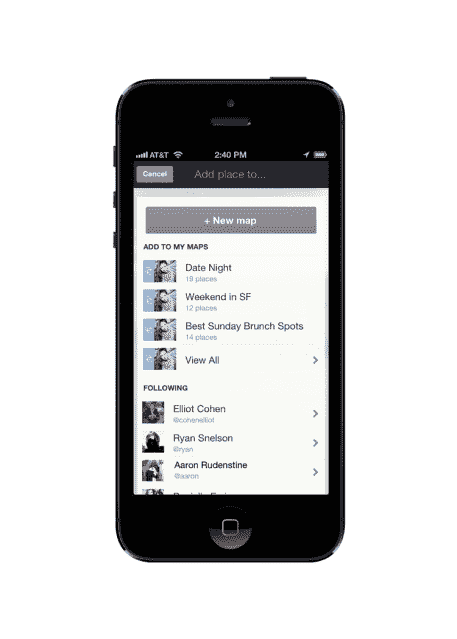
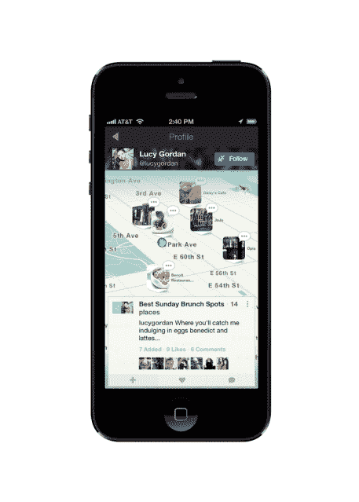

# 城市地图宣布从 Endeca 创始人 TechCrunch 的 A 级投资公司获得 150 万美元的额外 A 轮融资

> 原文：<https://web.archive.org/web/https://techcrunch.com/2013/08/01/citymaps-announces-1-5m-in-additional-series-a-funding-from-a-grade-investments-endecas-founder-others/>

[CityMaps](https://web.archive.org/web/20221006130604/http://citymaps.com/) ，本周新闻报道的[公司](https://web.archive.org/web/20221006130604/http://www.techmeme.com/130725/p31#a130725p31)为其新版 iOS 移动地图应用程序筹集了额外一轮 150 万美元的外部资金——这是其早期 A 轮融资的延伸，这一次引入了新的投资者，包括[阿什顿·库彻](https://web.archive.org/web/20221006130604/http://www.crunchbase.com/person/ashton-kutcher)和[盖伊·奥塞里](https://web.archive.org/web/20221006130604/http://www.crunchbase.com/person/guy-oseary) s [A 级投资](https://web.archive.org/web/20221006130604/http://www.crunchbase.com/financial-organization/a-grade-investments-3)，[史蒂夫·帕帕](https://web.archive.org/web/20221006130604/http://crunchbase.com/person/steve-papa)(Endeca 的创始人，[将其出售给甲骨文](https://web.archive.org/web/20221006130604/https://beta.techcrunch.com/2011/10/18/oracle-buys-enterprise-search-and-data-management-company-endeca/)这一轮融资使 CityMaps 迄今筹集的资金总额达到 500 万美元。

我们最近花时间与 CityMaps 谈论了它准备在未来几周推出的产品，以及该公司将如何利用这笔资金在谷歌等地图巨头的阴影下进一步实现其打造独特地图产品的目标。

CityMaps 即将推出几项功能，包括一个开发者 API，以及一些可以通过提醒当地企业关注交易、促销、附近活动、每日特价等来更好地将他们与移动消费者联系起来的功能。但更广泛地说，该公司希望将城市地图定义为地图生态系统中的一个新领域，地图不再是需要信息的用户访问的只读作品，而是根据个人用户的兴趣和偏好进行个性化。

## 一个“疯狂的想法”开始了

两年半前，CityMaps 的联合创始人 Aaron Rudenstine 和 Elliot Cohen 有了一种新的地图界面的想法——他们解释说，这种界面的重点不仅仅是在你不熟悉的领域导航，而是在地图变得社交化、协作化的地方，更好地突出了人们花费时间和金钱的地方，如商店、酒吧、餐馆和其他当地企业。

“谷歌地图是地图的标志。这是一个了不起的产品，”Rudenstine 说。“但从第一天起，我们对地图的整体愿景——当埃利奥特找到我，说他有一个创建新地图的疯狂想法——就是地图应该不仅仅是帮助你从 A 点到 b 点的实用工具，”他将协作地图的想法比作社交网络的其余部分，在那里用户可以找到并跟踪他人，地图变得实时和动态。

需要说明的是，城市地图并不像 [OpenStreetMap](https://web.archive.org/web/20221006130604/http://www.openstreetmap.org/) 那样具有协作性，也就是说用户可以自己制作你周围的街道和地标地图。然而，OpenStreetMap 是该产品的数据来源之一，其中包括 [Natural Earth](https://web.archive.org/web/20221006130604/http://www.naturalearthdata.com/) 、 [Factual](https://web.archive.org/web/20221006130604/http://www.factual.com/about) 、 [Localeze](https://web.archive.org/web/20221006130604/http://www.neustar.biz/infoservices/solutions/localeze/local-search-platforms/listings-optimizations#.UfqvX2RATsk) ，以及 CityMaps 与财富 100 强公司建立的战略关系的一些数据，这些数据是不允许披露的。因此，城市地图的协作功能不是构建地图本身，而是作为基本地图数据之上的一个图层。这个想法是用户可以建立他们自己的对他们重要的地图，比如最喜欢的餐馆或商店的列表。此外，这意味着朋友们也可以建议他们应该添加到列表中的地方。

在几轮融资中筹集了 350 万美元后，该公司在 2012 年初推出了现在被称为“概念验证”的应用程序——这是它可以投放市场的最快的 [MVP](https://web.archive.org/web/20221006130604/http://en.wikipedia.org/wiki/Minimum_viable_product) 应用程序，以测试消费者是否会对这样的想法感兴趣。这个早期版本的城市地图只在五个城市运行——纽约、芝加哥、旧金山、波士顿和奥斯汀——在那里它获得了“几十万”用户，尽管不到一百万。

 但该公司的参与度足够高，足以推动其向前发展——该公司发现，超过一半(55%)的用户每周会多次打开该应用。该应用程序也获得了良好的反馈，甚至赢得了纽约市旅游局的推荐，并获得了一项交易，该交易使其在今年 1 月取代了微软在纽约市 7000 辆出租车上的地图软件。

通过重新设计和改进的 iOS 应用程序(这里是的[产品评论)，城市地图现在包括了美国各地超过 1500 万个商业地点，允许它在任何地方工作，而不仅仅是在最初支持的近六个城市。](https://web.archive.org/web/20221006130604/https://beta.techcrunch.com/2013/08/01/citymaps-launches-official-ios-app-that-aims-to-make-mapping-social/)

该公司的本地数据集包括企业名称和位置，以及用户想知道的其他信息，如当地餐馆的菜单、服装店出售的服装种类、欢乐时光的时间等等。

## 与你交流，提出建议的地图

在不久的将来，城市地图也将推出一个系统，帮助用户了解所有这些场馆目前正在发生的事情。

Rudenstine 解释说，这个系统将在几周内推出，将利用该公司与企业列表服务的合作关系。这将使当地企业主能够发布关于他们必须向 CityMaps 推广的任何内容的实时信息，以及 Yext 目前支持的所有其他服务。

 新地图内沟通和推荐功能集的发布合作伙伴包括 Bliss Spa、Aeropostale、Gansevoort Hotel Group 和 Morgans Hotels(连锁酒店)、The Vitamin Shoppe、Bond New York、StyleCaster Media Group 和 Time Out。在不久的将来，其他企业也将能够拥有自己的场地，管理自己的活动和交流。

同样即将推出的还有 CityMaps 更大的地图个性化计划。用户通过脸书登录后，或者后来连接他们的社交账户，如脸书或 Foursquare，城市地图将能够访问他们的个人资料和/或签到数据，开始对用户喜欢的东西做出一些简单的判断。随着用户继续使用该产品，城市地图提炼早期判断的能力也随之提高。

“我们的整体愿景是，没有两张地图应该是相同的，”Rudenstine 说。“当你打开城市地图时，你应该会看到一系列标志，这些标志代表了……城市地图认为与你相关的企业，”他解释道。“在最基本的层面上，个性化引擎将我们对企业的了解与我们对您的了解相匹配。”

## 开发者 API 即将发布

最后，除了即将推出的个性化引擎和推荐之外，CityMaps 正在为开发者开发 API，这将允许他们在自己的产品中使用 CityMaps 数据。例如，如果 Airbnb 的房主想为他们的客人制作附近餐馆和商店的地图，他们可以使用城市地图来代替谷歌。(Airbnb 不是这个项目的合作伙伴，这只是一个例子——但这是 A 级投资，所以谁知道呢)。该公司还在与原始设备制造商进行讨论，并将很快宣布他们将采用该 API。

在苹果将谷歌从其自己的地图应用预装应用列表中剔除之后，人们对建立地图初创公司的公司重新产生了兴趣，更不用说谷歌以[11 亿美元收购社交交通地图 Waze](https://web.archive.org/web/20221006130604/https://beta.techcrunch.com/2013/06/11/its-official-google-buys-waze-giving-a-social-data-boost-to-its-location-and-mapping-business/) 了，这不仅有助于其自身在地图方面的利益，也使这些数据不在苹果手中。

“城市地图”似乎认为，凭借其个性化努力，它现在已经进入了地图领域的下一个大事件，但很难忽视房间里的巨头谷歌。随着谷歌不断扩大的 Google+计划，它可以选择利用它已经知道的关于企业和用户的所有数据，用更多的合作和个性化功能来照亮地图。

但是 Rudenstine 充满希望，他说最近的事件改变了人们对地图的看法。“人们现在开始意识到拥有一张地图的重要性，”他说。“地图的故事还没有写出来。”