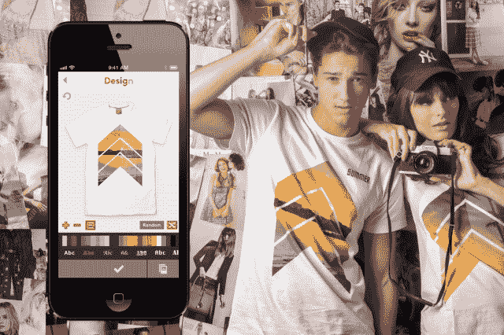
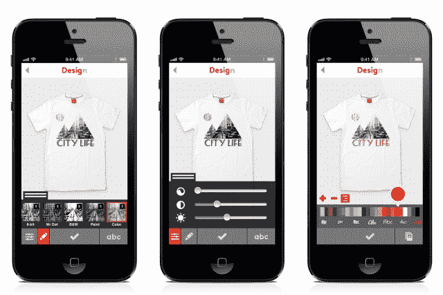

# 让设计定制 t 恤变得简单的应用 Snaptee 正式发布

> 原文：<https://web.archive.org/web/https://techcrunch.com/2013/08/01/snaptee-official-launch/>

# Snaptee 是一款让设计和订购定制 t 恤变得简单的应用，它正式推出了新的编辑功能

我们[在二月份介绍过](https://web.archive.org/web/20221208110610/https://beta.techcrunch.com/2013/02/27/snaptee)的定制 t 恤 [iOS 应用](https://web.archive.org/web/20221208110610/https://itunes.apple.com/us/app/t-shirt-design-snaptee/id599845533)snap tee，今天向公众推出了全新的外观和更多选择，包括女式 t 恤和升级版航运。Snaptee 的首款 Android 应用也将于本月底推出。

该应用程序旨在让定制 t 恤的设计和订购变得像对智能手机照片应用滤镜一样简单。Snaptee 的更新界面具有 Instagram 集成、广泛的字体和颜色选择、自定义滤镜和设计模板。完成的设计可以印在 100%有机棉的 t 恤上，每件 19.99 美元，然后运往世界各地。全球普通运费为 5 美元，而新的升级运费选项为 26 美元。用户也可以出售他们的设计，每单收取 10%的佣金。

首席传播官凯瑟琳·邵(Catherine Shao)在电子邮件中告诉我，“我们已经摆脱了旧布局和背景的混乱，采用了极简主义的干净外观，让设计和探索设计变得更加愉快和富有美感。”。“图标和按钮进行了调整(更大！)和简化，使用户在设计和订购过程中的进展更加无缝和一目了然。”

不想从头开始设计一件衬衫？Remix 按钮允许用户“解锁”他们的设计，这样他们就可以被其他人修改。来自世界各地的七位 Instagram 摄影师的相册目前可以作为其他用户设计的起点。

邵表示，这家初创公司希望用户将 Snaptee 视为一个社区，而不仅仅是一个编辑工具。

“我们设想 Remix 会越来越多，并在 Snaptee 的朋友和合作者一起设计中发挥作用，”她说。“对我们来说，t 恤不仅仅是一件衣服，它还是一块表达的空白画布。”

自今年早些时候试运行以来，Snaptee 已经在 45 个国家建立了超过 130，000 名用户的基础，其中包括美国、日本和德国的主要市场。该应用程序已被用于创建超过 160，000 个独特的 t 恤设计。

邵表示，Snaptee 目前正专注于寻找与其他公司和品牌的合作机会，并计划将澳大利亚、英国、韩国和东南亚作为其下一个核心市场。