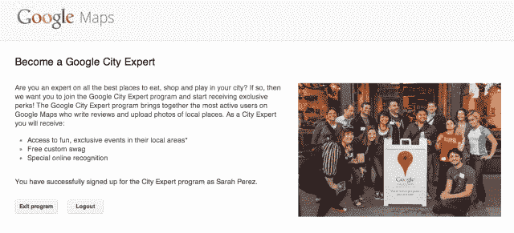

# 谷歌推出城市专家计划，鼓励更高质量的 Google+本地评论

> 原文：<https://web.archive.org/web/http://techcrunch.com/2013/08/02/google-launches-city-experts-program-to-encourage-higher-quality-google-local-reviews/?utm_source=feedburner&utm_medium=feed&utm_campaign=Feed%3A+Techcrunch+(TechCrunch>)

谷歌已经悄悄启动了一个名为[谷歌城市专家](https://web.archive.org/web/20230316100056/https://www.google.com/local/contest/cityexpert)的新项目，以鼓励在 Google+上提供更多高质量的本地商业评级和评论。该计划目前仅限于美国、英国、澳大利亚和日本的部分城市，并将奖励迄今为止至少留下 50 条评论、每月至少产生 5 条新评论的用户。

符合这些准则的人将获得额外津贴，如独家参加当地活动、“定制赠品”(意思是免费的谷歌品牌商品)和“特殊在线认可”。一名公司代表解释说，参与者还将收到包括各种优惠在内的每月简讯，以及他们可以参与的当地比赛和活动的提醒。

此外，我们被告知，谷歌城市的专家将被邀请到一个专属的 Google+社区，在那里他们可以与附近的其他专家会面，讨论使用 Google+ Local 和谷歌地图的技巧和诀窍。

作为加入这个计划的起点，需要 50 篇评论，可以包括那些过去离开的成员，或者可以在注册后撰写。但是为了保持活跃的会员，城市专家必须每个月至少创建五个好的评论——这意味着写得很好的帖子，并添加照片。

这些要求旨在防范垃圾邮件发送者，以及其他可能被鼓励写一些评论以换取免费内容的人。谷歌[解释说，“高质量的评论”必须至少有三四句话，同时也是有益和平衡的评论，而不是企业主、他们的朋友和员工在评论网站上偷偷留下的吹捧和奉承，或者愤怒的客户留下的攻击和负面评论，有时甚至是企业自己的竞争对手。](https://web.archive.org/web/20230316100056/https://support.google.com/plus/answer/2519605?hl=en&ref_topic=2624941)

这个程序利用了一个古老的互联网规则,即只有一小部分所谓的“创作者”创作了网络上的大部分内容，而大多数人只是消费其他人创作的内容。通过要求专家们至少要有 50 篇评论才能开始，谷歌限制了该计划的覆盖范围，只针对一小部分经常性的重度评论者。

本周早些时候，谷歌在纽约的 Google+页面上低调宣布了该计划，目前该计划在美国(奥斯汀、芝加哥、纽约、凤凰城、波特兰、罗利-达勒姆、旧金山)、英国(布里斯托尔、爱丁堡、伦敦、曼彻斯特)、澳大利亚(悉尼)和日本(东京和大阪)提供。然而，谷歌打算随着时间的推移将城市专家扩展到新的领域。

即使你不在首选城市之一，你仍然可以在[的城市专家主页](https://web.archive.org/web/20230316100056/https://www.google.com/local/contest/cityexpert)选择“其他”来注册你的谷歌账户。

## 条条大路通 Google+

一段时间以来，谷歌一直在巩固其在 Google+品牌和屋顶下带来本地商业评级和评论的努力，已经将业务[从 Google Places 转移到 Google+](https://web.archive.org/web/20230316100056/http://searchengineland.com/google-places-is-over-company-makes-google-the-center-of-gravity-for-local-search-122770) ，后来[将](https://web.archive.org/web/20230316100056/http://blumenthals.com/blog/2012/08/03/step-by-step-guide-to-the-google-businesslocal-merge-verification-process/) Google+商业页面与 Google+本地页面合并。最近，[它为 Google+页面所有者](https://web.archive.org/web/20230316100056/https://techcrunch.com/2013/06/10/new-google-dashboard-lets-page-owners-manage-their-online-presence-adwords-express-and-offers-campaigns/)升级了商业仪表盘，让他们从一个界面管理搜索、社交、地图和 AdWords。它还在 Google.com 顶部推出了一个交互式商业搜索结果转盘，用于相关的商业搜索。此外，谷歌关闭了其 Google+本地 iOS 应用，转而让用户使用谷歌地图。

到目前为止,“一切谷歌+”的唯一例外似乎是谷歌旗下 Zagat 应用程序的重新推出，这主要是因为谷歌目前仍保留 Zagat 品牌。

总的来说，这些努力显然是为了与其他评论服务竞争，例如 Yelp，它一直在推进自己的倡议，最近推出了 Yelp 平台，作为直接在 Yelp 上交易的一种方式，增加了与 Eat24 和 Delivery.com 的合作伙伴关系，更不用说 it[收购了 OpenTable 的竞争对手 seat me](https://web.archive.org/web/20230316100056/https://techcrunch.com/2013/07/18/yelp-acquires-online-reservation-service-seatme/)。但是，尽管最近从 Yelp 获得了稳定的[收益](https://web.archive.org/web/20230316100056/https://techcrunch.com/2013/07/31/yelp-beats-street-estimates-in-q2-with-revenue-of-55m-eps-loss-of-0-01/)，谷歌仍然在今天的本地广告市场占有更大的份额。推动评论者提高其服务的评级质量，然后在全球范围内推广该计划将是 Yelp 需要克服的另一个挑战。