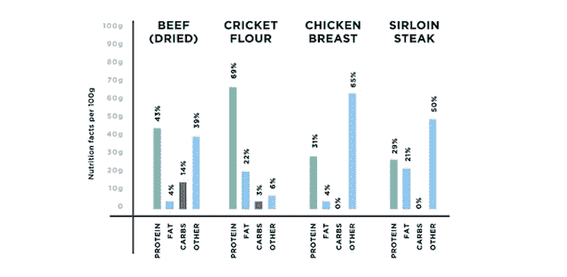

# 评论:Exo，一种基于板球的蛋白质棒，不会破坏你的生产力 TechCrunch

> 原文：<https://web.archive.org/web/http://techcrunch.com/2013/08/04/review-exo-a-cricket-based-protein-bar-that-wont-destroy-your-productivty/?utm_source=dlvr.it&utm_medium=twitter>

我喜欢吃甜食，这是生产力的大敌:含糖的零食是通往中午脑雾和软绵绵的爱之手的单程票。作为 TechCrunch 的常驻健康爱好者，我经常被声称解决工作场所零食问题的食品初创公司推销，但他们的“健康”替代品总是会像百事可乐中油炸的士力架一样提高我的血糖。

昨晚，我很高兴地说，我尝试了一种新的蛋白质棒，它足够美味，不会升高我的血糖，而且含有生的健康成分。只有一个问题:它是由粉碎的蟋蟀制成的(视频如下)。

令人钦佩的大胆的 Exo 团队希望将蟋蟀带到美国的饮食中，并在短短 3 天内在 Kickstarter 上成功筹集了 2 万美元，以建立一个工厂，生产基于昆虫的零食。“Exo 将向西方介绍世界上最有营养和可持续的蛋白质来源之一:昆虫，”[在他们的 Kickstarter 页面上宣布](https://web.archive.org/web/20230131001123/http://www.kickstarter.com/projects/exoprotein/exo-protein-bars-made-from-cricket-flour)。

根据 Exo 的说法，他们的蟋蟀粉比牛肉含有更多的蛋白质，也许更重要的是，不会对破坏环境的食物系统[有所贡献。牲畜产生的碳相当于一辆汽车产生的碳，它们吃的食物本可以给饥饿的儿童，它们被灌满了药物，这些药物用致命的抗生素耐药性细菌威胁着人类。所以——只是把这个放在那里——我们可能想找到一个替代方案，bug 可能就是它。](https://web.archive.org/web/20230131001123/http://www.newscientist.com/article/dn10786-cows-pigs-and-sheep-environments-greatest-threats.html#.Uf6AnmRgYaB)

巧克力棒本身是蟋蟀蛋白、椰枣、可可、椰子和杏仁黄油的混合物。Exo 具有微甜蛋白质棒的味道和质地。*不，你尝不出蟋蟀的味道*。团队发给我的早期版本非常易碎，有点脆(椰子片)。

不骗你，我吃过味道更好的零食，但它们都让我血糖升高。许多[受欢迎的能量/蛋白质棒](https://web.archive.org/web/20230131001123/http://eatthis.menshealth.com/slideshow/truth-about-energy-bars-1)有 Twix 的食物特征，高果糖玉米糖浆使它们像万圣节的剩菜一样健康。

事实是，以不破坏你的身体的方式获得营养的唯一方法是尽可能接近原始食物的最低限度加工的全天然成分。

这就是为什么[市场出现了所谓的“生”食物](https://web.archive.org/web/20230131001123/http://www.washingtonpost.com/blogs/going-out-guide/post/khepras-raw-food-brings-the-uncooked-trend-to-h-street-ne/2012/03/28/gIQAOhfehS_blog.html)的增长:没有谷物、乳制品、糖或加热的成分。我的 go-to 能量棒，基于日期的 [LaraBar](https://web.archive.org/web/20230131001123/http://en.wikipedia.org/wiki/L%C3%A4rabar) ，于 2009 年被通用磨坊收购。Exo 使用了少数几种可接受的甜味剂之一:生蜂蜜(另一种时髦的类似蜂蜜的甜味剂[龙舌兰，可能正在慢慢杀死你](https://web.archive.org/web/20230131001123/http://www.webmd.com/diet/features/the-truth-about-agave))。

而且，与 LaraBar 不同，它含有 10 克蛋白质，可以满足你生活中的健身爱好者。

我不知道 Exo 是否能满足嗜吃高糖零食的大众市场对甜食的需求，但我确实喜欢他们可能发现了一种可持续蛋白质的想法。至少，对于想要更健康的工作场所来说，它足够美味。

我的建议是:为办公室买一束，看看你的同事怎么想(然后告诉我们！)