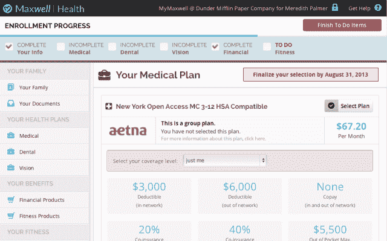
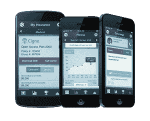

# Maxwell Health 筹集了 1000 万美元 2M，通过门房服务、个人健康激励和 TechCrunch 来应对 Zenefits

> 原文：<https://web.archive.org/web/https://techcrunch.com/2013/08/05/maxwell-health-raises-2m-series-a/>

提供易于管理的健康保险的平台 Maxwell Health 已经在 A 轮融资中筹集了 200 万美元。领投这轮融资的是 Tribeca Venture Partners，参与方包括 Lerer Ventures、Vaizra Investments、BoxGroup、TiE Angels 和其他几家天使投资人。这一轮使该公司的总资金达到 380 万美元。

Maxwell Health 于 2 月推出，是一项免费的福利管理服务，面向医疗、牙科、视力、人寿、残疾、COBRA 管理、HRA/HSA、FSA 和 401(k)等企业。首席执行官兼联合创始人 Veer Gidwaney 表示，新一轮的资金将用于增加新的服务功能，增加外联和建立分销。

这家初创公司允许员工看到更多的保险计划选择，并提供选择建议。现有计划的员工可以使用 Maxwell Health 的平台在门户网站上管理他们的福利。它的仪表板允许企业跟踪招聘、员工参与度和公司支出。Maxwell Health 可以免费提供这一切，因为它从用户选择的每个保险计划中赚取佣金。

【T2

如果 Maxwell Health 的商业模式听起来很熟悉，那是因为它是一家名为 [Zenefits](https://web.archive.org/web/20221004131103/https://beta.techcrunch.com/2013/04/29/zenefits-the-yc-backed-employee-benefits-manager-gets-into-payroll-management-and-expands-to-ny/) 的初创公司，该公司在加州取得了巨大成功，刚刚筹集了 210 万美元。根据[我们最近对该公司的报道](https://web.archive.org/web/20221004131103/https://beta.techcrunch.com/2013/07/26/zenefits-lands-2-1m-from-venrock-maverick-aaron-levie-charlie-cheever-and-more-to-automate-startup-hr/)，Zenefits 拥有大约 110 名客户，是加州前 5%的保险经纪人之一。它的服务提供工资、雇佣、医疗、牙科、视力和 401(k)管理。但是 Maxwell Health 的一些功能可能会让它在与 Zenefits 以及医疗保健组织者如 [Cake Health](https://web.archive.org/web/20221004131103/https://beta.techcrunch.com/2011/09/12/cake-health-the-mint-for-health-insurance-launches-to-the-public/) 和 [Simplee](https://web.archive.org/web/20221004131103/https://beta.techcrunch.com/2012/05/15/simplee-raises-6-million-series-a-for-its-mint-like-approach-to-tracking-healthcare-expenses/) 的竞争中占据优势。

Maxwell Health 非常重视独立健康，为员工提供健康饮食和定期锻炼的激励措施。每个员工都使用健身设备，并获得活动积分，这些积分可以用来换取奖励。 

另一个值得注意的是它的“礼宾服务”，作为健康相关问题的顾问，处理账单，保险纠纷和医疗预约。用户可以将他们医疗索赔的照片发送给礼宾部，他或她将代表用户进行处理。

“当我们走进一家公司时，我们的目标是成为建议的单一参考点，成为与福利、健康和福祉有关的所有事情的可信赖的顾问，”吉德瓦尼告诉我。"我们想全面满足公司的需求。"

随着数十家企业的加入，Maxwell Health 离 Zenefits 的客户群还有一段距离。然而，它被授权为 24 个不同州的企业提供服务，而 Zenefits 被限制在加利福尼亚和纽约，尽管它正在寻求扩张。如果 Maxwell Health 能够在竞争对手之前提供一个全面的保险和薪资平台，它可能会在任何进入这一领域的新业务中占据相当大的优势。就服务而言，Maxwell Health 似乎覆盖了所有的基础。但不止于此。该公司还计划增加护士随叫随到服务，以及跟踪和管理营养、睡眠和压力。