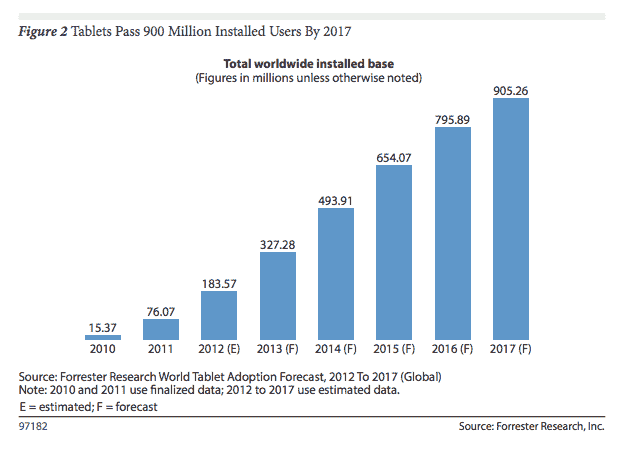

# Forrester:平板电脑的“高速增长”将推动全球装机量从 2013 年的 3.27 亿台增加到 2017 年的 9.05 亿台

> 原文：<https://web.archive.org/web/https://techcrunch.com/2013/08/06/forrester-tablets/>

随着[移动计算继续消耗 PC 的午餐](https://web.archive.org/web/20221006185531/https://beta.techcrunch.com/2013/04/04/gartner-2012-2017-devices-forecast/)，这个蚕食故事的核心部分当然是平板电脑拥有量的增长。分析师 Forrester】对全球平板电脑市场发布了一份新的预测，预测平板电脑销售将在未来几年继续火箭般的增长轨迹，预计 2012 年至 2017 年间的复合年增长率为 25.6%。

Forrester 预测，五年后，平板电脑的全球装机量将超过 9.05 亿台，2017 年的年销售额预计将达到 3.8123 亿台。

早在 2010 年，史蒂夫·乔布斯(Steve Jobs)推出第一代 iPad 的那一年，slates 的全球安装量仅为 1500 多万，这表明该类别已经实现了 Forrester 所谓的“高速增长”。该分析师预测，今年全球将有超过 3.27 亿台平板电脑投入使用。(截至 2013 年 Q2，苹果的品类领先 iPad 累计销量超过 1.4 亿部。)

根据 Forrester 的说法，平板电脑代表了当今分散的电脑市场中“最成功的分支”,无论是从渗透率还是竞争的多样性来看都是如此。在未来，它预计平板电脑将推动新型的“协作计算”行为——包括使用多个平板电脑或支持多用户交互的“类似平板的设备”。

Forrester 预测，到 2017 年，北美绝大多数(60%)的在线消费者将拥有平板电脑。在欧洲，这个数字会更低，不到一半(42%)。而在发展中国家，它预计到 2017 年平板电脑的总渗透率将保持在四分之一(25%)以下，尽管它预计某些“较富裕的亚洲市场”——如新加坡和韩国——届时将把平板电脑作为既定的“通用计算工具”。

**工作中的平板电脑**

该报告还深入研究了人们使用平板电脑的目的——与传统的个人电脑和智能手机相比。根据 Forrester 的调查，计算设备类型的使用因地点和移动状态的不同而有很大差异，平板电脑是家庭中最常用的设备(76%的受访者表示在这里使用平板电脑)。接下来最受欢迎的平板电脑位置是“办公桌”，有 58%的受访者提到了这一位置，这凸显了平板电脑在商业领域的重要作用。另有 49%的人报告称在“工作的其他房间”使用平板电脑。

“业务适用性显示了平板电脑的全部潜力，”Forrester 在报告中指出。“对员工使用个人电脑、平板电脑和智能手机的地方进行的比较显示，虽然个人电脑主宰了办公桌，但平板电脑在移动性方面与智能手机不相上下。”

**碎片化**

该报告还指出，平板电脑市场正在分化为各种外形、操作系统、连接和附件——弗雷斯特预计这种情况将继续下去，因为它说“买家对平板电脑尺寸没有统一的偏好”。换句话说，这是与石板有关的课程的马。

因此，虽然“许多”潜在平板电脑买家(61%的受访消费者)倾向于“传统”平板电脑(即屏幕在 8.9 至 10.1 英寸之间的平板电脑)，但 Forrester 指出，较小的平板电脑(7 至 7.9 英寸)的偏好份额约为 16%。还有 11%的人对超大平板电脑(10.1 英寸以上)感兴趣。整整 12%的受访消费者还不知道该买哪个尺寸的。

谈到平板电脑操作系统，Forrester 表示，它预计苹果将通过 iOS 和 iPad 保持其平板电脑的领先地位，但也预计 Android 将继续增长，主要来自三星和亚马逊的平板电脑硬件。该公司还预计，基于微软 Windows 系统的平板电脑将在未来获得发展——但指出，在这种情况发生之前，应用程序的状况需要“巨大的改善”。

“弗雷斯特认为，Windows 将在平板电脑市场找到立足点，但要实现这一点，它需要生态系统的巨大改善，特别是现代 UI 应用的数量和质量，”报告指出。

**协作**

展望未来，该分析师预计平板电脑将继续鼓励新型协作计算。可能的场景包括在电视大小的单屏幕多点触控平板设备上进行交互——它引用了联想的 IdeaCenter Horizon 和微软的 PixelSense 技术作为它在这里考虑的技术类型的例子。

它还看到了通过协作应用程序(如实验室的 MindMeld 应用程序)连接在一起的多台平板电脑的使用量增加。

“使用 MindMeld 应用程序，[多个远程位置的平板电脑用户]可以加入一个协作工作区，在通话过程中实时更新。MindMeld 应用程序“倾听”对话，以 word-cloud 风格呈现主题和话题。报告指出:“然后，它利用一个预测计算引擎来寻找出现在这些主题上的相关内容(比如说，从网络上寻找)。”“这些图片、视频、文章和其他内容创造了更丰富的对话和协作体验记录，这将推动更强大、更有效、更有数据支持的协作。”

它还预计，平板电脑将在智能互联设备(如健康跟踪套件和家庭自动化设备)的崛起中发挥关键作用——作为“管理控制台设备”。