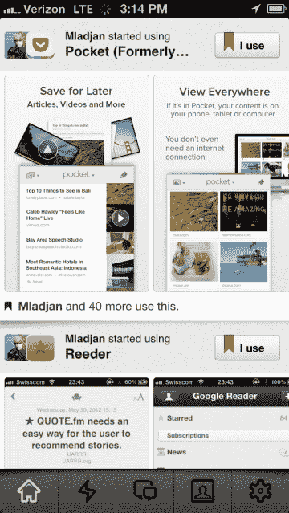
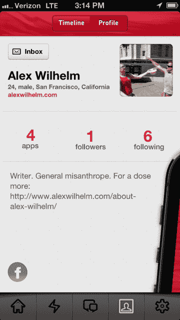

# 会见 Appidemia，一个漂亮的 iOS 应用程序指南，以防你需要更多的分心 TechCrunch

> 原文：<https://web.archive.org/web/https://techcrunch.com/2013/08/06/meet-appidemia-a-beautiful-application-guide-for-ios-in-case-you-need-more-distractions/>

# 满足 Appidemia，一个美丽的 iOS 应用程序指南，以防你需要更多的分心

今天 [Appricot](https://web.archive.org/web/20221207071353/http://appricot.co/) 发布了 [Appidemia](https://web.archive.org/web/20221207071353/https://itunes.apple.com/us/app/appidemia/id632138534?mt=8) ，这是一个 iOS 应用指南，可以帮助你找到新的软件来玩，并跟踪你的朋友在使用什么。它是我在任何手机上用过的最漂亮的应用程序之一。

一旦一个平台扩张超过一定规模，其应用程序目录的绝对规模就会变得笨重。你到底是怎么找到你需要的东西的？iOS、Android 和 Windows Phone 等等都在这个问题上苦苦挣扎。我会说任何超过 10，000 份的申请都会变得一团糟。当然，从最好的意义上来说是混乱的，因为在这种情况下，更多的选择并不是一件坏事。然而，你确实需要一种拨开迷雾的方法。

Appidemia 就是试图解决这个问题。它是为那些认真对待手机体验的人设计的，所以如果你只是浅尝辄止，你不会用到它。但是，如果你想挖掘 Instagram、脸书和 Lyft，你可能会发现一些值得使用的东西。

Appidemia 靠你的社交关系给你带来一些推荐；你的朋友使用的东西也可能是你可能喜欢使用的东西的一个强烈信号。在 Appidemia 里面，你可以点击使用一个应用或者下一个应用。你的应用程序位于你的个人资料中，所以如果我们在应用程序中链接，我可以查看你使用的应用程序。

当你第一次加入该服务时，它建议你关注几个在该公司工作的人。当你开始时，这给了你一个挖掘的活动源。鉴于 Appidemia 是多么新，我怀疑你会有一个朋友也使用这项服务，如果你给它一个旋转。

然而，由于我不想再找一个社交网络来修补——我对 Twitter 的爱依然存在——我发现 Appidemia 的搜索功能是 it 服务中最引人注目的部分。它的搜索功能远远优于苹果在 App Store 手机工具中提供的功能。下面是它如何工作的一个镜头:

Appidemia 引起了我的注意，因为它不是我会想到使用的东西。说到移动应用，我与行家截然相反。所以，我想更好地了解应用程序市场，而要做到这一点的方法就是挖掘它。

Appidemia 的搜索技术和用户界面是它的强项。我认为，这项服务的社交成分可以被弱化，至少在它获得更多市场渗透之前是如此。坦白地说，我不在乎你用什么应用程序。我只是想筛选一下最受欢迎的图书应用程序，以确保我听说过所有的应用程序。原来有比我知道的更多的漫画相关的应用程序。现在你也知道了。

如果你想尝试一些新的应用程序，试试的 Appidemia 吧。但如果你不想在手机上看到另一个该死的应用程序，就关上笔记本电脑屏幕，慢慢走开。

*顶级形象信用:[市场经理](https://web.archive.org/web/20221207071353/http://www.flickr.com/photos/37884983@N03/)*