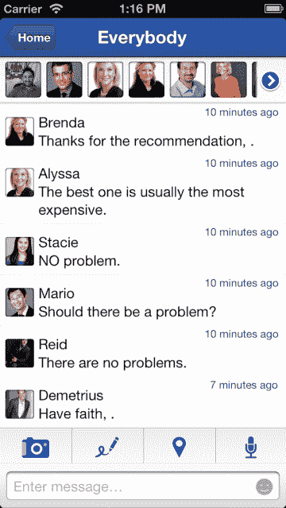
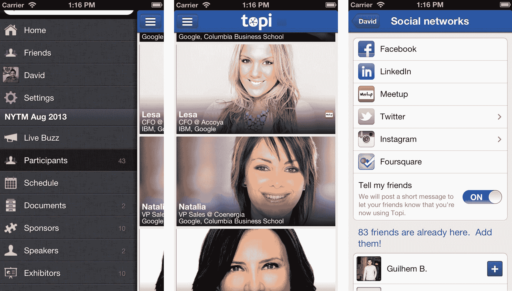

# 会议网络应用 Topi 获得深度 Meetup 集成 TechCrunch

> 原文：<https://web.archive.org/web/https://techcrunch.com/2013/08/07/conference-networking-app-topi-gets-deep-meetup-integration/>

一款移动活动网络应用 Topi ，它希望帮助你在大型会议上找到合适的交谈对象，今天宣布它已经与 [Meetup](https://web.archive.org/web/20221005231652/http://www.meetup.com/about/) 进行了巧妙的整合。新功能将允许该网站的成员在活动中更容易地找到彼此，甚至在活动结束后或在未来的其他活动中保持联系。Topi 现在还使用地理围栏来允许 meetup 与会者相互联系，只要他们在同一个地点。该应用适用于 [iOS](https://web.archive.org/web/20221005231652/https://itunes.apple.com/us/app/topi/id404221908?mt=8) 和 [Android](https://web.archive.org/web/20221005231652/https://play.google.com/store/apps/details?id=com.topi&hl=en) 设备。

正如 Topi 联合创始人兼首席执行官 David Aubespin 今天早些时候告诉我的那样，所有 Meetup 组织者都可以在他们的活动中免费使用该工具。虽然这不是与 Meetup 的官方合作关系——Topi 只是使用了他们的公共 API——但他认为这一新功能将使 Meetup 更有趣，因为它在这些活动的基础上创建了一个层，在它们结束后仍然存在。

例如，如果你是纽约理工大学 meetup 的会员，Topi 今天第一次展示这些功能，然后你去参加另一个活动，该工具将显示之前 Meetup 的其他人在附近。

除了整合 meetup，Topi 还在它的应用程序中扩展了 Twitter、脸书和 LinkedIn 的使用。例如，LinkedIn 现在被集成到 Topi 的 PeopleRank 算法中，“因此与会者可以更好地了解他们可能认识的人的建议以及他们应该会见的人。”奥贝斯平告诉我，PeopleRank 因为这种整合变得非常聪明，这项服务现在能够根据你以前工作过的地方或你所在的行业来推荐聊天室。Topi 团队认为，这将使参与者更容易打破僵局，开始在大型商业活动中建立联系。

Topi 现在还支持脸书活动，因此它可以将用户相应地分组到 Topi 聊天室，并允许您在活动之前、期间和之后与用户联系。它的 Twitter 集成允许你查看所有带有官方活动标签的推文，并从带有标签的应用程序中发布推文。

对于 Topi 来说，这个想法是与活动组织者合作(并可能向他们收费)，为他们的活动提供官方应用程序。例如，活动组织者可以在 Topi 上包括他们的时间表、赞助商、参展商的链接以及他们活动的文件下载。不过，奥贝斯平告诉我，对于 Meetup 的组织者来说，这项服务将永远免费提供。

