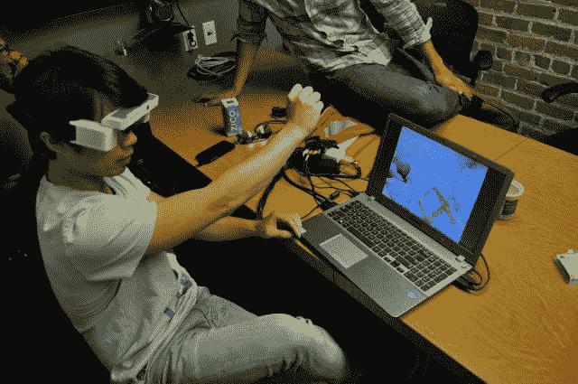
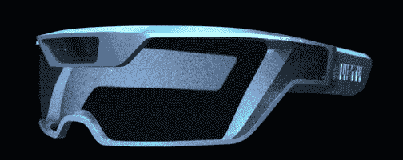

# Meta 是一款疯狂的 AR 眼镜，旨在实现谷歌眼镜无法实现的功能，它将接受预购

> 原文：<https://web.archive.org/web/https://techcrunch.com/2013/08/09/meta-the-ar-glasses-that-aim-to-be-what-google-glass-is-not-go-up-for-pre-order/>

谷歌眼镜发布已经一年多了，我与之交谈的许多人似乎仍然不理解谷歌眼镜到底能做什么。

“这对增强现实来说太棒了！”他们说，假设玻璃可以将物体直接渲染到你的世界全景(它不能。)“嚯！这就像少数派报告！”，期望 Glass 的摄像头能捕捉到你的每一次挥手动作(事实并非如此。)

然后他们试了一双，意识到…嗯，那不是玻璃。但这正是 Meta 的目标——他们的第一个(阅读:仍然有点粗糙)版本将于今天开始向公众销售。

为了描述 Meta，想象一副眼镜——或者更准确地说，在当前阶段，一副护目镜。在每个目镜中放置一个半透明的反射面，在你的视野顶部显示图像，这些图像是从镜架每个臂上内置的微型投影仪中发出的。拿几个微型 RGB/红外相机——本质上是一个微型 Kinect——把它们绑在框架上。那是元。

然后元插入另一个设备，帮助它处理数据；现在，那是一台笔记本电脑。向前看，这将是你的手机。

在一年多的时间里，Meta 在 Kickstarter 上首次亮相。到活动结束时，他们已经将最初的 10 万美元目标翻了近一番。他们承诺在本月底之前将这些设备运送给他们的支持者，他们说他们正在赶在最后期限之前完成——所以现在他们向所有人开放下一代产品的预售。

需要说明的是，他们今天推出的硬件还为时尚早。它可能有点超越了“仅限开发人员”的水平，但它仍然主要面向铁杆早期采用者和修补者。地狱，它的早期状态反映在它的名字上；这个模型被称为 META.01，暗示了未来的许多修正。META.01 的售价为 667 美元，计划于 11 月开始发货。

自从 Kinect 被绑在眼镜上的日子以来，该公司已经吸引了一些硬件设计师，使这一迭代比之前的 Kickstarter 版本更加苗条。Meta.01s 仍将比他们希望推出的最终硬件略显笨重，但这是朝着正确方向迈出的一步。

**这是他们下一次迭代的目标(他们向我保证他们可以在 11 月完成设计，尽管还没有完成):**

我见过很多承诺做这类事情的公司。每一次，我都期望被吹走。每一次，这家公司都或多或少地空手而归。一个人展示了一副 3D 打印的眼镜，内置一个基本的摄像头，但没有任何显示。一个人出现时，除了一本充满概念草图和宏伟承诺的对开本之外，什么都没有。

与此同时，Meta 展示了*多副*功能性眼镜(尽管还是早期的原型),以及一堆工作中的(虽然粗糙)技术演示。

**看看他们的概念视频:**

【YouTube = http://www . YouTube . com/watch？v = b7i 7 juqxttw & amp；iv _ load _ policy = 3；w=560&h=315]

我戴上眼镜的那一刻，一个数字在我眼前盘旋，告诉我我和我所看到的东西之间的距离。我举起我的手，一个漂浮的矩形出现在太空中，随着我的手掌走到哪里，随着我张开和握紧拳头而扩大和闭合。

“它在增强现实方面做得怎么样？”，我问。

他们从我的桌子上抓起一张纸——标准的空白打印纸，没有任何二维码或跟踪标记。他们按下笔记本电脑上的几个按钮，一部电影预告片开始在纸上播放。请注意，它不是边对边完美地呈现，而是漂浮在中间——但当他们在我们的办公室里挥舞它时，它仍然非常好地跟踪这张毫无特色的纸，蹩脚的头顶荧光灯等等。追踪空白的白色物体——无论是一张纸，还是一面空白的大墙——都是最难的计算机视觉挑战之一。

然而他们在这里。他弯曲纸，视频也跟着弯曲。他把纸揉成一团，然后展开；视频再次开始播放，现在*扭曲成褶皱*。什么？

“手势怎么样？”

他们按了几个按钮。一个 3d 蘑菇弹出来，似乎从我的视野中漂浮了大约 2 英尺。“戳它”，该公司首席技术官 Raymond Lo 说。我做了，笨拙地戳在我的大脑认为蘑菇在哪里。我花了几秒钟的时间“找到”这种飘渺的真菌——但是当我找到它的时候，很快就能看出来。蘑菇在我的手指周围像一团粘土一样改变形状，完全摸不着，但似乎不知何故*在那里。* Meta 希望有一天人们能够利用这项技术进行成熟的 3D 建模，将他们的作品直接发送到 3D 打印机上。

演示最终失去了我的手的踪迹，无法找回它——鉴于项目的早期状态，这是可以原谅的——但在短暂的几秒钟里，我终于*瞥见了许多团队之前向我承诺的 AR 技术。时间还早。很粗糙。但是*该死的*，爽吗。*

我不是唯一一个印象深刻的人，即使是在早期。Steve Feiner 是世界领先的 AR 专家之一，也是哥伦比亚大学 AR 研究部门的负责人，他签约成为他们的首席顾问。史蒂夫·曼是他们的首席科学家，他经常被称为“可穿戴计算之父”。他们轻而易举地进入了 Y-Combinator，我听说投资者从那以后就一直在敲门。

META.01 眼镜从今天开始在 META 新收购的(也很有自知之明的)域名[SpaceGlasses.com](https://web.archive.org/web/20230306100421/https://www.spaceglasses.com/)发售。