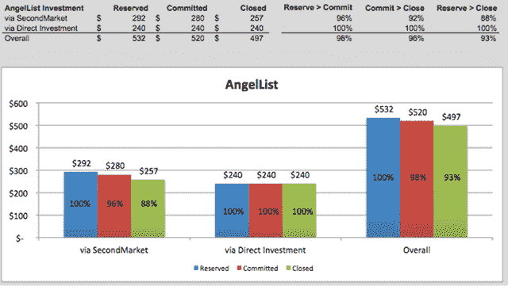

# 在 AngelList TechCrunch 上使用新的“入站”工具和技术结束一轮

> 原文：<https://web.archive.org/web/https://techcrunch.com/2013/08/10/how-we-closed-a-1-75-million-round-on-angellist-using-new-inbound-tools-and-techniques/>

More posts by this contributor

**编者按:** *安东尼·布莱登(Antony Brydon)，一位在过去十年中为四家初创公司筹集了十轮种子、债务和风险投资的企业家，目前是[direct](https://web.archive.org/web/20221206143159/http://www.directly.com/)的联合创始人。在 Twitter 上关注他* *[@abrydon](https://web.archive.org/web/20221206143159/https://twitter.com/abrydon) 。*

上周，我的公司[直接](https://web.archive.org/web/20221206143159/http://www.directly.com/)完成了一轮 175 万美元的种子融资，采用的是“内向型”融资方式。在过去的风险投资中，我们使用了几乎所有初创公司都使用的“外向”方法——确定投资者，建立联系以协调电话和会议，并 1:1 地工作以创造需求。我们新的内向型方法将新的营销技术应用于众筹网站，以产生广泛的投资者需求，跟踪投资者参与度，并将传统低效的外向融资流程转变为高效的内向融资。

效率有多高？在外向投资模式中，一个强大的创业公司能够吸引 5%到 10%的投资者是幸运的。在我们的入站模型中，我们完成了 37%。

我们这轮融资中的 125 万美元来自我们熟悉的投资者，包括 True Ventures、CrunchFund*和 Toba Capital，以及我们过去合作过的个人，包括雷·莱恩和埃丝特·戴森。另外 50 万美元来自 AngelList 和 SecondMarket，由来自戴尔、易贝、脸书、惠普、IAC、麦肯锡、Nuance、甲骨文、贝宝和 SAP 等公司的创始人、高管和校友组成的战略团队[。](https://web.archive.org/web/20221206143159/http://www.directly.com/info/investors)

这篇文章将讲述一些我希望在八周前就知道的事情。在这本书里，我会:解释一种你可以在下次加薪中使用的内向型方法；描述你能在几个小时内设置好的工具和技术；并向您展示我们的详细结果，从第一次呼入联系到成交。

我们的整体方法将最新的营销技术和技巧应用于 AngelList。我们开展了一项活动来产生内向需求，共同开发技术来提高投资者的整体意识，并使用销售漏斗从承诺转向个人投资者的 50 万美元。以下是我们是如何做到的，以及我们的投资者 Gil Penchina 的一些建议，他帮助设计了这个方法。

##### **开展集客活动以创造需求**

我们做的第一件事也是最重要的一件事，是将我们对筹资的想法从“外向”销售转变为旨在创造需求的“内向”营销。我们的目标是最大限度地提高我们的初始曝光率，并引起已经对我们的空间和公司感兴趣的人的兴趣，而不是接触那些可能喜欢或不喜欢我们业务的特定投资者，并与他们进行电话联系和会面。从战术上来说，这意味着:

—从可信且有联系的推荐人开始(在我们的例子中，是 Gil)
—关注我们关心的类别(移动、众包等。)
—在 AngelList 上招募 100 多位朋友分享我们的简介
—定期向我们的关注者发布更新
—每 1-2 天发布一轮新投资者

通过将此视为一场运动，我们能够创造一个浪潮，将我们带到 AngelList 的前 10 名，并最终帮助我们达到第一名并成为特色。在三周的时间里，这一活动带来了 650 次关注和 150 次引入。我们接受了 97 份来自我们认为合适的个人的介绍，并关闭了其中的 36 份——37%的关闭率。

值得注意的是，我们并没有停止对我们想要的投资者的直接追逐。我们追求 AngelList 之外的机构和个人，但我们将这些努力融入到更广泛的运动中。

##### **投资者整体认知技术**

合适的工具改变了我们的游戏规则，让我们对感兴趣的投资者有了前所未有的认识和了解。在销售和营销环境中，你可以使用 Marketo 和 Salesforce.com 推出内容，跟踪参与度，为线索评分，并确定跟进的优先顺序。在一次筹款中，你可以用不太贵的替代品来获得同样的收益。我们依赖 Clearslide(以及他们的配套移动应用)；Rapportive(作为 Gmail 中的侧边栏)；Gmail、Gmail 文件夹、Gmail 固定回复；以及 Angie (AngelList 的配套 iPhone 应用)。

**透明幻灯片。** Clearslide 是一项在线服务，用于主持销售演示。我将投资者资料的前半部分上传到 Clearslide，并在 AngelList 上发布了链接。我配置了面板，要求观众用他们的电子邮件地址登录，然后激活提醒，每当有人登录面板时就给我发电子邮件。最后，文档的最后一页取笑了我们即将发布的新服务，并提示读者要求介绍或给我发电子邮件了解更多信息。仅这一点就创造了许多入站介绍请求。你可以在这里看到这副牌的动作[。](https://web.archive.org/web/20221206143159/http://www.angel.co/directly)

 ****Rapportive** 。Rapportive 是 Gmail 的社交侧边栏。当我在 Gmail 中收到这些电子邮件提醒时，[的工具条会链接到投资者在 AngelList 和 LinkedIn 上查看的简介。只需点击一两下，我就能详细了解投资者的情况，并确定他们是否合适，是否值得投资。总的来说，我对之前投资过 AngelList 的投资者和在我们关注的领域拥有专业知识的个人反应最快。](https://web.archive.org/web/20221206143159/http://www.rapportive.com/)

**Gmail、Gmail 文件夹和 Gmail 固定回复**。我在 Gmail 中起草了固定回复，以帮助我快速回复合格投资者，我还可以经常给他们发送个人信息(通过了解他们来自 Rapportive)和完整的投资者资料，而他们仍在查看最初的资料。Gmail 文件夹允许我为关键潜在客户创建单独的文件夹，由于每次他们打开资料时我都会收到通知，这有助于我给他们“打分”:如果一个投资者经常打开资料，他们的文件夹会包含更多提醒，我知道他们会感兴趣。

安琪。Angie 是 AngelList 的配套 iPhone 应用，每当有投资者关注该公司或要求介绍时，它都会提醒我。当我在旅途中远离电子邮件时，它很有用，帮助我快速跟进。它还能很好地分类任务，我发现精简版的 UX 是 AngelList 网站的一个很好的补充。

 **将所有这些技术结合在一起的结果是，我能够立即了解谁在查看甲板，并联系他们，通常是在他们还在查看材料的时候。这让我们很快从兴趣转向参与。

##### **使用销售漏斗从承诺走向成交**

我们做的最后一件重要的事情是像对待销售漏斗一样对待投资者漏斗，让潜在客户经历五个明确的阶段:

—兴趣—600 关注
—参与—150 个介绍请求(我们接受了 97 个)
—预订—50 个预订
—承诺—40 个承诺
—关闭—37 个关闭

从美元的角度来看，这个漏斗是这样的:

**

因为它是一个漏斗，所以我们专注于收益——尽可能有效地将预订转化为成交。我们认为“预订”这个概念本身可能会带来很多负面影响(在你最喜欢的餐馆里询问*T4 的领班关于“不露面”的问题)，所以我们创建了一个“承诺”步骤，要求投资者向我们发送完整的投资信息，并确认他们的在线预订。这是有效的:只有三个投资者在做出承诺后放弃了总额的 5%。*

我们还努力在最初的兴趣和成交之间的几周内将影响降到最低。这意味着一个稳定的更新流——一些整体交付，一些单独交付。

我没有走极端。这些服务的试用版价格低廉，安装和配置总共需要两到三个小时。我在 Excel 中管理整个流程，尽管我们通常使用 Salesforce.com，因为我需要最大的灵活性来动态地重新配置电子表格(也因为我是唯一一个更新记录的人)。如果你想要我用过的电子表格的空白版本，请随时[联系我](https://web.archive.org/web/20221206143159/http://www.twitter.com/abrydon)。

**包装完毕**

如果你正在应对一个拥有强大团队、强大投资者和良好早期牵引力的大市场，AngelList 可能是扩展你的回合和范围的宝贵方式，正确的技术和工具可以将低效的“外向”筹资活动转变为高效的“内向”筹资。开展一项活动来创造内向需求，利用能让你准确了解投资者活动的工具和技术，使用销售漏斗来无情地关闭——你将改变你的融资方式。

我一直觉得筹款令人兴奋，但这是第一次这么有趣。

**披露:CrunchFund 的迈克尔·阿灵顿也创立了 TechCrunch*

*【图片来源*****