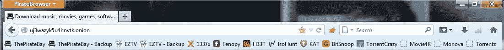

# 海盗湾推出基于 Tor 的反审查浏览器 TechCrunch 庆祝其 10 岁生日

> 原文：<https://web.archive.org/web/https://techcrunch.com/2013/08/10/the-pirate-bay-celebrates-its-10th-birthday-by-launching-a-tor-based-anti-censorship-browser/>

# 海盗湾推出基于 Tor 的反审查浏览器，庆祝其 10 岁生日

海盗湾(TPB)，一个不再需要介绍的种子网站，今天庆祝了它的 10 岁生日。为了纪念这一天，[推出了](https://web.archive.org/web/20221207182608/https://thepiratebay.sx/blog/233) [PirateBrowser](https://web.archive.org/web/20221207182608/http://piratebrowser.com/) ， [Tor 客户端(Vidalia)](https://web.archive.org/web/20221207182608/https://www.torproject.org/) ， [Firefox 便携浏览器](https://web.archive.org/web/20221207182608/http://portableapps.com/apps/internet/firefox_portable)(带 [foxyproxy 插件](https://web.archive.org/web/20221207182608/https://getfoxyproxy.org/))

该组织表示，该软件包包括“一些定制配置，允许你绕过某些国家如伊朗、朝鲜、英国、荷兰、比利时、芬兰、丹麦、意大利和爱尔兰对其公民实施的审查。”

如果你曾经尝试过 Tor 项目中的 Tor 浏览器包，你会有一种使用盗版浏览器的感觉。它本质上是相同的包，但是有最新版本的 Firefox 和一些为你预先收藏的种子网站。

鉴于它基本上是 Tor 浏览器捆绑包，你也可以用它来访问 Silkroad 和其他隐藏的 onion 网站，但总的来说，看起来盗版浏览器不会提供 Tor projects 捆绑包提供的相同类型的保护(正如我们上周看到的，[也不总是有效，](https://web.archive.org/web/20221207182608/https://www.eff.org/deeplinks/2013/08/tor-browser-attacked-users-should-update-software-immediately))。据我所知，它不会使用 Tor 网络来访问不在其代理设置中的非 torrent 网站，因此它不能替代常规的 Tor 设置。

TPB 在它的下载页面上也说了同样的话(但它在页面的最下方，大多数人可能会错过):“虽然它使用的是为匿名冲浪设计的 [Tor 网络](https://web.archive.org/web/20221207182608/https://www.torproject.org/)，但这款浏览器只是为了规避审查——取消对访问政府不想让你知道的网站的限制。”