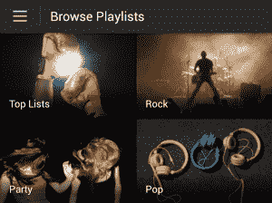

# Spotify 希望成为每个人的一切

> 原文：<https://web.archive.org/web/https://techcrunch.com/2013/08/10/the-quest-to-be-your-omni-jukebox/>

你可以从很多地方获得一些音乐，但 Spotify 正在寻求成为你的全方位点唱机。它已经提供了点播流媒体和广播，它刚刚推出了 Browse T1，这是一种发现不同情绪和风格的评论家和社区播放列表的新方法。Spotify 希望结合社交、算法和专家监管来击败这些平台，成为你需要的唯一音乐伴侣。

Spotify 产品经理 Miles Lennon 告诉我:“这是进入音乐圈的好时机。”。“五年前，人们认为音乐初创公司没有成功的能力。我们真的很高兴成为复兴的一部分。”

唯一的问题是音乐正在成为一种商品。每个智能手机制造商和操作系统都希望拥有自己的音乐服务，因为 iPod 证明了音乐是移动体验的一个基本部分。苹果有 iTunes，很快[会有 iTunes Radio](https://web.archive.org/web/20230404170619/https://techcrunch.com/2013/06/10/itunes-radio/) 。谷歌刚刚推出了 [Google Play 音乐全接入](https://web.archive.org/web/20230404170619/https://techcrunch.com/2013/05/15/google-play-music-all-access/)。[诺基亚](https://web.archive.org/web/20230404170619/https://techcrunch.com/2013/01/27/will-nokias-music-premium-service-be-enough-to-dent-lumia-sales-unlikely/)和[三星](https://web.archive.org/web/20230404170619/https://techcrunch.com/2013/06/16/samsung-galaxy-owners-will-get-jay-zs-new-album-for-free-72-hours-before-its-official-release/)有自己的，而 HTC 买了 MOG。它们都具有设备预安装或优先访问的优势。

Spotify 如何竞争？作为一家音乐公司。不是一家涉足视频和书籍的“媒体公司”。不是以音乐为媒介的广告公司。而不是一家希望完善其产品的硬件公司。Spotify 必须是一家 100%的音乐公司。

这就是计划。Spotify 现在拥有超过 2400 万活跃用户和超过 600 万高级订户。一位发言人表示，该公司的全球员工人数目前约为 800 人，财务文件显示，该公司 2012 年的收入翻了一番，达到 5.33 亿美元。

这是一个良好的开端，但在 Napster 时代让世界相信音乐是免费的之后，Spotify 仍在努力说服人们音乐值得听广告或付费。Spotify 董事兼 Napster 联合创始人肖恩·帕克曾表示，打击盗版的唯一方法是方便和可访问性，因此 Spotify 试图将你想要的所有音乐服务放在一个容易的地方。

### 一点点潘多拉，一点点松扎

起初，它只是像 Rdio 和现在的 Google Music 一样提供点播流媒体，让你可以在任何时候从一个巨大的目录中播放任何东西，而且每首歌都是免费的。然后在 2011 年末，它闯入了 Pandora 的地盘，带着一个[无线电服务](https://web.archive.org/web/20230404170619/https://techcrunch.com/2011/12/09/watch-your-back-pandora-spotify-launches-spotify-radio/)学习你的品味，让你将任何艺术家或歌曲扩展到一个电台。就在本周 [Rdio 还增加了自适应](https://web.archive.org/web/20230404170619/https://techcrunch.com/2013/08/08/rdio-rado-radi-radio/)电台，不久 iTunes 也将加入这场竞争。去年 12 月，Spotify 凭借[的新朋友和影响者追踪功能](https://web.archive.org/web/20230404170619/https://techcrunch.com/2012/12/06/spotify-following/)解决了脸书和 Twitter 等社交网络的问题。

基本上，如果你确切知道你想听什么，你可以搜索它，如果你不知道或不关心，你可以打开 Spotify 收音机。但是缺少的是更人性化的接触。通常，当我们接触音乐时，是因为我们处于一种特殊的情绪或情况下，想要与之相匹配的声音。你可以用 Spotify 制作自己的数字混音带，但许多人没有时间或专业知识来不断创建新的播放列表。

正是这个前提使得 [Songza](https://web.archive.org/web/20230404170619/http://songza.com/) 获得了成功。这项服务[为特定场景推荐专家选择的播放列表](https://web.archive.org/web/20230404170619/https://techcrunch.com/2013/07/05/songza-founders-talk-about-newly-launched-club-songza-competition-from-apple-pandora/)，比如观星、起床工作，或者当你感觉浪漫的时候(是时候进入“慢歌的黄金时代”)。

所以在 5 月份， [Spotify 收购了 Songza 的竞争对手 Tunigo](https://web.archive.org/web/20230404170619/https://techcrunch.com/2013/05/03/spotify-acquires-music-discovery-app-tunigo-a-spotify-powered-songza-competitor/) ，它告诉我这为它刚刚推出的[新浏览功能](https://web.archive.org/web/20230404170619/https://www.spotify.com/us/blog/archives/2013/08/05/browse/)提供了动力。打开标签，你会看到一系列的播放列表主题，如派对、放松、心情和热门列表。每个都包含一组播放列表——用于晚宴和舞会、古典音乐或电子音乐、激动或心碎、顶级独立歌曲或瑞典顶级歌曲。

其中一些来自 Spotify 直接合作的音乐专家，另一些来自 Spotify 用户创建的数十亿个播放列表。列侬说:“如果在朋友到达前五分钟，你想‘糟糕，我还没有把我需要的音乐放在一起’，你就离一个为朋友晚餐设计的播放列表只有两次点击的距离了。”发布会对 Songza 来说可能会很艰难，但对 Spotify 及其社区来说却很棒。

“Browse 是一个很棒的分发系统，它给了这些播放列表很多爱，”Lennon 向我解释道。他认为，通过吸引订阅者和对建立播放列表的普通用户的感谢信息，Spotify 可以提供“情感奖励”,让他们喜欢它的服务。

培养这种情感联系也让 Spotify 改进了其信息功能。新的 Spotify 收件箱将你与每个朋友的所有信息收集到你分享的每首音乐的终身线索中。它还可以让你与没有歌曲的人开始一个新话题，所以你可以简单地发送一些对脸书上发布的一个很棒的播放列表的称赞，或者请求推荐。新的 Spotify 信息系统即将登陆桌面，稍后将登陆手机。

### 成为全自动点唱机

Spotify 少了什么？你不能像 SoundCloud 一样添加自己的歌曲，像 iTunes 一样购买 MP3，像 Shazam 一样识别你听到的歌曲，或者听现场调频广播。后两者可能会对 Spotify 产生新的影响，或者吸引脱口秀的粉丝。

Spotify 也没有强迫名人制作播放列表。列侬坚持说，我们不需要出去招募名人，因为名人希望通过这项服务与他们的粉丝建立联系。“然而，这些有机名人播放列表都没有达到“国际潮人”的明星知名度，这是肖恩·帕克不断发展的组合，拥有超过 80 万订户。

不过，它确实有独家内容。把像罗伯特·德隆在 SXSW 的演唱会盗版或者像 T5【1975】T6【这样的乐队的精简录音室会议变成只能在 Spotify 上获得的专辑会留住这些艺术家；忠诚于服务的追随者。

尽管如此，Spotify 现在已经拥有了全自动点唱机的组成部分。只需要让它变得更好。一种更好的将你最喜欢的音乐保存到收藏中的方法、改进的移动导航和更好的个人资料将会磨平 Spotify 的优势。

“在一个屋檐下拥有这一切非常重要。我们的假设是，最好的发现体验将结合来自你信任的人、有影响力的人和艺术家的社交推荐；基于你的收听历史和口味的智能推荐算法；以及专家和数百万社区成员的人类监管。我们移动指针的方式是满足更多的用例，”Lennon 告诉我。

广度可能是对抗聚焦音乐服务、超越平台所有者和诱惑主流的答案。如果 Spotify 能满足你所有的音乐欲望，你的耳朵永远不会迷路。