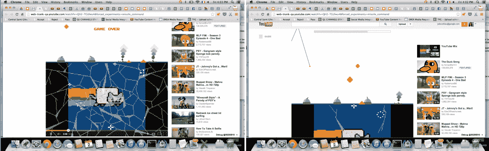
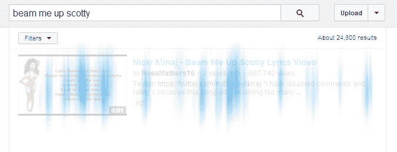
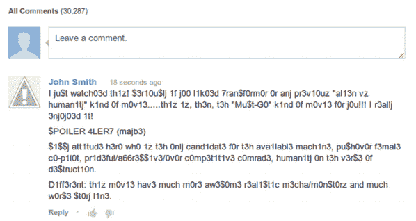

# YouTube 极客周复活节彩蛋庆祝导弹司令部，星球大战和 Bronies

> 原文：<https://web.archive.org/web/https://techcrunch.com/2013/08/10/youtubes-geek-week-easter-eggs-celebrate-missile-command-star-trek-and-my-little-pony/>

# YouTube 极客周复活节彩蛋庆祝导弹司令部，星际迷航和 Bronies

YouTube 刚刚结束了它的第一个极客周，这是一个庆祝所有极客的活动。除了展示慢动作[水球大战](https://web.archive.org/web/20230213103835/http://www.youtube.com/watch?v=Xz5z1hBxejg&feature=c4-overview-vl&list=PLbpi6ZahtOH75AaR5RsVcN3SjC7VNpUpV)，尼尔·德格拉斯·泰森[谈论科学](https://web.archive.org/web/20230213103835/http://www.youtube.com/watch?v=cxfTa_fSSC0&feature=c4-overview-vl&list=PLbpi6ZahtOH6nDXfPtCMEm8aAzmbzZUBw)和[动漫版神秘博士](https://web.archive.org/web/20230213103835/http://www.youtube.com/watch?v=TySLmj2ZWIo&feature=c4-overview-vl&list=PLbpi6ZahtOH6E5AHWB5WHkDF67y1m13_Z)之类的日常视频，YouTube 每天还会展示复活节彩蛋。如果你像我们一样，没有完全注意到其中的每一个，这里有一个完整的列表，包括一个非常有趣的导弹命令克隆，让你从那些讨厌的导弹中保护你最喜欢的视频。

我们不知道这些视频会在 YouTube 上保留多久，所以在它们消失之前，现在就给它们一个尝试吧。

导弹指令:要在 YouTube 上玩导弹指令，只需在观看视频时输入 1980。这里的诀窍是只需点击页面上的空白区域并开始输入(不是在搜索栏！).需要额外的能量吗？在你玩的时候输入 2300。

**我的小马**:想找点压力小点的？只需搜索“[小马](https://web.archive.org/web/20230213103835/http://www.youtube.com/results?search_query=ponies&page=&utm_source=opensearch)或“[野马](https://web.archive.org/web/20230213103835/http://www.youtube.com/results?search_query=bronies&page=&utm_source=opensearch)”如果马上没什么事，就等几秒钟。

《星际迷航》和《星球大战》的粉丝们也会很高兴听到他们没有被遗忘。只需输入' [use the force luke](https://web.archive.org/web/20230213103835/http://www.youtube.com/results?search_query=use+the+force+luke&page=&utm_source=opensearch) 或' [beam me up scotty](https://web.archive.org/web/20230213103835/http://www.youtube.com/results?search_query=beam+me+up+scotty&page=&utm_source=opensearch) '即可获得“对页面元素的绝地风格控制”(这是谷歌的叫法)，并观看载入《星际迷航》风格的视频。

**精英**:还享受 l33t 说话？在任何页面上输入“1337 ”,看看 YouTube 上的评论。它们突然变得更有意义了。

ASCII 码:ASCII 码 YouTube 是一个稍微老一点的复活节彩蛋，它仍然在工作。只要在任何搜索词前面加一个“/”，看看会发生什么。

我再也不能去工作的复活节彩蛋是“fibonnaci”搜索这个显然让你的视频在上周一载入了一个黄金螺旋(8/5//13——都是 Fibonnaci 数字)。

**奖励**:如果你想知道“美女”是怎么回事，这里有一段视频可以解释一下: