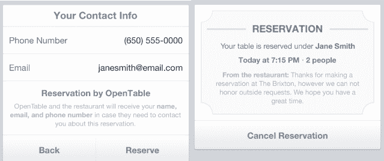

# 脸书通过 OpenTable Reservations 和 Rovi TV Guide Info | TechCrunch 使移动页面更加实用

> 原文：<https://web.archive.org/web/https://techcrunch.com/2013/08/12/facebook-opentable-useful-not-just-social/>

脸书的使命是让手机页面更加实用。继 4 月份进行类似 Yelp 的重新设计之后，今天晚些时候即将推出的 iOS、Android 和移动网站更新增加了与 OpenTable 的集成，允许您从 20，000 家北美餐馆的脸书页面预订，Rovi 还在页面中添加了电视指南。脸书希望增加流量，让页面对企业变得更加重要。

【更新:iOS 6.4 更新的[脸书现已在 App Store 推出。随着 OpenTable 和 Rovi 的集成，它让你](https://web.archive.org/web/20230404160004/https://itunes.apple.com/us/app/facebook/id284882215?mt=8)[点击或搜索标签](https://web.archive.org/web/20230404160004/https://techcrunch.com/2013/06/27/facebook-related-hashtags/)来查看朋友的帖子、页面和包含它们的公共更新。这些选项在 6 月下旬出现在移动网站上。

如果脸书能让它的移动页面真正有用，它就能在竞争中击败更专注的本地信息和发现网站，如 Yelp、Foursquare 和谷歌搜索结果。给人们多一个打开脸书应用的理由，会增加他们最终查看通知、发送消息和浏览看到广告的新闻源的机会。

通过[为网页提供信息和互动](https://web.archive.org/web/20230404160004/https://techcrunch.com/2013/04/23/facebook-mobile-pages/)来推动商业，脸书也可以鼓励他们为自己的网页做广告。企业已经在谷歌搜索、Yelp 和其他广告平台上投入了大量资金，在这些平台上他们可以接触到有购买意向的人。

大多数人浏览脸书商业网页不是为了好玩。他们是去获取一些重要信息的。脸书发言人 Tim Rathschmidt 告诉我“如果你在移动设备上看一个页面，这可能是因为你想看看他们是否打开，或者打电话预订。”脸书移动页面浏览器拥有广告商正在寻找的意图，所以这个社交网络正竭尽所能让更多人访问。

### 有用，不仅仅是社交

OpenTable 的消费产品副总裁 Jocelyn Mangan 告诉我关于整合的事情。脸书是 600 多个合作网站和服务中最新的一个，通过 OpenTable 引导人们寻找餐饮预订。这些推荐产生了 OpenTable 每月 1200 万个预订席位中的 5%-10%。这两家公司已经在二月份推出的[我吃过的地方应用](https://web.archive.org/web/20230404160004/https://apps.facebook.com/opentableapps)脸书桌面应用 OpenTable 上合作。

与 Yelp 的 OpenTable 集成类似，脸书餐厅移动页面不需要你访问 OpenTable 的网站，使用它的应用程序，甚至不需要你有一个帐户。多亏了它的 API，选择聚会规模和预定桌子的首选时间的过程完全在脸书进行。

要预订，你只需访问餐厅的页面，在它的地址和营业时间(在四月重新设计的中突出显示)下面，你会看到一个面板提醒你“晚上 7:00 左右可以预订两个人的座位”。脸书会自动用您的姓名、电子邮件和电话号码(如果您有存档的话)预填预订表格。按下“预订”按钮，你会得到屏幕和电子邮件确认，还有一个在脸书页面取消的选项。

如果你正在寻找“晚餐和表演”，脸书页面也可以帮你找到一些娱乐。与数字娱乐信息提供商 Rovi lets 的新集成为电视节目和电影的脸书页面添加了本地网络、播放时间和剧集信息。这意味着你可以去《绝命毒师》的页面，看它在美国西部时间周日晚上 9 点在 AMC 频道播出，下一集叫做；“埋葬”和处理沃尔特掩盖他的踪迹，杰西处理内疚。

这些类型的整合使得脸书网页不仅仅是一个社交中心或网络上额外的虚荣心。他们实际上可以做生意，脸书也可以赚钱。

OpenTable 通过其网站或合作伙伴向餐馆收取每份餐车 1 美元的费用，但这些顾客平均花费 43 美元。如果餐馆将这种支出归因于脸书，他们可能更愿意为自己的页面购买赞，推广帖子以提高他们的新闻订阅，或其他广告，将人们带到脸书页面，在那里他们可以预订。与此同时，如果电视节目看到脸书页面参与度增加与收视率提升相关，他们可能会在播出期间更多地推广他们的页面。

不要指望这些是脸书为提升页面功能所做的最后一次整合。它与 OpenTable 没有独家协议，因此它也可以与 RestaurantReservations.com 等服务合作，以帮助就餐者。最终，我希望脸书页面能够提供任何需要预订或预约的选项。

然而，在寻求这种信息或帮助时，脸书必须想办法改变我们的行为模式。我们大多数人都被训练去谷歌搜索这类东西，或者点击 Yelp 寻求餐饮帮助。当我想到脸书页面时，我想到的是 feed 帖子、新闻和照片——内容，而不是功能。让我们进入应用程序，显示搜索框，成功导航到一个页面是相当多的工作，就像挖掘脸书被严重掩埋的[“附近的地方”本地发现功能](https://web.archive.org/web/20230404160004/https://techcrunch.com/2012/12/17/facebook-nearby/)。如果我们永远无法访问页面，那么世界上所有的功能都没有用。

但是，如果我的怀疑是正确的，这些网页可能会很快变得更容易找到。我认为，专注于改造餐馆、电视和电影移动页面，可能是为拖延已久的移动图形搜索的推出做准备。