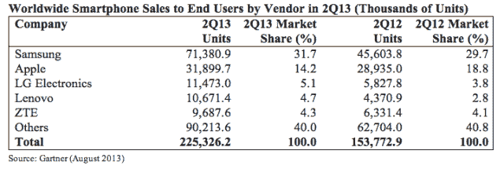
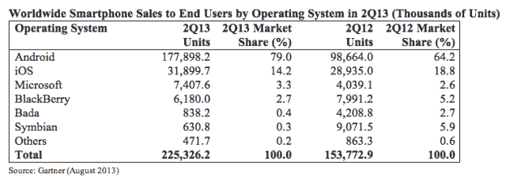

# Gartner TechCrunch 称，在 Q2，智能手机的全球销量最终超过了 Dumbphone，Android 现在占到了 79%

> 原文：<https://web.archive.org/web/https://techcrunch.com/2013/08/14/gartner-q2-smartphone/>

分析师 Gartner 发布了其最新的智能手机市场报告，Q2 2013 年的数据显示，不可避免的事情终于发生了:智能手机销量首次超过功能手机销量。多年来，Android 一直在扼杀智能手机的生命，但看起来市场的临界点正在到来。

在 Q2，Gartner 说，全球智能手机销量较上年同期增长 46.5%，达到 2.25 亿部，而功能手机销量同比下降 21%，至 2.1 亿部。智能手机出货量增长最多的是亚太地区、拉丁美洲和东欧，增长率分别为 74.1%、55.7%和 31.6%，但该分析师表示，所有地区的销量都有增长。 [IDC](https://web.archive.org/web/20221219210732/https://techcrunch.com/2013/08/07/android-nears-80-market-share-in-global-smartphone-shipments-as-ios-and-blackberry-share-slides-per-idc/) 最近的市场数据显示，安卓在 Q2 的全球市场份额接近 80%。谷歌的移动操作系统显然正在通过吸引以前的功能手机用户来扩大其份额。

全球智能手机拥有量的上升趋势正在推高所有船只，但三星继续主导智能手机市场。Gartner 表示，三星的市场份额接近三分之一(31.7%)，在 2012 年 Q2 上增长了 29.7%。苹果也增加了其 iPhone 的出货量，但其市场份额下降——这突出表明了库比蒂诺制造[低成本 iPhone](https://web.archive.org/web/20221219210732/https://techcrunch.com/2013/07/29/plastic-casing-for-apples-low-cost-iphone-gets-confirmed-in-a-supplier-responsibility-investigation/) 以抓住市场预算端的增长。2013 年，苹果在 Q2 的市场份额为 14.2%，去年同期为 18.8%。与 2012 年的 Q2 相比，苹果的 iPhones 出货量仍然增长了 10.2%，但被更高的智能手机市场增长率超过了。

在三星和苹果之后，这是所有亚洲智能手机制造商争夺第三名的故事:LG 在 Q2 获得第三名(份额为 5.1%)；其次是联想(4.7%)，其乐 phone 一直是中国的畅销产品；以及中兴通讯(4.3%)。

Gartner 表示，苹果公司在 Q2 的设备平均售价(ASP)大幅下降，其平均售价降至苹果公司自 2007 年推出 iPhone 以来的最低水平。这归因于 iPhone 4 的强劲销售——再次强调了苹果推出更便宜的 iPhone 的理由(从销量的角度来看)。然而，这样做显然会加速其平均销售价格的下降，即使市场增长现在是由廉价设备推动的——这为苹果公司将 iPhone 扩展到更便宜的价格点提供了动力。

Gartner 分析师 Anshul Gupta 在一份声明中评论道:“虽然苹果(下滑的)平均售价表明了对新旗舰机型的需求，但苹果推出新的低价机型也是有风险的。”“尽管这款可能的低价新设备的定价可能与 iPhone 4 类似，在 300 美元至 400 美元之间，但被蚕食的可能性将远远大于如今 iPhone 4 的情况。尽管被视为旗舰产品中价格较低的同类产品，但它将代表一种新设备，伴随着与之相关的营销宣传。

同样值得注意的是，在 Q2，微软的 Windows Phone 平台首次超过黑莓的操作系统，成为第三大平台。早在 2010 年 Windows Phone 发布时，史蒂夫·鲍尔默和诺基亚的首席执行官史蒂芬·埃洛普谈到了他们在智能手机领域创建第三个生态系统的雄心。他们仍在试图储存生态系统的火种，但从销售角度来看，他们至少排在第三位。

Windows Phone 在 Q2 的全球市场份额为 3.3%，而苦苦挣扎的黑莓操作系统的份额仅为 2.7%。古普塔指出:“虽然微软在本季度设法增加了份额和数量，但微软应该继续关注应用程序开发者日益增长的兴趣，以帮助增加其在用户中的吸引力。”

总的来说，Android 和 iOS 在本季度占据了 93.2%的全球市场份额——这强调了为什么开发者首先选择支持这两个平台，并且通常需要激励他们在其他地方花费精力。根据 Gartner 的数据，Android 在 Q2 的全球市场份额达到了惊人的 79%,高于去年同期的 64.2%——这得益于功能手机的转变。

功能手机销量的下降对诺基亚来说是个坏消息，该公司仍然严重依赖其功能手机业务(因为其智能手机业务与 Windows Phone 的弱势地位密切相关)。诺基亚在 Q2 的功能手机出货量仅为 6100 万部，低于去年同期的 8300 万部。但这家芬兰手机制造商至少在智能手机领域看到了一些不错的增长，这要归功于它提供了更广泛的不同价位的产品组合。根据 Gartner 的数据，2013 年诺基亚基于 Windows Phone 的 Lumia 在 Q2 的销量增长了 112.7%。