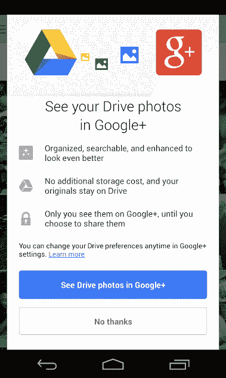

# Google+ For Android 将 Messenger 替换为 Hangouts，与 Google Drive 和更多 TechCrunch 集成

> 原文：<https://web.archive.org/web/http://techcrunch.com/2013/08/14/google-for-android-swaps-messenger-for-hangouts-integrates-with-google-drive-more/>

谷歌今天继续统一其混乱的通信，更新了其 [Google+ Android 应用程序](https://web.archive.org/web/20230131012850/https://play.google.com/store/apps/details?id=com.google.android.apps.plus&hl=en)，除其他外，最终杀死了 Messenger。此前，Messenger 允许该应用程序的用户将朋友带入群组对话，进行短信、照片共享和面对面的视频聊天。但现在，Hangouts 在 Google+和更广的范围内服务于这个目的。

在[今年的谷歌 I/O 大会](https://web.archive.org/web/20230131012850/https://techcrunch.com/2013/05/15/google-hangouts-messaging-app/)上，谷歌宣布将 Gmail 和 Google+ chat 合并为“Hangouts”的新品牌，这是当时已经广为流传的[谷歌试图将其所有通信工作集中在一个屋檐下的尝试。多年来，谷歌已经推出了大量的信息和视频聊天服务，例如 Google Talk、Google+ Messenger 和 Google+ Hangouts。该公司开始转向 Hangouts，在 iOS 和 Android 上推出了独立的 Hangouts 应用程序来取代 Google Talk，并在 Gmail 中提供了从 Google Talk 到 Hangouts 的升级。](https://web.archive.org/web/20230131012850/http://www.droid-life.com/2013/04/09/google-babel-news-google-voice-support-eventually-coming-synced-notifications-first-class-ios-experience/)

但直到现在，Messenger 仍然挂在主要的 Google+应用程序中，无论是在 iOS 还是 Android 上。现在它要被永远拔出来了。谷歌表示，今天晚些时候，所有用户的 Messenger 对话都可以通过谷歌外卖下载，包括文本和照片。

Messenger 的移除并不是 Google+应用更新中唯一的重大变化。该公司表示，它还推出了其他几个最受欢迎的功能，包括支持 Google Apps 的商业功能，改进的帐户和页面切换，更多的位置共享控制(通过 Circle 定位和城市级别)，以及访问 Google Drive 照片和视频。存储和社交服务之间的后者升级是另一个急需的集成。还增加了拉至刷新功能。所有这些功能的详细信息已于今天早些时候发布在——还有哪里？–[Google+](https://web.archive.org/web/20230131012850/https://plus.google.com/101870761930221849874/posts/HNSJByBhDin)。

并非所有人都对 Google+最近的变化感到满意。在谷歌纬度的[关闭](https://web.archive.org/web/20230131012850/https://techcrunch.com/2013/07/10/google-maps-for-android-gets-a-new-ui-but-drops-latitude-and-offline-maps-ipad-app-coming-soon/)之后，谷歌 Play 商店的许多评论报告了崩溃问题，而其他人则抱怨定位服务的问题。Hangouts 也没有给每个人留下深刻的印象——例如，今天在 TechCrunch 办公室无意中听到的，是这样的嘲笑:*“新 Hangouts 唯一的好处就是有更多种类的表情符号*哎哟。

虽然谷歌已经运营消息和聊天服务有一段时间了，但最近它不得不在这个世界上追赶，因为 Facebook Messenger、Whatsapp、LINE、卡考、微信等移动消息应用以及 Path、Snapchat、MessageMe、Viber 等初创公司的其他应用已经在全球范围内获得了数百万用户。不过，这些数字在手机短信面前可能还是相形见绌。我们已经听到传言说，谷歌在这种通信整合方面还远远没有完成，可能会在未来将 Hangouts 更深入地集成到 Android 操作系统中(不仅仅是[添加](https://web.archive.org/web/20230131012850/https://techcrunch.com/2013/05/16/googles-new-hangouts-chat-and-messaging-app-to-incorporate-sms-soon/)短信集成)，例如，使其更像谷歌版的苹果 iMessage——这对消费者来说是一个很大的卖点，但对于一直拥有自己的消息接口和服务的 Android OEMs 厂商来说，这可能是一个潜在的棘手问题(如三星的 ChatOn)。

Android 版 Google+的更新版本正在推出。iOS 更新将紧随其后。