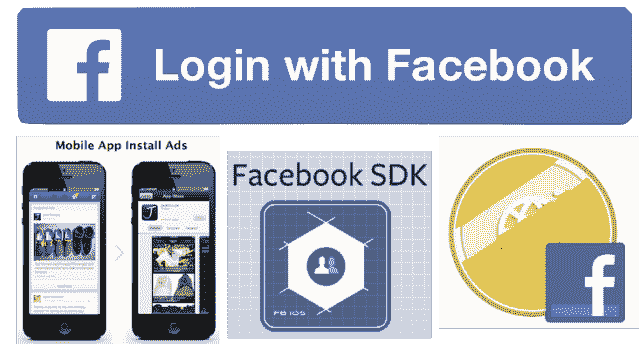

# 脸书支付测试不是贝宝的竞争对手，它是一个补充账单信息的伙伴

> 原文：<https://web.archive.org/web/https://techcrunch.com/2013/08/15/facebook-paypal-companion-not-competitor/?utm_source=dlvr.it&utm_medium=twitter>

脸书正在测试一种让信用卡支付更容易的方法，但它与 PayPal 兼容，而不是像 AllThingsD 写的那样反对它。该功能会预先填充信用卡和账单信息，以便通过 PayPal、Stripe、Braintree 或第三方移动应用程序中的其他支付处理器进行更轻松的购买。它本身不是一个支付处理器，但可以帮助脸书证明其广告的投资回报率。

AllThingsD 最初报道称，脸书正在与电子商务应用 JackThreads 合作进行一项新的支付测试，但将其误认为是对 PayPal 核心业务的直接威胁。由于脸书实际上并不处理这些移动应用支付，它不能作为贝宝的替代品。有一天，随着脸书成为一名加工者的大量工作，这种情况可能会改变，但现在还不是时候。

在线支付专家、环球银行间金融电信协会(SWIFT)前顾问 matthus Krzykowski 证实了这一说法，他说:“考虑与 PayPal 竞争的最简单方式是把脸书想象成 Visa 或美国运通。为了竞争，脸书将需要获得一个[【收单银行】](https://web.archive.org/web/20230318224658/http://en.wikipedia.org/wiki/Acquirer)的地位，并积累大量像 Visa 或美国运通这样的公司所拥有的技术和人力。这不是这个新闻的内容。如果真的发生了——这是一个巨大的“如果”,我们会很容易看到这种情况的发生。”

matthus 根据他在该行业的经验总结道，“我基本上已经认识到，与 PayPal 竞争是一个白日梦。”

### 脸书的支付信息填写如何工作

比方说，你点击脸书上的一个广告进入一个电子商务应用程序，或者自己访问一个电子商务应用程序。当你去购物时，你通常必须在你的小键盘上输入你的信用卡和帐单地址信息。这是一个阻碍人们真正买东西的麻烦。

在脸书新的支付测试中，你会看到一个类似“让脸书输入我的账单信息”的按钮然后你会看到一个数据许可请求，要求你允许访问你以前在脸书存储的购买礼物或在游戏中付款的账单信息。只需一次点击，你的许可填写所有的帐单信息，你可以点击“确认购买”按钮。

然后，付款由应用程序已经使用的任何处理器处理，无论是 PayPal、Braintree、Stripe 还是其他任何处理器，它都会收取正常费用。实际上，脸书的支付功能是一个数据层，建立在其他支付服务之上，而不是与之竞争。这类似于[脸书不直接与 iOS 和 Android](https://web.archive.org/web/20230318224658/https://techcrunch.com/2013/04/25/everything-but-a-facebook-os/) 竞争，而是在它们之上的一个社交层。

PayPal 的全球倡议高级总监 Anuj Nayar 同意这就是脸书的系统在他的公司中的工作方式。脸书否认该测试试图从 PayPal 抢走客户的官方声明是:

> “我们正在进行一个非常小的测试，让人们在购买时将他们已经在脸书存档的支付信息填充到手机应用程序的结账表单中。然后，应用程序处理并完成支付。这项测试让人们只需预先填写你的支付信息，就能更容易、更快捷地在移动应用中购物。这将是一个非常小的测试与 1-2 个合作伙伴。
> 
> 我们继续与 PayPal 保持着良好的关系，该产品只是为了测试我们如何帮助我们的应用程序合作伙伴提供更简单的商业体验。这项测试不涉及将支付处理从应用程序的当前支付提供商(如 PayPal)转移出去。"

### 策略？促进广告销售

脸书的支付测试不是收取费用，而是向它提供关于你的广告点击是否会给广告商带来收入的数据。假设你通过脸书的一则广告获得了这款电子商务应用，点击该应用只需 0.25 美元。如果你使用脸书信息填写选项购买了 20 美元，脸书可以向广告商报告他们的广告购买为他们赢得了投资回报。这对说服他们购买更多广告至关重要。[更新:[华尔街日报的 Evelyn Rusli](https://web.archive.org/web/20230318224658/https://twitter.com/EvelynRusli) 得出了类似的结论，这是为了证明广告的投资回报率，而不是与 PayPal 竞争。]

脸书也可以利用同样的流量让广告商更容易购买这些广告。

或许几年后，脸书会认真起来，把自己打造成一个支付处理商，但就目前而言，这项功能对脸书来说，除了以 PayPal 为代价获得直接收入之外，还有其他好处。就中短期而言，脸书的业务是广告。它的策略是为广告商和开发商提供一切可能的工具，让他们购买更多的广告，无论是在线还是离线。

在肉类领域，[脸书正与 Datalogix](https://web.archive.org/web/20230318224658/https://techcrunch.com/2013/04/25/datalogix-offline-purchase-data/) 合作，测量其广告如何鼓励实体店的购买。如果它能向一个牙膏品牌展示，在旧金山 100 万美元的广告购买使其在该市的牙膏销售额增加了 300 万美元，它就能说服他们继续用它做广告。

在网上，脸书希望平台开发商购买其广告，并贡献可以在旁边显示广告的内容。它在 11 月推出了[移动应用安装广告](https://web.archive.org/web/20230318224658/https://techcrunch.com/2012/10/17/facebook-mobile-app-install-ads/)，以帮助开发者在拥挤的应用商店中发现他们的产品。这些广告迅速成为脸书广告收入的重要组成部分。

然后[在 4 月份收购了移动后端即服务解析](https://web.archive.org/web/20230318224658/https://techcrunch.com/2013/04/25/facebook-parse/),以方便开发者托管他们的应用并专注于用户体验。通过 Parse 拉近与开发者的距离，脸书可以推广其社交分享软件开发套件，让分享内容的应用通过广告赚钱，并推广其移动应用安装广告。

其战略的这些在线组成部分可以结合起来，通过以下方式让其在移动经济的每一步中发挥作用:

1.  让广告商快速购买移动应用安装广告，并填写付费信息
2.  在新闻提要中提供这些应用程序安装广告，让应用程序获得更多用户
3.  通过提供其移动 SDK 来烘烤社交分享功能，帮助这些应用程序病毒式增长
4.  让应用程序的用户更容易通过填写账单信息进行购买

由于脸书的业务正决定性地转向移动领域，而且它在社交广告领域面临着来自 Twitter 和其他平台的竞争对手，因此它必须尽一切努力提高广告销售，同时改善用户体验。赚更多钱的一个简单答案是要么展示更多广告，要么拓展第三方支付处理等全新业务。但一个更好的方法可能是简单地通过使用数据来提高广告的针对性并证明它们有效，从而使其现有的广告更加相关和昂贵。

虽然人们总是倾向于假设大公司做的任何事情都是为了赚钱，但脸书可能只是觉得，当手机已经存储了他们的支付信息时，让人们在手机上输入这些信息是愚蠢的。

脸书实际上试图允许开发商请求家庭地址，以消除账单和运输信息输入的摩擦早在 2011 年，批评者对隐私问题产生了不必要的恐慌，脸书在几天后就关闭了这一选项。幸运的是，从那以后我们已经进化了，可能会让脸书和其他公司消除网上的这种麻烦。