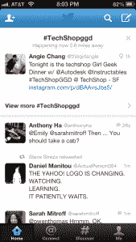

# Twitter 展示其位置优势，测试发生在你身边的现场事件的亮点 TechCrunch

> 原文：<https://web.archive.org/web/https://techcrunch.com/2013/08/15/twitter-is-testing-out-a-feature-to-highlight-live-events-happening-near-you/>

昨天我们报道了 [Twitter 如何测试一个新的电视节目趋势框](https://web.archive.org/web/20230129075528/https://techcrunch.com/2013/08/14/twitter-is-testing-out-a-new-tv-trending-box-at-the-top-of-your-timeline/)在你的时间线顶端运行；今天我们发现了另一个新功能的测试:提醒你身边正在发生的事件。

像趋势电视功能一样，基于邻近度的警报是围绕标签组织的——在这种情况下，是针对附近的实际亲身事件，而不是电视节目。他们是 Twitter 成为所有场合讨论的首选平台的又一个例子——真实的和虚拟的；它如何成为基于位置的服务的有力参与者；以及 Twitter 如何利用这样的新形式以付费广告的形式增加收入。

与昨天的测试一样，Twitter 的 iPhone 应用程序也发现了附近活动的功能，这一次是由 TechCrunch 自己的安东尼·哈(Anthony Ha)发现的。右边是它的截图。

你所看到的是时间线顶部的一个盒子，它被分成三个部分:一个部分带有一个标签，标明事件与你的距离；一条带有与该事件相关的标志性推文；另一个会带你去一个更长的提到这个标签的推文列表。你可以通过点击右上角的“x”来关闭整个框。

这里最引人注目的事件是[周三晚上的女孩极客晚宴](https://web.archive.org/web/20230129075528/http://www.bayareagirlgeekdinners.com/bay-area-girl-geek-dinner-46-sponsored-by-techshop/)，这是一次定期聚会——你猜对了——技术女性，她们在玩新事物和听大创意演示时建立关系网。我们联系了女极客创始人，询问她们是否知道这个 Twitter 测试。从某种意义上来说，如果 Twitter 选择了这个活动，这将和它与组织者协调一致的努力一样有趣。

**更新**:原来这不是 Twitter 问他们的问题。“没有人从我们这里获得额外的信息来发布一个标签，”海湾地区女孩极客晚餐医学博士 Sukrutha Raman Bhadouria 说。

“多么有趣的 Twitter 冒泡到安东尼的 feed my event tweet 的顶部…我想知道他们怎么知道这是一个事件。我想是自然语言处理，”湾区女孩极客晚餐的创始人 Angie Chang 补充道。

我们也联系了 Twitter 询问此事，和昨天一样，他们拒绝发表评论，但给我指出了他们关于“[通过实验创新](https://web.archive.org/web/20230129075528/https://blog.twitter.com/2012/innovate-through-experimentation)”的博客帖子的方向这是该公司在 2012 年 5 月启动的一个项目，旨在测试更多的新功能，其中一些最终会作为平台的永久更改推出。

就像对趋势电视的测试一样，这直接符合 Twitter 过去明确的雄心，即它希望在继续增长的同时如何塑造自己的服务。

今年 6 月，[首席执行官迪克·科斯特罗说了很多话](https://web.archive.org/web/20230129075528/https://techcrunch.com/2013/06/26/twitter-is-experimenting-with-new-live-events-platform-dvr-mode-for-using-twitter-with-tv-more/)关于 Twitter 不再像它一直渴望的城市广场，因为它变得越来越嘈杂，有很多不同种类的信息。为此，他指出，Twitter 正在试验一种实时事件工具，以帮助突出关键时刻。其中一些时刻肯定会出现在电视上，尤其是因为这已经是 Twitter 上非常受欢迎的话题。但是有些人不会——这就是这个新功能派上用场的地方。

Twitter 最初是一项只提供手机服务的服务，所以在某种程度上，开发更多的功能是该公司 DNA 的一部分。我们能够看到一条推文的位置已经有很长一段时间了，所以基于位置的功能对 Twitter 来说并不新鲜。或许更有趣的是，Twitter 开始寻找利用这些信息向人们推送特定信息的方法。

这也让我想起该公司最近的一些收购，包括地理限制搜索引擎的制造商 [Spindle](https://web.archive.org/web/20230129075528/https://techcrunch.com/2013/06/19/twitter-acquires-local-discovery-startup-spindle-will-end-spindle-service/) ，回答“附近现在发生了什么”的问题；和[幸运的种类](https://web.archive.org/web/20230129075528/https://techcrunch.com/2013/05/13/twitter-acquires-big-data-visualization-startup-lucky-sort-service-to-shutter-in-months-ahead/)，发现实时数据流模式的引擎制造商。总之，你可以看到像这样的技术，结合在 Twitter 的平台上，可以用来绘制出你自己的时间线事件，这些事件可能是你个人最感兴趣的，也是你最亲近的人最感兴趣的。

最后但同样重要的是，虽然 Twitter 可以非常容易地将这作为一种有用的额外服务提供给人们，让他们更多地参与 Twitter 对话和浏览其平台，但你也可以看到这样的东西如何能够像一个新的移动广告单元一样容易地扩展，为那些对推广你周围的活动或地方感兴趣的人服务。在这方面，这与 Twitter 在趋势话题等其他功能上的做法没有什么不同，趋势话题往往不仅是有机/病毒流行词的混合物，也是赞助商付费放在前面和中心的词的混合物。随着 Twitter 的不断成熟，这一持续的货币化主题可能会成为贯穿其大部分内容的潜流。

安东尼哈补充报道。