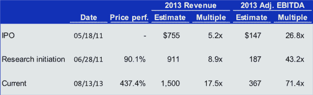

# LinkedIn 如何成为华尔街巨头 TechCrunch

> 原文：<https://web.archive.org/web/https://techcrunch.com/2013/08/17/how-linkedin-became-a-wall-street-juggernaut/>

More posts by this contributor

格伦·索罗门是 GGV 资本公司的合伙人。他最近的一些投资包括 Pandora、Successfactors、Isilon、Domo、Square、Zendesk、Quinstreet 和 Nimble Storage。他的个人博客关注的是处于成长期的企业家，他们有远大的想法；可以在[这里](https://web.archive.org/web/20230129065412/http://goinglongblog.com/)找到。在 Twitter 上关注他 [@glennsolomon](https://web.archive.org/web/20230129065412/https://twitter.com/glennsolomon) 。

2010 年，如果你向最聪明的硅谷企业家和投资者暗示，2013 年 LinkedIn 的市值将超过 Groupon、Zynga 或 Twitter，你会遭到嘲笑。如果你假设 LinkedIn 的价值将超过 Groupon、Zynga 和 Twitter 的总和，价值接近脸书的三分之一，没有人会相信你。LinkedIn 不像当时的互联网宠儿那样令人兴奋，因此，当时有许多 LinkedIn 的怀疑者，包括我自己。

虽然 LinkedIn 在 2010 年左右可能没有其活跃的互联网兄弟们那么令人兴奋，但该公司显然做了一些非常正确的事情，建立了一个产品路线图、公司战略和团队，自该公司首次公开募股以来，他们已经支付了可观的股息。LinkedIn 的案例研究向创始人和投资者提出了有趣的问题:为什么 LinkedIn 作为一只上市股票表现如此之好？我们能从它的 IPO 和上市后表现中学到什么？在这篇文章中，我将简要阐述 LinkedIn 表现如此出色的四个原因:

1.  华尔街“击败并提高”方法的价值
2.  创造强大的竞争优势和地位
3.  构建多重增长载体
4.  设计越大越好的产品

##### 击败和提高方法

LinkedIn 完美地扮演了华尔街。该公司的 IPO 定价远低于市场出清价格，保持了较低的预期，自上市以来，它已经抹去了其指导数字和华尔街的一致估计。事实上，正如你在下面看到的，华尔街对 LinkedIn 2013 年收入的普遍预期已经从 2011 年 5 月中旬上市时的 7.55 亿美元上升到目前的 15 亿美元。2013 年 EBITDA 共识也是如此，从 IPO 时的 1.47 亿美元攀升至今天的 3.67 亿美元。随着收入和利润预期的飙升，股价也在上涨。

来源:德意志银行证券

这个策略需要耐心。在业务中建立足够的成熟度需要时间，以便团队能够可预测地交付结果并保持可见性。在华尔街，引用电台司令的话，“没有警报，也没有惊喜。”

这种策略也要求公司承受打击，这是一件很难做到的事情。从早期投资者到新的 IPO 投资者的价值转移表现为更高的稀释或更少的 IPO 融资。大多数硅谷人都被训练成不这么做，但人们必须考虑向前支付，即使是对华尔街而言，尽管这听起来很疯狂。如果公司能为投资者赚钱，这些股东往往会保持忠诚，并吸引其他认可这种价值的人。与此同时，管理层在投资者中赢得越来越多的信任，这是上市公司非常宝贵的资产。

##### 创造深度竞争优势

尽管现在我们都很清楚，LinkedIn 为自己创造了一个非常有竞争力的位置。LinkedIn 的核心是其庞大的个人和公司专业信息数据集。该公司花费了多年时间来研究如何建立这一信息资料库，并创造合适的用户体验，以保持数据集的价值不断增长。可以说，目前没有微软、谷歌或 Salesforce.com 的资金可以重建这个数据集。这是护城河。花了很长时间建造的事实只会让它更有价值，而且它不会去任何地方。

华尔街已经获得了信心，认为竞争对手不可能出现并杀死 LinkedIn，在华尔街，一旦对可信竞争的恐惧消失，估值倍数就会飙升。也就是说，尽管自 IPO 以来，2013 年的收入预期几乎翻了一番，如上图所示，投资者愿意为这一收入支付的倍数已经超过了*的三倍*(从 5.2 倍到 17.5 倍)。对竞争的恐惧正在消退，对公司超越其指导能力的信心正在增长。

##### 构建多重增长载体

LinkedIn 建立的不是一个，而是许多增长载体。华尔街投资者喜欢一个大的、可定位的市场，虽然他们不喜欢公司通过追逐许多互不关联的市场而分散自己，但他们确实喜欢利用核心资产的相邻市场。有了这一点，投资者可以在更长的时间内模拟出更多的增长，并将继续为股票支付更高的价格，期待高增长率。LinkedIn 在建立多种收入来源方面做得非常好(人才解决方案、营销解决方案和高级订阅都是快速增长的，为整体收入贡献了健康的份额)，增加了他们的产品集，并通过积极的 iOS+html 5 战略转向移动，所有这些都利用了他们的核心数据集。

##### 设计越大越好的产品

LinkedIn 就像一瓶陈年佳酿，随着年龄和规模越来越好。在硅谷，人们不惜一切代价关注增长。这是有道理的。华尔街也迷恋增长，但投资者通常也同样喜欢利润扩张和扩大利润增长(有时甚至更多)。

LinkedIn 对其业务进行了投资，因此该公司现在受益于巨大的利润动态——快速增长的收入和不断扩大的利润率(例如，EBITDA 利润率在 6 月季度从去年同期的 22.1%上升到 24.4%)。我的猜测是，公司管理层选择在早期牺牲更快的增长，以确保他们设计了正确的模式。这可能解释了为什么一些人在早期没有积极看待 LinkedIn，但现在这一切都没有意义，因为他们的耐心在街上得到回报。

随着脸书 IPO 的失败和最近的复苏，我经常被问到公司应该如何为华尔街做打算。我的答案是:你越能效仿 LinkedIn 的做法，就越好。