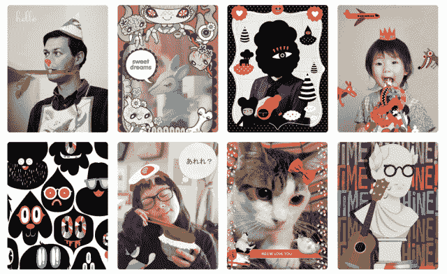

# Chiizu 是为艺术、插图和设计爱好者设计的照片装饰应用程序

> 原文：<https://web.archive.org/web/http://techcrunch.com/2013/08/21/chiizu-is-the-photo-decoration-app-for-art-illustration-and-design-lovers/?utm_source=dlvr.it&utm_medium=linkedin>

# Chiizu 是为艺术、插图和设计爱好者设计的照片装饰应用程序

如果你认为 purikura 应用程序是一种用闪光和其他劣质图形玷污照片的方式，那么 [Chiizu](https://web.archive.org/web/20230316040227/http://chiizuapp.com/) 会让你大吃一惊。由一名媒体艺术家、一名插画家和一名设计师创建的 iOS 照片装饰[应用程序提供了由杰出艺术家名册制作的主题布景，包括](https://web.archive.org/web/20230316040227/http://get.chiizuapp.com/)[琳达·加文](https://web.archive.org/web/20230316040227/http://t.co/Xvu0WTGqCR)，推特标志的最初创造者；[Dyna Moe](https://web.archive.org/web/20230316040227/http://www.nobodyssweetheart.com/),[狂人自己背后的女人](https://web.archive.org/web/20230316040227/http://www.amctv.com/shows/mad-men/mad-men-yourself)《阿凡达》制作者；画家[朱卡·荒川](https://web.archive.org/web/20230316040227/http://araikawajuka.com/)；前流行音乐唱片艺术总监杰西·勒杜。

联合创始人 Stella Lai 表示，Chiizu 的目标是鼓励用户将视觉艺术和设计融入日常生活。您可以使用 Chiizu 将朋友的照片转换为达达风格的拼贴画，或者从空白画布开始，创建一个充满超现实生物的幻影景观。

“我们想创建一个应用程序，让像我们这样的人(和我们的朋友)可以向世界提供内容，”赖在一封电子邮件中说。“摄影似乎是一种天然的契合，所以我们开始发布艺术家的‘单幅作品’或主题，每幅作品都封装了艺术家的创作愿景，供人们下载或购买。”

该应用刚刚推出了第二个版本，重点是让 Chiizu 更加社交化(它与新浪微博和人人网等社交网络相结合，以此向 Chiizu 在亚洲的庞大用户群致敬)。功能包括应用内摄像头、过滤器和面部识别。目前有六套主题套装是免费的，其他的每套售价 99 美分。Chiizu 遵循付费主题的画廊模式，与创作者分享每次下载的收入。

Chiizu 目前阵容中的其他艺人还有[十一月社](https://web.archive.org/web/20230316040227/https://www.facebook.com/sktbkk)、[布莱恩·巴特勒](https://web.archive.org/web/20230316040227/http://theupperhandart.com/)、[穆 xxi](https://web.archive.org/web/20230316040227/http://muxxi.me/) 、Chiizu 先生、[顺子·水野彩香](https://web.archive.org/web/20230316040227/http://www.mizuno-junko.com/)、[孙铁麟·蒙斯特](https://web.archive.org/web/20230316040227/http://tomimonstre.blogspot.tw/)、[赤泽绫子](https://web.archive.org/web/20230316040227/http://www.lepetitgraphiste.com/)、[加藤绫子](https://web.archive.org/web/20230316040227/http://www.ayakato.net/)、[米歇尔·罗莫](https://web.archive.org/web/20230316040227/http://www.crowdedteeth.com/)、[马丁内斯&树](https://web.archive.org/web/20230316040227/http://www.martineztrees.com/)、[斯特拉·莱](https://web.archive.org/web/20230316040227/http://www.tree-axis.com/stella/#/home)

该应用的目标是每月发布三到四个新主题。s [uero-studio](https://web.archive.org/web/20230316040227/http://suero-studio.com/) 、 [Christal Sih](https://web.archive.org/web/20230316040227/http://portfolios.mica.edu/christalsih) 和 [Andres Guzman](https://web.archive.org/web/20230316040227/http://www.andresguzman.com/) 的片场即将到来。Chiizu 还与艺术家 Aaron Noble 合作一个主题，该主题将与他为新墨西哥州阿尔伯克基的一个青年中心创作的展览和壁画一起推出。

“我们的选择过程是基于质量、独特性以及艺术家的作品是否对媒体有意义，”联合创始人赖说。“我们不支配风格。相反，我们鼓励艺术家自由表达自己，同时考虑他们希望人们如何与他们的作品互动。”

大多数用户是 18 至 35 岁的女性，但 Chiizu 希望未来通过提供更多性别中立的内容来吸引男性用户，包括面向文本的主题和街头艺术家的布景。这款应用的下一个版本将为用户提供更多关于每个主题创建者的信息。