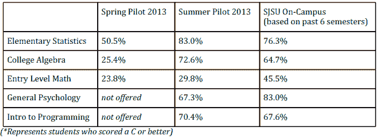

# Udacity 和圣何塞州立大学的在线教育实验有所改进[更新]

> 原文：<https://web.archive.org/web/https://techcrunch.com/2013/08/28/californias-online-college-pilot-proves-successful-after-poor-results-in-1st-semester/>

实验就像过山车。去年春天，在令人失望的结果之后，圣荷西州立大学暂停了其有争议的在线课程实验。但该大学及其平台合作伙伴 Udacity 在第二次尝试中反弹，与传统的在线课程相比，提高了学生在五门夏季课程中的四门课程的成绩。

SJSU 大规模开放在线课程(MOOCs)的试点被认为是为大众开创了一个超低成本课程的时代——而不牺牲教学质量。事实上，理论是，在线视频讲座的自定进度学习方式比一刀切的课堂更适合个人需求。学生们可以随时向导师和他们的同龄人咨询，为了掌握材料，他们可以根据需要听多次讲座。

SJSU 是第一个提供大学学分的大学，这在全国范围内引起了在线高等教育实验的热潮。因此，当 SJSU 的春季学期没有达到预期时，这可能是一个巨大的挫折。事实证明，失败是过早的。

根据 SJSU 教务长和负责学术事务的副校长 Ellen Junn 的说法，他们加大了对新生的定向力度，改善了课程期间的电子邮件通信，并增加了鼓励学生完成课程的方法。“每个人都需要一点鼓励来坚持下去。因此，我们增加了帮助学生评估他们进步的工具，我们更频繁地与学生个人联系，”Junn 在一份声明中说。

困扰这项实验的一个主要问题是，Udacity 和 SJSU 已经向高中生和非全日制大学生开放了这门课程。[根据华尔街日报](https://web.archive.org/web/20221206213907/http://blogs.wsj.com/digits/2013/07/18/san-jose-state-pauses-udacity/)，“20%是高中生，62%的试点学生不是普通的圣荷西学生，所有被录取的学生之前都没有通过数学补习班。”换句话说，表现不佳的学生在班上占主导地位，拉低了分数。

我应该注意到这个故事还有一个额外的复杂层次。SJSU 使用的糟糕的报告方法加剧了线上和线下学生群体不同的问题。在春季和夏季课程中，SJSU 报告了学生成绩的简单百分比。然而，当代教育研究者通常根据年龄、性别、种族、社会经济地位、智商和/或教育经历对学生进行分组。相反，SJSU 只是发布所有学生的平均分数(如上图)，即使 MOOC 学生的平均分数与在校学生的平均分数相差很大。

使用现代技术，而不是简单的百分比，我们可能会看到 MOOC 在春天不那么失败，在夏天也不那么本垒打——让每个人都省了一个大麻烦。

*更新:Udacity 发言人告诉我，他们将在 9 月 4 日发布更复杂的课程统计分析，这很好，因为《高等教育纪事报》[发现](https://web.archive.org/web/20221206213907/http://chronicle.com/blogs/wiredcampus/scores-improve-in-new-round-of-san-jose-states-experiment-with-udacity/45997)夏季的在线学生人数与春季有很大不同，这使问题更加复杂*。

不管结果如何(以及评估方法)，这都是一个大实验，所以我们必须对结果有耐心。然而，我坚持认为，正如我们所知，SJSU 将从根本上改变 T4 的高等教育。

[图片来源:Flickr 用户 [roarofthefour](https://web.archive.org/web/20221206213907/http://www.flickr.com/photos/18702768@N04/2424334594/sizes/l/in/photolist-4Gemdj-4RwBJD-4RwCt6-4RANNb-4RAPvs-4S5KwC-5mct3p-5mct3H-5mcz3x-5mcz3R-5mcE6a-5mcE6B-5mcE6T-5mcE7Z-5mcE8P-5mcE9R-5mgKqN-5mgKrU-5mgKt1-5mgKtj-5mgRvU-5mgRwm-5mgWpj-5mgWr3-5mgWrJ-5mgWs3-5mgWt1-5mgWtu-5oT7wC-77VrjU-7ucsoA-7xW2C5-dZeK8U-dZ93qZ-9baZ59-8BH51V-8AaqbF-8BLavw-8ATqmg-bK6ywF-96AohW-96Apb1-9qDVGM-9bjHWy-8ingFj-cH9V5j-96AnCA-coDzBC-bwbNum-e8aMTD-e8aMZe/)