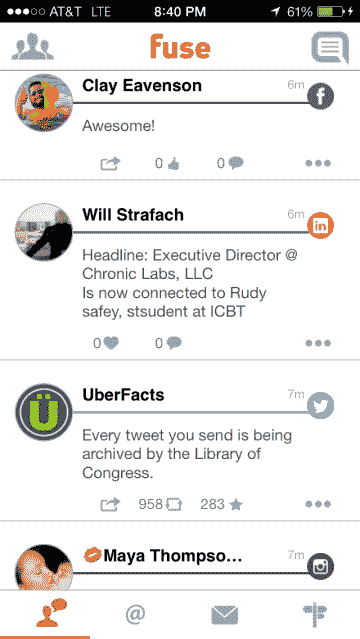

# Fuse 将您的社交网络简化为一个移动应用| TechCrunch

> 原文：<https://web.archive.org/web/http://techcrunch.com/2013/08/28/fuse-streamlines-your-social-networking-into-one-mobile-app/>

Fuse 是一款新的移动应用程序，它将你的社交网络活动聚合到一个“融合”的订阅源中，你可以与它互动、搜索、回复等等，最近它进行了一次彻底的改革，使它成为一款更稳定的产品——由于外观和感觉的升级，它现在已经为即将到来的 iOS 7 操作系统做好了准备。

这款应用背后的概念很简单:它将你所有的社交网络集中在一个统一的界面下。目前，Fuse 整合了你在脸书、Twitter、Instagram 和 LinkedIn 的账户，并计划在未来为 Pinterest、Google+、Foursquare 和其他网络提供支持。

 和大多数社交应用一样， [Fuse](https://web.archive.org/web/20230319234920/http://laicos.com/fuse/) 以类似流的格式呈现你的更新，允许你点赞/收藏、分享、转发/再发、回复等等。此外，它可以让你写文章，然后立刻分享到你所有的网络上——就像早期 Web 2.0 时代的 Ping.fm 曾经做的那样。您还可以创建和保存搜索，以便在您的所有网络中查找您的关键词和搜索词。

还有其他一些应用程序可以让你合并你的社交账户——例如，[divy 专注于照片](https://web.archive.org/web/20230319234920/https://techcrunch.com/2013/06/02/divvy-is-photo-consumption-and-sharing-done-right/)，新推出的 [Socialblend](https://web.archive.org/web/20230319234920/https://itunes.apple.com/us/app/socialblend-combine-facebook/id653717317?mt=8) 看起来也很有前景。然而，其他潜在的竞争对手已经放弃了这个领域，包括 TweetDeck，今年早些时候[撤回了其脸书集成和移动应用](https://web.archive.org/web/20230319234920/https://blog.twitter.com/2013/update-tweetdeck)，而 [Streamified 最近宣布他们将加入 Airbnb](https://web.archive.org/web/20230319234920/http://blog.streamified.com/post/54538781142/streamified-is-joining-airbnb) 并关闭。

Fuse 似乎希望从第一天起就有一个合适的商业模式，从而坚持更长时间。Twitter 和脸书支持在应用程序中免费提供，但 Instagram 和 LinkedIn 通过应用内购买需要 99 美分。据推测，随着其他服务的增加，它们也将是付费升级。

Fuse 的联合创始人凯尔·马修斯最广为人知的身份是 ModMy LLC 的联合创始人，ModMy LLC 是最大的 iPhone 定制社区[ModMyi.com](https://web.archive.org/web/20230319234920/http://modmyi.com/)的幕后公司，拥有约 85 万名会员和 100 万次日浏览量。他解释说，这个新应用是出于个人需求而开发的。马修斯表示，随着越来越多的应用程序争夺你的注意力，管理你的社交形象需要越来越多的时间。“我厌倦了每天早上打开四个不同的应用程序来检查我的社交活动。我们的口号是“你是一个社会人”。“买一个社交应用，”他说。

马修斯与电子商务网站 [Negri Electronics](https://web.archive.org/web/20230319234920/http://negrielectronics.com/) 的首席执行官、联合创始人瑞安·内格里(Ryan Negri)合作，创建了 Fuse 背后的移动开发工作室 [Laicos](https://web.archive.org/web/20230319234920/http://laicos.com/) 。两人在移动领域拥有丰富的经验——Negri 在无线行业和自举公司工作，Matthews 在应用构建、咨询等领域工作，包括 ModMy 通过 [ModMedical](https://web.archive.org/web/20230319234920/http://modmedicalapps.com/) 对医疗应用的其他扩展，以及通过 [Brooks Motorsport](https://web.archive.org/web/20230319234920/http://brooksmotorsport.com/) 进行汽车定制等。

Fuse 应用程序于 6 月下旬悄然推出，并于一周前接受了大修。Fuse 完全自筹资金，[住在 iTunes 应用商店](https://web.archive.org/web/20230319234920/https://itunes.apple.com/us/app/fuse-social/id586162097?ls=1&mt=8)这里。

【YouTube http://www.youtube.com/watch?v=DviUzsYx6FU？feature=player_detailpage]