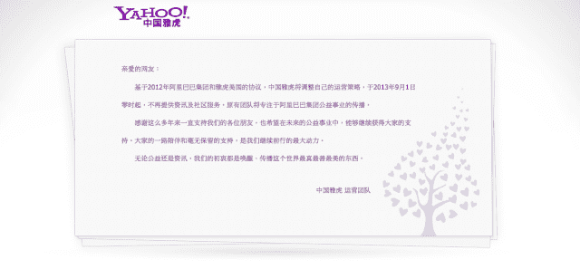

# 雅虎中国关闭门户网站

> 原文：<https://web.archive.org/web/https://techcrunch.com/2013/09/01/yahoo-china-shuts-down-its-web-portal/>

# 雅虎中国关闭门户网站

由中国电子商务和互联网服务巨头阿里巴巴集团运营的雅虎中国关闭了其门户网站。该网站现在会显示一条再见信息，然后将访问者重定向到 now.taobao.com，这是一个由阿里巴巴集团旗下淘宝运营的新闻网站。

告别信中说，关闭雅虎中国门户的决定是根据阿里巴巴集团和雅虎 2012 年达成的协议做出的，雅虎中国的员工将转移到阿里巴巴的新职位。

雅虎中国门户网站的关闭是阿里巴巴集团决定逐步关闭其运营的雅虎品牌服务的最后步骤之一，两周前，雅虎在中国的电子邮件服务被关闭，用户被要求将账户转移到阿里巴巴的 Alimail。一月份，[雅虎中国停止了其中文音乐服务](https://web.archive.org/web/20230305215105/https://techcrunch.com/2012/12/18/yahoo-china-will-shutter-its-music-website/)，称其调整了产品策略。

2005 年，雅虎斥资 10 亿美元收购了阿里巴巴 40%的股份，随后该公司成长为中国迅速扩张的电子商务市场的中坚力量。今年 9 月，阿里巴巴完成了以 76 亿美元从雅虎回购股票的初步交易。作为交易的一部分，雅虎同意阿里巴巴集团可以继续运营雅虎中国的品牌长达四年。阿里巴巴集团逐步停止运营其雅虎品牌资产的决定提醒人们，由于政府审查、未能有效本地化以及百度和腾讯等中国公司的迅速崛起等因素的综合作用，包括谷歌、易贝和亚马逊在内的美国主要互联网公司在中国面临的困境。

雅虎在中国公司剩余的 24%股份，预计将在未来两年内上市，[估计价值约 140 亿美元。](https://web.archive.org/web/20230305215105/http://money.cnn.com/2013/04/16/technology/yahoo-mayer/index.html)